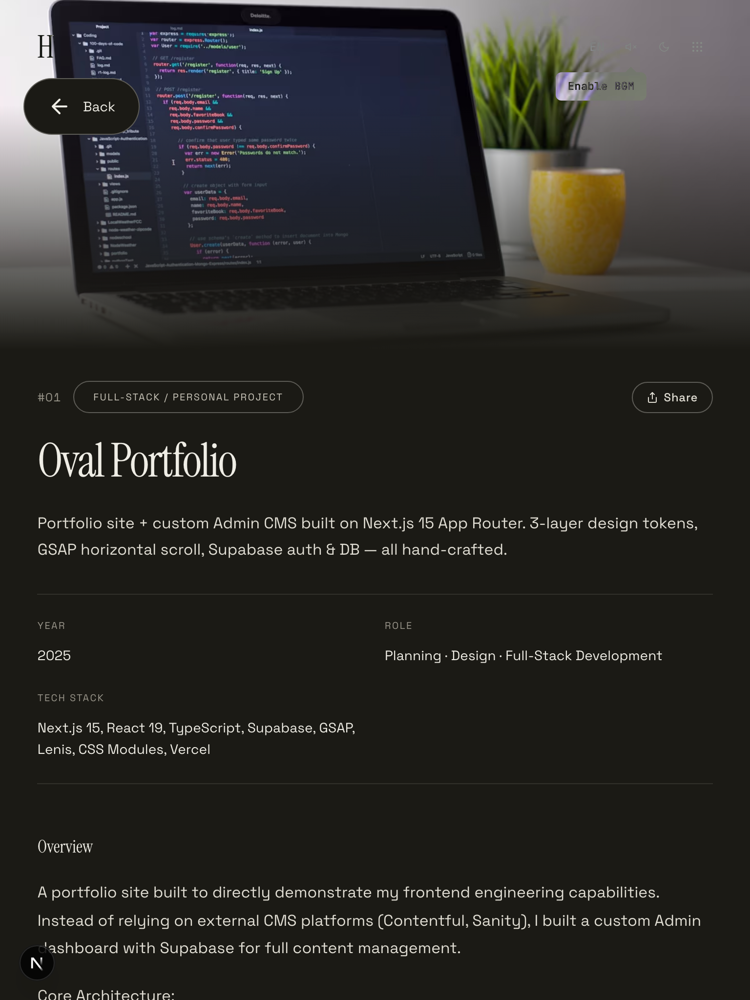
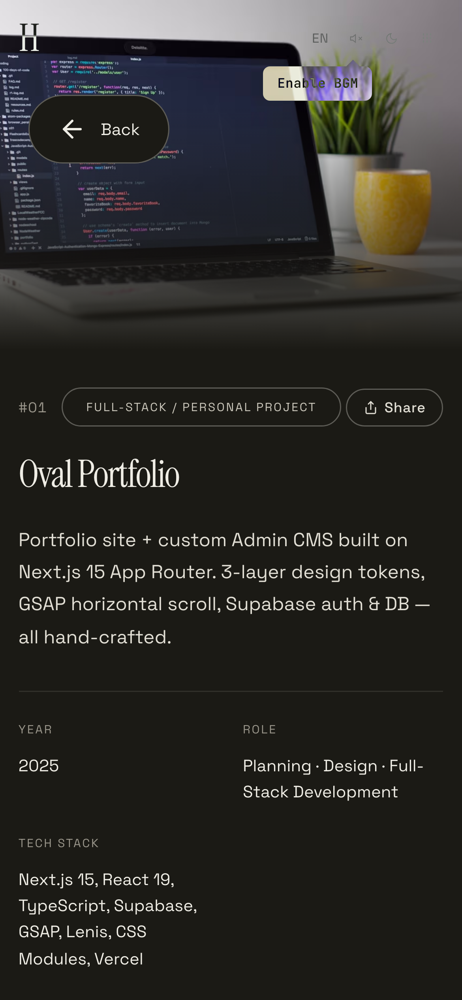
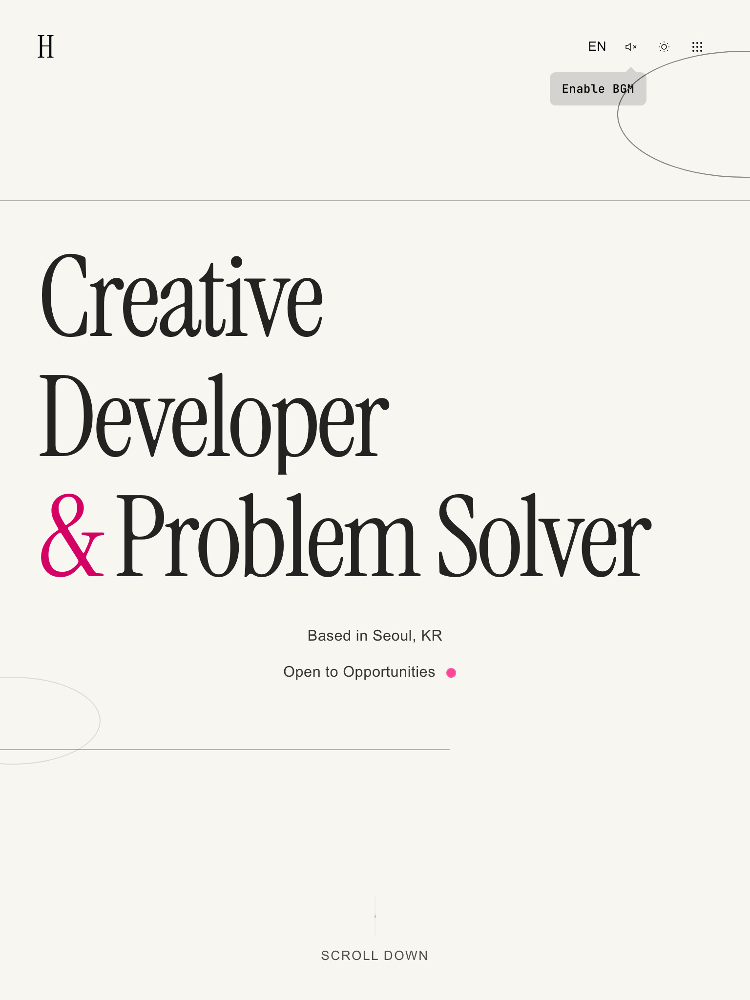
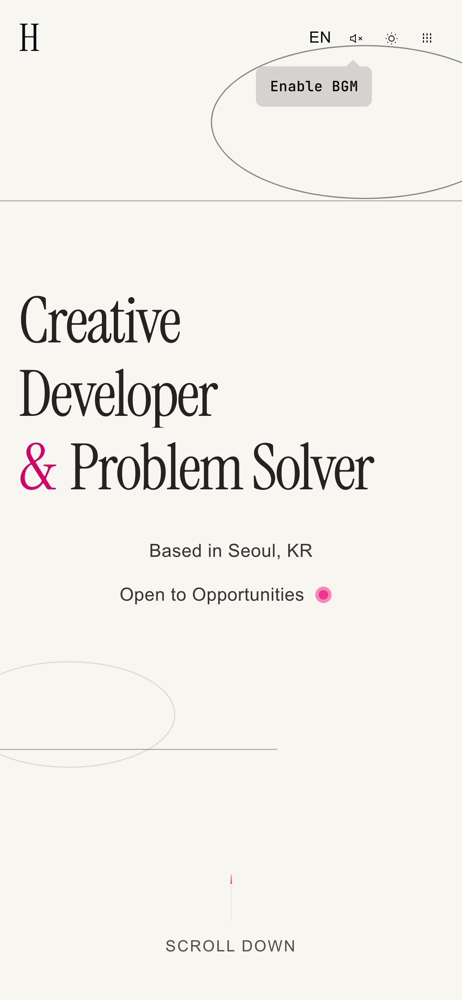

<div align="center">

English | **[한국어](./README.md)**

# Arc — Where Growth Takes Shape

A personal portfolio website built with Next.js 15, React 19, and TypeScript, featuring interactive animations powered by GSAP, Framer Motion, and Lenis.

[](./LICENSE)
[](https://nextjs.org)
[](https://react.dev)
[](https://typescriptlang.org)
[](https://supabase.com)

<br />


</div>

---

## Preview

### Dark / Light Theme

| Dark | Light |
|:---:|:---:|
|  |  |
|  |  |
|  |  |

<details>
<summary><strong>See more — Profile / About / Work Detail / Design System</strong></summary>

| Dark | Light |
|:---:|:---:|
|  |  |
|  |  |
|  |  |
|  |  |

</details>

### Responsive — PC / Tablet / Mobile

| PC (1440px) | Tablet (768px) | Mobile (390px) |
|:---:|:---:|:---:|
|  |  |  |
|  |  |  |
|  |  |  |

---

## At a Glance

> A quick overview of this project's core highlights before diving into the full README.

| Area | Highlights |
|:---|:---|
| **Interaction** | Infinite scroll loop, mouse parallax, scroll velocity parallax, per-character StaggerText |
| **Works** | GSAP bidirectional infinite horizontal scroll gallery + Three.js 3D torus (Lissajous curve path) |
| **Blog** | SSR + ISR caching, series, banner slider (4 layouts x 4 overlays), guest comments (dual auth) |
| **Admin** | 5-tab Settings, modular Plate.js editor (React.memo optimized, custom footnotes, 5 templates), MD↔richtext bidirectional conversion, client-side image compression, AI fallback chain, revision history (diff comparison + dismissed tracking), auto translation |
| **Performance** | Lighthouse 98 — unused font removal + reCAPTCHA lazy loading + CSS animation transition for LCP 1.9s, page 449KB |
| **Responsive** | PC/Tablet/Mobile 3-tier breakpoints + BreakpointGuard (automatic GSAP reinitialization) |
| **i18n** | Full Korean/English i18n + translation Tooltip + auto translation (DeepL/Google/Gemini/Claude) |
| **Security** | Multi-layer validation (SQL Injection, XSS, RLS, dual auth, category whitelist) |
| **Design System** | 3-layer tokens (Raw → Semantic → Context) + `/design-system` live preview |

---

## Tech Stack

| Category | Technology |
|:---|:---|
| Framework |  (App Router, Turbopack) |
| Language |  |
| UI |  |
| Styling |  + CSS Variables |
| Animation |    |
| 3D |    |
| Typography | Instrument Serif, Space Grotesk, JetBrains Mono (30+ presets per category + direct Google Fonts input in admin settings) |
| Backend |  (PostgreSQL, Auth, Storage) |
| Editor |  (Slate-based WYSIWYG) + Markdown |
| AI Image | NanoBanana / Hugging Face (priority-based fallback chain) |

## Key Features

### Animation & Interaction

- **Infinite Scroll Loop**: Lenis smooth scroll + Bridge Section-based infinite circular scrolling
- **Mouse Parallax**: Mouse-responsive parallax based on Framer Motion useSpring/useTransform
- **Scroll-Triggered Animations**: Scroll-based entrance animations using GSAP ScrollTrigger
- **Scroll Velocity Parallax**: Image parallax linked to scroll speed via Lenis velocity
- **StaggerText**: Component with sequential per-character outline animation on hover
- **3D Scroll Torus**: Three.js (R3F) 3D metallic torus — Lissajous curve path rotation, theme-specific materials, mobile touch repulsion interaction

<p align="center">
  
  
</p>

### Works Gallery

- **Works Horizontal Gallery**: GSAP-based horizontal scroll gallery — bidirectional infinite wrapping, intro inflow placement, layout stabilization on language switch
- **Breakpoint Guard**: Automatic page remount on viewport breakpoint (768/1024px) transitions to reinitialize GSAP/ScrollTrigger

<p align="center">
  
  
</p>

### Blog System

- **Posts (Blog)**: Supabase-based blog system — SSR + ISR caching, Markdown/Rich Text toggle editor, search/tag filters, view count tracking
- **Series**: Group posts into series for sequential publishing — subcategory element, series/post view toggle, previous/next navigation on detail pages
- **Posts Banner Slider**: Display pinned posts as banners — 4 layouts x 4 overlays x 2 transition modes, selectable from Admin
- **Posts Filter Bar**: Category collapse/expand (+N more), hover indicator (layoutId), sticky + scroll direction detection, content blur effect
- **Posts i18n & Sort Capsule**: All text moved to locale files, sort UI changed to capsule-style segment control (Framer Motion layoutId)
- **IP-based Likes**: Single `likes` table with `target_type` discrimination for Posts/Works/comments, IP-based UNIQUE constraint to prevent duplicates
- **Comment System**: Guest threaded replies — dual authentication (commenter_hash + bcrypt), nickname shuffle, email reply notifications, admin comments

<p align="center">
  
  
</p>

### Works Detail & Project Pages

- **Works Admin CRUD**: Supabase DB-based work management — single editor (MD/Rich Text) + 8-section template, auto-generated TOC, Korean/English bilingual, gallery/team members
- **Work Detail**: Project detail page — TOC from `##` heading parsing in content, gallery images, likes/comments, static data fallback when DB is not connected

<p align="center">
  
  
</p>

### Navigation & UX

- **Mix-Blend Navigation**: Auto-inverting navigation with mix-blend-mode: difference — image logo (short/full/dark-only), glitch effect controlled from Admin
- **Tooltip & Translation Tooltip**: Generic Tooltip + translation `<T>` component — shows opposite language on long hover (600ms), createPortal-based, mobile touch toggle
- **Footer Sliding Indicator**: Same sliding indicator as Navigation — arrow movement on hover, ResizeObserver + fonts.ready accuracy
- **Carousel (default / cylinder)**: Shared Carousel — default (CSS opacity) / cylinder (3D perspective) modes, autoPlay/loop/dots/arrows
- **About Horizontal Scroll**: GSAP-based horizontal scroll via `useHorizontalScroll` hook (desktop), automatic vertical stack on mobile

<p align="center">
  
  
</p>

### Admin & CMS

**Dashboard & CRUD**

- **Admin Dashboard**: Supabase Auth-based admin — Layout-level `/admin` route protection, post/work CRUD, bulk select (drag) + publish/delete (count input confirmation), .md file upload (frontmatter metadata + auto category detection + random preset cover generation, shared for Posts/Works), series management (cover background + collapse animation + add post modal (multi-select/drag) + double-click order insert + delete modal with child post option), trash preview (hover tooltip + full preview + restore/purge), shared SubTable · SearchCapsule · DraggableTag components
- **Site Content Management**: Settings with 5 tabs (General/Content/Appearance/Services/Account) — brand, SEO, Hero/About/Services bilingual editing, BroadcastChannel sync
- **Profile Admin**: Profile data (career/skills/philosophy/certifications/awards) admin editing — JSONB storage, `PeriodPicker` structured period input

**Editor & Content**

- **Editor Revision History**: Auto-save stores JSONB snapshots permanently in DB — shared across devices/tabs, LCS diff comparison (current→revision direction), Revert, dismissed tracking (prevents repeated prompts for same version), duplicate revision prevention, drag multi-select + modal delete confirmation, skeleton loading + height transition animation, automatic cleanup beyond 50 entries
- **Template Insertion**: 5 bilingual templates (Tutorial, Troubleshooting, Review, Essay, TIL) via modal — supports both Markdown/Rich Text, append after existing content or insert into empty editor
- **Markdown ↔ Rich Text Conversion**: Bidirectional conversion for footnotes, callouts, math, column blocks (table conversion), checklists (todo). Column block round-trip guaranteed
- **Markdown Editor**: Undo/redo history (Cmd+Z/Shift+Z), mobile Editor/Preview tab toggle, table grid picker
- **AI Auto Summary**: On publish, Gemini/OpenAI/Claude auto-generates ko+en summaries → saved to DB, displayed in AISummary component with expand/collapse on detail pages, manual regeneration supported
- **Auto Translation**: Auto-translate empty fields on editor language switch — select DeepL/Google/Gemini/Claude, re-translate button, duplicate request blocking
- **Bilingual Category Management**: Manage Posts/Works categories as `{ ko, en }` pairs — drag ordering, batch reassignment on delete
- **Series Edit**: Dedicated edit page for managing title/description/cover/category/publish status, post reordering/unlinking
- **Cover Image Picker**: 3 methods (16 preset gradients, Unsplash search, AI generation) — stored in Supabase Storage, AI provider priority-based fallback chain
- **Client-side Image Compression**: WebP conversion → resolution reduction (2560px) → quality step-down (0.85→0.7) in browser before upload. SVG/GIF skipped, dynamic import keeps it out of the main bundle
- **Modular PlateEditor**: Slate-based Plate.js editor split into MainToolbar, TableToolbar, ImageToolbar, MathToolbar — each wrapped with React.memo to prevent unnecessary re-renders. Custom footnote plugin (inline ref + block definition, heading support, click→scroll / double-click→edit / arrow-key→edit separation)

**Media & Utilities**

- **CTA Resume & Social Links**: Resume PDF download on Home CTA + social icons (9 types, max 6) — upload/reorder from Admin
- **BGM & Audio Source**: Upload BGM files (10MB) from Admin, display audio source (track name/artist/YouTube) in Footer
- **Visitor Statistics**: IP+date-based daily/cumulative visitor counter, real-time display in Footer

<p align="center">
  
  
</p>

### Performance

- **Bundle Optimization**: Replaced react-icons with inline SVGs, Three.js dynamic import, About 6-panel code splitting (62% JS reduction), removed unused packages/images (22MB)
- **Performance Optimization**: Hero/marquee CSS animation transition (compositor thread), useMagneticRepel direct DOM manipulation via refs (60fps), Three.js FrontSide + dispose, AudioContext lazy initialization

| Metric | Before | After |
|:---|:---:|:---:|
| Lighthouse Performance | 60 | **98** |
| LCP | 7,294ms | **1,979ms** |
| Page Size | 1,489KB | **449KB** (-70%) |
| Network Requests | 63 | **28** |

### Design System

- **Design System Preview**: View tokens/components/banner layouts at `/design-system` route — Tooltip, Select (portal-based dropdown), Pagination (smart ellipsis), PeriodPicker, Gradient Tokens, 3-phase scroll animation

<p align="center">
  
  
</p>

<details>
<summary><strong>Security</strong></summary>

Multi-layered security validation is applied to all public API endpoints.

| Security Layer | Implementation | Scope |
|------------|-----------|----------|
| **SQL Injection Prevention** | Supabase parameterized queries (prepared statements) | All DB queries |
| **XSS Prevention** | React JSX auto-escaping + server-side HTML tag stripping (`<[^>]*>` removal) + control character removal | All user input |
| **Input Validation** | UUID format validation, length limits, email format validation, enum type validation, category whitelist validation | All public APIs |
| **Authentication** | Comment dual authentication (commenter_hash + bcrypt password), admin comment server-side Supabase Auth re-verification | Comment edit/delete, admin |
| **RLS** | Supabase Row Level Security policies | All tables |
| **Route Protection** | Layout-level Supabase Auth session check + access denied page | `/admin/*` |
| **Duplicate Prevention** | IP-based UNIQUE constraints | Likes, visitor statistics |
| **Password Security** | bcrypt (salt round 10), 72-byte limit, minimum 2 characters | Comment passwords |
| **Category Validation** | Server-side whitelist validation — only categories registered in site settings are allowed | Posts, Works, Series |
| **Secret Management** | API keys stored in DB, `SUPABASE_SERVICE_ROLE_KEY` server-side only, only `NEXT_PUBLIC_` prefix exposed to client | Environment variables, API keys |

**Server-side input sanitization (`commentValidation.ts`):**

| Function | Validation |
|------|----------|
| `isValidUUID()` | UUID v4 regex format validation |
| `sanitizeContent()` | HTML tag stripping + control character removal + 2000 character length limit |
| `validatePassword()` | Minimum 2 characters, bcrypt 72-byte upper limit |
| `validateEmail()` | RFC format validation, 254 character limit, lowercase normalization |
| `validateNickname()` | HTML tag stripping + control character removal + 50 character limit |

**Validated API endpoints:**

| Endpoint | Validation |
|-----------|----------|
| `POST/PATCH /api/comments` | UUID, content (2000 chars, HTML strip), nickname (50 chars), password (72B), email (254 chars) |
| `POST/PATCH /api/work-comments` | UUID, content (2000 chars, HTML strip), nickname (50 chars), password (72B), email (254 chars) |
| `DELETE /api/comments/[id]` | UUID format validation |
| `DELETE /api/work-comments/[id]` | UUID format validation |
| `POST /api/comment-likes` | UUID, comment_type enum validation |
| `GET/POST /api/posts/[id]/like` | UUID format validation |
| `GET/POST /api/works/[id]/like` | UUID format validation |
| `POST/PATCH /api/posts` | Category whitelist validation |
| `POST/PATCH /api/works` | Category pair (ko/en) whitelist validation |
| `POST/PATCH /api/series` | Category whitelist validation |
| `POST /api/contact` | Name (100 chars), email format/length, message (5000 chars) |
| `POST /api/translate` | Text (2000 chars), targetLang enum |


</details>

<details>
<summary><strong>DB Design Decisions</strong></summary>


### Unified Likes Table: `likes`

All likes (posts, works, post comments, work comments) are managed in a single `likes` table, distinguished by `target_type`.

**Alternatives considered:**

| Approach | Pros | Cons |
|------|------|------|
| **Single table** (current) | Single Source of Truth, one UNIQUE constraint prevents all duplicates, only need to add a CHECK value for new entities | 4 `target_type` values |
| **Fully separated** (post_likes, work_likes, ...) | Simple queries | Too many tables, schema duplication |
| **2 tables** (likes + comment_likes) | Content/comment separation of concerns | Distributed sync logic, increased table count |

**Rationale:** A single `UNIQUE(target_type, target_id, ip)` constraint prevents duplicates for all entities at the DB level. Comment likes are queried via real-time `COUNT(*)`, and only Posts sync to a `posts.like_count` cache column for list performance. With indexes applied, there is no performance difference up to thousands of records, so consistency and simplicity take priority.

### Denormalized Count Caching: `posts.like_count`

The `likes` table is the **source of truth** for likes, and `posts.like_count` is a **cache column** for list query performance.

| Entity | Count Method | Rationale |
|--------|------------|------|
| **Posts** | `posts.like_count` cache column sync | Instant display in lists without JOIN |
| **Works / Comments** | Real-time `COUNT(*)` query | Count not needed in lists, only queried on detail pages |

**Rationale:** A portfolio site has a read >> write ratio. Only Posts display like counts in lists, so a cache column is needed; the rest are fine with real-time queries.

### Editor Revision History: `revisions`

A polymorphic table that permanently stores the entire form as a JSONB snapshot on each auto-save of the Posts/Works editor.

**Alternatives considered:**

| Approach | Pros | Cons |
|------|------|------|
| **Separate DB table** (current) | Persistent across devices, tabs, and sessions; automatic cleanup per entity; diff comparison possible | DB write on each auto-save |
| **sessionStorage** (previous) | Instant access, no DB load | Lost when tab closes, no cross-device sharing |

**Rationale:** Since only one admin uses this, DB write costs are negligible. Cross-device/tab/session revision sharing and diff-based detailed comparison are more important. A `entity_type` CHECK column distinguishes posts/works in a single table, and snapshots are excluded from list queries for lightweight loading. JSON.stringify hash comparison prevents duplicate snapshot storage, and the detail view displays diffs for metadata items like categories, tags, and series.

**Auto-save interval decision:** Initially implemented with a 5-second debounce, but comparing against Google Docs (OT/diff), Notion (immediate save but server receives patches), and WordPress (60 seconds) revealed that **5 seconds is too frequent for a full-snapshot approach** — revisions accumulated meaninglessly. A diff-based approach was considered but rejected: no benefit over the complexity for a single-user environment with a 50-revision cap (~2.5MB). Changed to **30-second debounce + forced save on page leave**. Leave-save is handled via two paths: browser close/refresh uses `navigator.sendBeacon` (async-safe), and Next.js SPA navigation uses `fetch({ keepalive: true })` in the component unmount cleanup.

### Anonymous Comment Dual Authentication

In a login-free comment system, edit/delete permissions are verified through **2 paths**.

| Auth Path | Storage | Persistence | Purpose |
|-----------|----------|--------|------|
| `commenter_hash` | Browser localStorage UUID -> SHA-256 | Permanent on same browser | Auto authentication (no password input needed) |
| `password_hash` | bcrypt (salt round 10) | As long as user remembers | Authentication from different device/browser |

**Why both are needed:** With only `commenter_hash`, editing is impossible when changing browsers. With only `password`, input is required every time. Using both provides auto authentication on the same browser and password fallback in other environments, securing both UX and security.

### Comment System Features

| Feature | Description |
|------|------|
| **Nickname Shuffle** | Random emoji+name combination, changeable via shuffle button |
| **Reply Email Notification** | Enter email (optional) when commenting to receive reply notifications (`notify_email` column) |
| **Admin Comments** | Post comments with Admin badge without password when logged in, server-side Supabase Auth re-verification |


</details>

<details>
<summary><strong>User Flow</strong></summary>


### Visitor Flow

```
Home -> Works Gallery (horizontal scroll) -> Work Detail (likes)
     -> Posts List (search/tag filter) -> Post Detail (likes/comments)
     -> Profile -> About (technical documentation)
```

- **Works**: Browse projects in the horizontal scroll gallery, and leave IP-based likes on the detail page
- **Posts**: Filter blog posts by tags/search. Selecting a category displays that category's series as book-shaped cards, and clicking a series filters to its posts only. On the detail page, you can leave likes and guest comments (dual auth: browser UUID + password), and series posts show previous/next navigation
- **About**: Traverse 15 panels via horizontal scroll (project overview, user flow, architecture, features, design concept, development process, tech stack, backend, ERD, code highlights, troubleshooting, security). The UserFlow panel visualizes 9 flows (Visitor, Posts, Works, Profile, Contact, Comment, Admin/Settings, Admin/Settings/Appearance, Admin/Posts/Works) with tabs + SVG diagrams. The ERD panel displays interactive DB table relationships. The Security panel visualizes 8 security layers (SQL Injection, XSS, Input Validation, Dual Auth, RLS, Route Protection, Duplicate Prevention, Secret Management)

### Admin Flow

```
Direct access to /admin -> Supabase Auth login -> Settings redirect
-> Write post (Markdown/Rich Text toggle) -> Select cover image (preset/Unsplash/AI) -> Select series (optional) -> Publish
-> Manage works (/admin/works) — create, edit, delete, publish/private toggle, sort order change
-> Site settings (/admin/settings) — General (brand/logo customization, SEO, footer, BGM), Content (Home/Profile/About/Posts/Works sub-tabs), Appearance (theme/typography/date picker styles), Services (API key management, reveal original after password verification), Account (email change pending management, password policy, security notification emails)
-> Settings conflict detection — when code defaults change, compare with DB-stored values and visualize via per-hunk diff modal, checked items are auto-applied on save (JSON key order independent via deepEqual comparison)
```

- No login button — accessed by directly entering the URL
- Layout-level Supabase Auth session verification — redirects to `/admin/denied` (access denied page) when unauthenticated


</details>

## Getting Started

```bash
# 1. Install dependencies
npm install

# 2. Start dev server
npm run dev
```

View the result at [http://localhost:3000](http://localhost:3000).

> **Works without Supabase.** If no environment variables are set, the site automatically falls back to static data for Works, Profile, and Settings. To use DB-dependent features (Posts, comments, likes), see the Supabase Setup Guide below.

---

<details>
<summary><strong>Supabase Setup Guide</strong></summary>

Supabase project setup is required to use the Posts feature.

### 1. Environment Variables

Create a `.env.local` file in the project root:

```env
NEXT_PUBLIC_SUPABASE_URL=https://YOUR_PROJECT_ID.supabase.co
NEXT_PUBLIC_SUPABASE_ANON_KEY=eyJhbGci...
SUPABASE_SERVICE_ROLE_KEY=eyJhbGci...

# Cover Image Picker — Unsplash (optional)
UNSPLASH_ACCESS_KEY=your_unsplash_access_key

# Cover Image Picker — AI Generate (set only the key matching your provider)
# Uses the key corresponding to aiCover.provider value in site.config.ts
HUGGINGFACE_API_KEY=hf_...          # provider: "huggingface"
NANOBANANA_API_KEY=your_key         # provider: "nanobanana"

# Translation — set only the key matching your chosen provider
# Uses the key corresponding to translation.provider value in site.config.ts (default: deepl)
DEEPL_API_KEY=your_deepl_key                   # provider: "deepl" (default)
GOOGLE_TRANSLATE_API_KEY=your_google_key        # provider: "google"
GEMINI_API_KEY=your_gemini_key                  # provider: "gemini"
ANTHROPIC_API_KEY=your_anthropic_key            # provider: "claude" (translation + AI summary)
```

**How to find the values:**

1. [Supabase Dashboard](https://supabase.com/dashboard) -> Select your project
2. **Settings** -> **API** tab
3. `Project URL` -> `NEXT_PUBLIC_SUPABASE_URL`
4. `anon` `public` key -> `NEXT_PUBLIC_SUPABASE_ANON_KEY`
5. `service_role` `secret` key -> `SUPABASE_SERVICE_ROLE_KEY`

> **Warning**: The `service_role` key bypasses RLS and must never be exposed to the client. `SUPABASE_SERVICE_ROLE_KEY` is used server-side only without the `NEXT_PUBLIC_` prefix.

### 2. Database Table Creation

The [`supabase/setup.sql`](supabase/setup.sql) file contains all table creation + RLS policies.

Copy the file contents and run them at once in Supabase Dashboard -> **SQL Editor**.

**Tables created (10):**

| Table | Purpose |
|--------|------|
| `site_settings` | Site settings + profile data + secrets/API keys (JSONB) |
| `series` | Blog series |
| `posts` | Blog posts (post_number sequence column for unique numbering) |
| `comments` | Post comments (threaded replies, dual auth: commenter_hash + password) |
| `likes` | Likes (unified for posts/works/comments, distinguished by target_type, IP duplicate prevention) |
| `works` | Portfolio works (includes team_members jsonb) |
| `site_visits` | Visitor statistics (1 per IP+date) |
| `work_comments` | Works comments (threaded replies, dual auth) |
| `admin_notifications` | Admin notification logs |
| `revisions` | Editor revision history (shared for posts/works, JSONB snapshot) |

> Uses `IF NOT EXISTS` so existing tables are skipped. Missing columns (commenter_hash, updated_at, etc.) in existing deployed DBs are safely added via `ALTER TABLE ADD COLUMN IF NOT EXISTS` in the migration section at the bottom of the file.

> **Works without Supabase**: If environment variables are not set, the site automatically falls back to static data from Works (`data/projects.ts`), Profile (`data/profile.ts`), and Settings (`config/site.config.ts`).

**Key API endpoints:**

> **Posts API**: `GET/POST /api/posts`, `GET/PATCH/DELETE /api/posts/[id]`, `POST /api/posts/[id]/view`, `GET/POST /api/posts/[id]/like`
>
> **Series API**: `GET/POST /api/series`, `GET/PATCH/DELETE /api/series/[id]`
>
> **Works API**: `GET/POST /api/works`, `GET/PATCH/DELETE /api/works/[id]`, `GET/POST /api/works/[id]/like`
>
> **Comments API**: `GET /api/comments?post_id=`, `POST /api/comments`, `PATCH /api/comments` (edit), `DELETE /api/comments/[id]`
>
> **Work Comments API**: `GET /api/work-comments?work_id=`, `POST /api/work-comments`, `PATCH /api/work-comments` (edit), `DELETE /api/work-comments/[id]`
>
> **Comment Likes API**: `GET /api/comment-likes?comment_type=&comment_ids=` (batch like status query), `POST /api/comment-likes` (toggle comment like)
>
> **Admin API**: `POST /api/admin/auth`, `GET/PATCH /api/admin/settings`, `GET/PATCH /api/admin/profile`, `GET/PATCH /api/admin/account`, `GET/PUT /api/admin/secrets`, `POST /api/admin/upload`, `POST /api/admin/translate`
>
> **Revisions API**: `GET /api/revisions?entity_type=&entity_id=` (list, excluding snapshots), `POST /api/revisions` (save + cleanup beyond 50), `GET /api/revisions/[id]` (single with snapshot), `DELETE /api/revisions/[id]`
>
> **Categories API**: `GET /api/categories` (Posts bilingual category list), `GET /api/works-categories` (Works bilingual category list)
>
> **Utility API**: `POST /api/translate` (public, Gemini single text), `POST /api/posts/reassign-category` (batch category reassignment), `GET /api/fonts/search?q=` (Google Fonts autocomplete search)

### 3. Storage Bucket Creation

For image, resume, and BGM uploads:

1. Supabase Dashboard -> **Storage**
2. Click **New bucket**
3. Bucket name: `uploads`
4. Check **Public bucket** (to allow public URL access to files)
5. **Create bucket**

> The upload API organizes files by folder: `logos/`, `resume/`, `bgm/`, `covers/`, `images/`, etc.

**Storage policy setup:**

```sql
-- Only authenticated users can upload
CREATE POLICY "Authenticated users can upload"
  ON storage.objects FOR INSERT
  WITH CHECK (bucket_id = 'uploads' AND auth.role() = 'authenticated');

-- Anyone can read (public bucket)
CREATE POLICY "Anyone can view uploads"
  ON storage.objects FOR SELECT
  USING (bucket_id = 'uploads');
```

### 4. Admin Account Creation

Supabase Dashboard -> **Authentication** -> **Users** -> **Add user**:

- Enter Email and Password
- Check **Auto Confirm User** (skip email verification)

### 5. Admin Login Method

There is no login button on the site. Only the admin accesses it by entering the URL directly.

**Login:**

1. Go to `/admin/login`
2. Enter the email/password created in Supabase
3. Login success -> Redirect to `/admin/settings`

**Features available after login:**

- `/admin/posts` — Post list (publish/private status, hover preview, row numbers, thumbnails)
- `/admin/posts/new` — New post creation (Markdown <-> Rich Text toggle, auto translation, re-translate, auto save + DB revision history + diff comparison + Revert)
- `/admin/posts/[id]/edit` — Edit existing post (PlateEditor loading skeleton)
- `/admin/posts/series/new` — Create new series
- `/admin/posts/series/[id]/edit` — Edit series
- `/admin/works` — Works list (table view, publish/private toggle, sort order, thumbnails, .md upload)
- `/admin/works/new` — Create new work (single content editor + template, Korean/English bilingual, tech stack, gallery)
- `/admin/works/[id]/edit` — Edit existing work
- `/admin/settings` — Site settings (General, Content, Appearance, Services, Account — 5 tabs). General tab for brand/SEO/footer copyright/BGM file upload/audio source (track name/artist/URL) management. Content tab split into Home/Profile/About/Posts/Works sub-navigation. Services tab for email service, AI cover, reCAPTCHA settings and API key editing. Account tab for admin email/password changes

### 6. Cover Image Picker Usage

In the Cover Image / Main Image area of the post, series, and work editors, you can choose between **Upload** (direct upload) and **Choose cover** (picker).

Clicking **Choose cover** shows 3 tabs:

| Tab | Description | Required Environment Variable |
|----|------|----------------|
| **Presets** | Click from 16 gradient/pattern options to generate a 1200x630 image via Canvas API and upload to Supabase | None |
| **Unsplash** | Search Unsplash photos by keyword -> click to trigger download tracking + Supabase upload | `UNSPLASH_ACCESS_KEY` |
| **AI Generate** | Prompt + style selection -> AI image generation -> Supabase upload | Provider-specific API key (see below) |

> **Note**: The Unsplash and AI Generate tabs each require their own API key. The Presets tab works without any environment variables.

---

#### AI Generate — Provider Setup

Select the service to use in `src/config/site.config.ts` under `aiCover.provider`:

```ts
aiCover: {
  provider: "huggingface",  // "nanobanana" | "huggingface"
},
```

| Provider | Model | Environment Variable | Price | How to Get |
|----------|------|----------|------|-----------|
| **huggingface** | FLUX.1-schnell | `HUGGINGFACE_API_KEY` | Free (with rate limits) | [huggingface.co/settings/tokens](https://huggingface.co/settings/tokens) -> New token -> Check `Inference Providers` permission |
| **nanobanana** | Gemini 2.5 Flash | `NANOBANANA_API_KEY` | ~$0.02/image (free credits on signup) | [nanobananaapi.ai/api-key](https://nanobananaapi.ai/api-key) -> Sign up -> Copy API Key |

**Setup example (.env.local):**

```env
# When using Hugging Face (recommended — free)
HUGGINGFACE_API_KEY=hf_xxxxxxxxxxxxxxxxxxxxxxxxxxxxxxxx

# Or when using NanoBanana
# NANOBANANA_API_KEY=nb_xxxxxxxxxxxxxxxx

```

> After changing the provider, just set the corresponding key in `.env.local`. Keys for unused providers can be left empty.

---

#### Hugging Face API Key Setup (Recommended)

1. Sign up at [huggingface.co](https://huggingface.co/join)
2. Go to [Settings -> Access Tokens](https://huggingface.co/settings/tokens)
3. Click **Create new token**
4. Token type: Select **Fine-grained**
5. Token name: Any name (e.g., `portfolio-cover`)
6. Permissions setup:
   - **Inference Providers** -> Check **Make calls to Inference Providers** (required)
   - All other permissions can be left unchecked
7. **Create token** -> Copy the `hf_...` format token
8. Enter `HUGGINGFACE_API_KEY=hf_...` in `.env.local`

> Free tier allows hundreds of calls per hour. More than sufficient for cover image generation.

#### NanoBanana API Key Setup

1. Sign up at [nanobananaapi.ai](https://nanobananaapi.ai)
2. Go to the [API Key management page](https://nanobananaapi.ai/api-key)
3. Copy the API Key (no separate permission setup — one key for all API access)
4. Enter `NANOBANANA_API_KEY=...` in `.env.local`

> Free credits provided on signup. ~$0.02/image afterwards. Uses an async approach (generation request -> polling), so responses may take several seconds.

---

#### Unsplash API Key Setup

1. Sign up at [Unsplash Developers](https://unsplash.com/developers)
2. Click **Your apps** -> **New Application**
3. Check guideline agreements, enter app name/description -> **Create application**
4. Copy the **Access Key** from the created app page (not the Secret Key)
5. Enter `UNSPLASH_ACCESS_KEY=...` in `.env.local`

> Demo app limit: 50 requests/hour. Production approval: 5,000 requests/hour.

**Authentication flow:**

```
/admin/login (form submit)
  -> POST /api/admin/auth
    -> supabase.auth.signInWithPassword()
    -> Set session cookie
  -> Redirect to /admin/settings

Accessing /admin/*
  -> Dashboard layout checks session
  -> No session -> /admin/denied (access denied page)
  -> Session exists -> Normal access

Accessing /admin/login
  -> Auth layout checks session
  -> Already logged in -> Redirect to /admin/settings
```

> **Key point**: Regular visitors can only read posts and leave comments at `/posts`. Only the admin (yourself) accesses `/admin/login` by entering the URL directly. Since this is a portfolio site, the login UI is not exposed.


</details>

<details>
<summary><strong>Testing</strong></summary>


**Stack**: Vitest + React Testing Library + jsdom

```bash
# Run all tests
npm test

# Watch mode (auto-rerun on file changes)
npm run test:watch
```

**Test targets**:

| File                       | Tests | Description                                                                |
| -------------------------- | --------- | ------------------------------------------------------------------- |
| `cn.test.ts`               | 6         | Class name composition utility (`cn`)                                           |
| `date.test.ts`             | 6         | Date format utilities (`formatDate`, `getYear`)                            |
| `random.test.ts`           | 8         | Random element generation (`generateRandomElements`, `generateRandomDroplets`) |
| `mobileCheck.test.ts`      | 6         | Mobile layout detection (`checkMobileLayout`)                          |
| `renderHighlight.test.tsx` | 4         | Highlight markup conversion (`renderHighlight`)                          |

Config file: `vitest.config.ts`, Test location: `src/__tests__/`

---


</details>

<details>
<summary><strong>Components</strong></summary>

<p align="center">
  
  <br />
  <sub>View all tokens and components on the <code>/design-system</code> page</sub>
</p>

### StaggerText

A component that splits text into individual characters and applies sequential outline animation on hover.

**Path**: `src/components/effects/StaggerText`

<p align="center">
  
</p>

**Features**:

- On hover, characters sequentially change to outline (stroke) starting from the first character
- On hover release, colors fill in reverse order starting from the last character (stroke maintained)
- Custom stroke color and width support
- Configurable per-character delay

**Usage**:

```tsx
import StaggerText from "@/components/effects/StaggerText";

// Basic usage
<StaggerText>Hello World</StaggerText>

// Custom options
<StaggerText
  className={styles.title}
  strokeColor="var(--text-primary)"  // Stroke color
  strokeWidth={2}                     // Stroke width (default: 1px)
  delayPerChar={0.05}                 // Per-character delay (default: 0.04s)
  hoverEffect={false}                 // Disable hover effect
>
  Custom Text
</StaggerText>
```

**Props**:

| Prop           | Type      | Default        | Description                          |
| -------------- | --------- | -------------- | ------------------------------------ |
| `children`     | `string`  | (required)     | Text to display                      |
| `className`    | `string`  | -              | Additional CSS class                 |
| `strokeColor`  | `string`  | `currentColor` | Stroke color (CSS variable or color value) |
| `strokeWidth`  | `number`  | `1`            | Stroke width (px)                    |
| `delayPerChar` | `number`  | `0.04`         | Per-character delay (seconds)        |
| `hoverEffect`  | `boolean` | `true`         | Enable hover effect                  |

---

### BreakpointGuard

A component that automatically unmounts/remounts page content when the viewport crosses breakpoint boundaries (768px, 1024px) to reinitialize GSAP ScrollTrigger, RAF-based animations, etc.

**Path**: `src/components/common/BreakpointGuard.tsx`

| PC | Tablet | Mobile |
|:---:|:---:|:---:|
|  |  |  |

**Features**:

- Detects viewport width changes and classifies as `desktop` (>1024px) / `tablet` (768-1024px) / `mobile` (<768px)
- Remounts children via `key` prop on breakpoint change
- Providers (Theme, Language, Lenis) are placed above to maintain state

**Applied at**: `src/app/layout.tsx`

```tsx
// root layout.tsx
<ThemeProvider>
  <LanguageProvider>
    <LenisProvider>
      <Navigation /> {/* maintained */}
      <main>
        <BreakpointGuard>
          {" "}
          {/* remount on breakpoint change */}
          {children}
        </BreakpointGuard>
      </main>
    </LenisProvider>
  </LanguageProvider>
</ThemeProvider>
```

**Breakpoints**:

| Breakpoint | Range          | Description              |
| ---------- | -------------- | ------------------------ |
| `desktop`  | > 1024px       | Horizontal scroll layout |
| `tablet`   | 768px - 1024px | Vertical scroll, tablet spacing |
| `mobile`   | < 768px        | Vertical scroll, mobile spacing |

---

### Modal (Bottom Sheet)

A modal component that behaves as a bottom sheet pattern on mobile. Center dialog on desktop.

| PC (Desktop Dialog) | Tablet | Mobile (Bottom Sheet) |
|:---:|:---:|:---:|
|  |  |  |

**Path**: `src/components/ui/Modal.tsx`

**Mobile behavior**:

- Slides up from bottom (85vh height limit)
- **Handle drag down**: CSS `translate`-based dismiss (closes when threshold exceeds 100px)
- **Handle drag up**: Height-based fullscreen expansion
- Close button hidden — close via handle drag or overlay tap

**Technical decisions**:

- Uses CSS `translate` property for drag dismiss (independent from framer-motion's `transform`)
- framer-motion handles only enter/exit animations; drag is controlled via `--sheet-y` CSS variable
- Global single render in `ClientOverlays` (portal to body)

---


</details>

## Trouble Shooting

> Major issues encountered during development and their resolutions. Each item is collapsed.

<details>
<summary><strong>1. Lenis Scroll Velocity Effect Not Working</strong></summary>

<p align="center">
  
</p>

#### Problem

Scroll speed-based parallax effect was not being applied to images in the Works section

#### Failed Attempts

1. **Direct wheel event detection**: Unstable and conflicted with Lenis
2. **RAF polling to calculate scroll delta**: Inaccurate velocity measurement
3. **Direct type assertion on Lenis velocity property**: Values not updated when accessed outside scroll events

#### Cause

- When calculating scroll position directly via RAF polling, the inter-frame delta is inconsistent, resulting in inaccurate velocity measurement
- Lenis internally calculates velocity and provides it as an instance property, but accurate values are only accessible within the scroll event handler

#### Solution

Used Lenis's native `on('scroll')` event to access the velocity property directly from the instance

```tsx
// ❌ Wrong approach - RAF polling
useEffect(() => {
  const updateOffset = () => {
    const currentScroll = lenis.scroll;
    const delta = currentScroll - prevScrollRef.current; // Inaccurate velocity
    prevScrollRef.current = currentScroll;
    rafIdRef.current = requestAnimationFrame(updateOffset);
  };
  rafIdRef.current = requestAnimationFrame(updateOffset);
}, []);

// ✅ Correct approach - Lenis scroll event
useEffect(() => {
  const handleScroll = () => {
    const velocity = (lenis as any).velocity; // Accurate velocity
    if (Math.abs(velocity) > 0.05) {
      const offset = Math.max(-50, Math.min(50, velocity * 30));
      workImageOffsetY.set(offset);
    }
  };
  lenis.on("scroll", handleScroll);
  return () => lenis.off("scroll", handleScroll);
}, [lenis]);
```

#### TL;DR

Lenis internally calculates velocity and provides it as an instance property, making it more accurate than manually calculating delta

---


</details>

<details>
<summary><strong>2. Framer Motion transform and CSS transform Conflict</strong></summary>

#### Problem

Using CSS `transform: translate(-50%, -50%)` for image centering caused Framer Motion's `y` property to stop working

#### Cause

- Framer Motion's `style={{ y }}` property generates an inline `transform: translateY()`
- When a CSS `transform` property is already set, Framer Motion's transform gets overwritten or conflicts

#### Solution

Switched to margin-based centering to avoid using CSS transform

```css
/* ❌ Wrong approach - using CSS transform */
.workImageInner {
  position: absolute;
  top: 50%;
  left: 50%;
  transform: translate(-50%, -50%); /* Conflicts with Framer Motion */
}

/* ✅ Correct approach - margin-based alignment */
.workImageInner {
  position: absolute;
  top: 50%;
  left: 50%;
  width: 130%;
  height: 130%;
  margin-left: -65%; /* Half of width */
  margin-top: -65%; /* Half of height */
}
```

#### TL;DR

Framer Motion's style prop generates inline transform, so it must be used separately from CSS transform

---


</details>

<details>
<summary><strong>3. TypeScript useRef Type Error</strong></summary>

#### Problem

"Expected 1 arguments, but got 0" type error with `useRef<ReturnType<typeof setTimeout>>()`

#### Cause

- `useRef` requires an initial value as a mandatory parameter
- `ReturnType<typeof setTimeout>` does not include `null`, and `clearTimeout` does not accept `null`

#### Solution

Explicitly provide `undefined` as the initial value and include it in the type

```tsx
// ❌ Wrong approach
const resetTimerRef = useRef<ReturnType<typeof setTimeout>>(); // Error: initial value needed
const resetTimerRef = useRef<ReturnType<typeof setTimeout> | null>(null); // clearTimeout type error

// ✅ Correct approach
const resetTimerRef = useRef<ReturnType<typeof setTimeout> | undefined>(
  undefined,
);
```

#### TL;DR

`clearTimeout` accepts `undefined` but not `null`. Timer refs should be initialized with `undefined`

---


</details>

<details>
<summary><strong>4. GSAP ScrollTrigger Horizontal Infinite Scroll Implementation</strong></summary>

<p align="center">
  
  
</p>

#### Problem

Horizontal scroll on the Works page would scroll in reverse direction when reaching the end, not appearing as infinite scroll

#### Failed Attempts

1. **Scroll position teleport**: Moving to start via `window.scrollTo` on reaching end -> visible jump
2. **Separate Bridge section**: Adding Bridge as separate section -> disrupted flow by transitioning from horizontal to vertical scroll
3. **Lenis infinite + teleport**: Conflict when controlling both Lenis and ScrollTrigger simultaneously

#### Cause

- GSAP ScrollTrigger has a finite scroll range defined by the `end` property
- Directly changing scroll position creates a visible jump for users
- Horizontal scroll converts vertical scrolling to horizontal movement, so adding separate sections creates vertical scroll segments

#### Solution

Set scroll distance very long and cycle only the container position using modulo operation

```tsx
// Clone content 3x
const allProjects = [...projects, ...projects, ...projects];

// Set scroll distance to 10x (effectively infinite)
const scrollDistance = oneSetWidth * 10;

gsap.to(container, {
  scrollTrigger: {
    end: () => `+=${scrollDistance}`,
    onUpdate: (self) => {
      // Modulo for position cycling - scroll continues but visually loops
      const totalProgress = self.progress * scrollDistance;
      const loopedX = totalProgress % oneSetWidth;
      gsap.set(container, { x: -loopedX });
    },
  },
});
```

#### TL;DR

A long scroll range + visual position loop approach provides a more natural infinite scroll experience than scroll position teleportation

---


</details>

<details>
<summary><strong>5. Lighthouse Performance Optimization — reCAPTCHA Lazy Loading</strong></summary>

<p align="center">
  
</p>

#### Problem

Lighthouse mobile Performance score of 48. LCP 17.1s, TTI 18.2s indicating severe performance degradation

#### Cause Analysis

Analysis of Lighthouse reports (Desktop/Mobile) revealed key bottlenecks:

1. **reCAPTCHA v3 immediate loading**: `GoogleReCaptchaProvider` wrapping the entire app downloads ~784KB JS on initial load. Main thread blocked for 280ms
2. **Missing preconnect**: Requests to Google domains start without prior connection -> 400ms delay
3. **Insufficient color contrast**: `#6b7280` on `#f8f6f0` (4.47:1, threshold 4.5:1), `#ff4f9d` on `#f8f6f0` (2.83:1)
4. **Accessibility**: Heading order skipped (h1 -> h3), aria-label and visible text mismatch

#### Solution

**1. reCAPTCHA Lazy Loading** — Biggest impact

Changed to load reCAPTCHA script only after user interaction (scroll/click/touch/keydown) or 4-second timeout:

```tsx
// ❌ Before - immediate load on app mount (784KB)
<GoogleReCaptchaProvider reCaptchaKey={siteKey}>
  {children}
</GoogleReCaptchaProvider>

// ✅ After - lazy load after user interaction
const [shouldLoad, setShouldLoad] = useState(false);

useEffect(() => {
  const load = () => setShouldLoad(true);
  const timer = setTimeout(load, 4000);
  const events = ["scroll", "click", "touchstart", "keydown"] as const;
  const handler = () => { load(); cleanup(); };
  // ...register event listeners (once: true, passive: true)
}, []);

if (!shouldLoad) return <>{children}</>;
return <GoogleReCaptchaProvider ...>{children}</GoogleReCaptchaProvider>;
```

**2. Preconnect Hints Added**

```html
<link rel="preconnect" href="https://www.google.com" />
<link rel="preconnect" href="https://www.gstatic.com" crossorigin="anonymous" />
```

**3. Color Contrast Fixes**

| Token                          | Before                               | After                         | Contrast Change       |
| ----------------------------- | ------------------------------------- | ------------------------------- | --------------- |
| `--color-neutral-600`         | `#6b7280`                             | `#656c79`                       | 4.47:1 -> ~4.9:1 |
| `--text-accent-secondary-alt` | `var(--color-accent-light)` (#ff4f9d) | `var(--color-accent)` (#d40063) | 2.83:1 -> ~4.8:1 |

**4. Accessibility Fixes**

- ServicesSection: `<h3>` -> `<h2>` to normalize heading order
- Language toggle: Include visible text ("KO"/"EN") in `aria-label`

#### TL;DR

- Excluding third-party scripts (reCAPTCHA, Analytics, etc.) from initial load and loading them after user interaction has a major impact on LCP/TTI
- Lighthouse results on dev server (Turbopack) are measured much lower than production due to unminified JS, devtools, etc.
- When using `mix-blend-mode: difference`, Lighthouse calculates contrast using pre-blend colors, which may differ from actual visual results

---


</details>

<details>
<summary><strong>6. reCAPTCHA Badge z-index Issue</strong></summary>

#### Problem

reCAPTCHA v3 badge was hidden behind the overlay when the Contact Drawer opened

#### Cause

- Contact Drawer backdrop is fixed positioned with `z-index: var(--z-overlay)` (40)
- The `.grecaptcha-badge` element injected by Google had a lower z-index than the backdrop

#### Solution

Dynamically set `z-index: 9999` on the badge when the drawer opens, remove when closed:

```tsx
badge.style.zIndex = isOpen ? "9999" : "";
```

#### TL;DR

DOM elements injected by third parties can have z-index conflicts with custom overlays/modals. z-index must be managed dynamically

---


</details>

<details>
<summary><strong>7. Advanced Lighthouse Performance Optimization — Unused Font Removal and Resource Reduction</strong></summary>

| PC | Tablet | Mobile |
|:---:|:---:|:---:|
|  |  |  |
<sub>Optimization target: Home page — achieved Performance score of 98 across all 3 devices</sub>

#### Problem

After the first optimization pass, Lighthouse mobile Performance score was 60. LCP 7.3s, TTI 13.7s, page size 1,489KB, 63 network requests

#### Cause Analysis

Bottlenecks identified by measuring production build directly with Lighthouse CLI:

1. **4 unused fonts loaded**: IBM Plex Mono (5 weights), Bebas Neue, Cormorant Garamond (5 weights), Abril Fatface downloaded 12 font files despite not being referenced in CSS
2. **reCAPTCHA 4-second timer**: Lazy loading had a `setTimeout(4000)` fallback that still loaded ~740KB during Lighthouse tests
3. **scroll event trigger**: reCAPTCHA also responded to scroll events, loading prematurely
4. **font-display not set**: All fonts blocking rendering
5. **Unused preconnect**: Since reCAPTCHA was removed from initial load, Google domain preconnects triggered "unused" warnings
6. **Excessive Inter weights**: 7 weights (300-900), but 800 and 900 were unused

#### Solution

**1. Remove Unused Fonts** — Biggest impact

```tsx
// ❌ Before - 9 font families (19 font files)
import {
  IBM_Plex_Mono,
  Inter,
  Playfair_Display,
  JetBrains_Mono,
  Bebas_Neue,
  Space_Grotesk,
  Cormorant_Garamond,
  Abril_Fatface,
  Instrument_Serif,
} from "next/font/google";

// ✅ After - 5 font families (5 font files)
import {
  Inter,
  Playfair_Display,
  JetBrains_Mono,
  Space_Grotesk,
  Instrument_Serif,
} from "next/font/google";
```

Verification: Searched across all CSS for `var(--font-ibm-plex)`, `var(--font-bebas)`, `var(--font-cormorant)`, `var(--font-abril)` -> 0 results. Referenced in `useFontMorph.ts` but that component was not imported on any page

**2. Add font-display: swap**

```tsx
const inter = Inter({
  subsets: ["latin"],
  weight: ["300", "400", "500", "600", "700"], // Removed 800, 900
  display: "swap", // Unblock font rendering
});
```

**3. Improved reCAPTCHA Loading Strategy**

```tsx
// ❌ Before - timer + scroll included
const timer = setTimeout(load, 4000); // Triggered during Lighthouse tests
const events = ["scroll", "click", "touchstart", "keydown"];

// ✅ After - intentional interactions only
const events = ["click", "touchstart", "keydown"]; // Removed timer/scroll
```

**4. Remove Unused Preconnect**

```html
<!-- ❌ Before - unused warning since reCAPTCHA removed from initial load -->
<link rel="preconnect" href="https://www.google.com" />
<link rel="preconnect" href="https://www.gstatic.com" crossorigin="anonymous" />

<!-- ✅ After - removed -->
```

#### Results (Lighthouse CLI, median of 3 measurements)

| Metric      | Before   | After       | Change          |
| ----------- | -------- | ----------- | ------------- |
| Performance | 60       | **98**      | **+38 points**     |
| FCP         | 2,573ms  | 1,979ms     | -594ms        |
| LCP         | 7,294ms  | **1,979ms** | **-5,315ms**  |
| TBT         | 430ms    | **0ms**     | -430ms        |
| CLS         | 0.012    | 0           | -0.012        |
| TTI         | 13,731ms | **1,979ms** | **-11,752ms** |
| Requests    | 63       | 28          | -35           |
| Page Size   | 1,489KB  | **449KB**   | **-70%**      |
| Font Files  | 19       | 5           | -14           |

#### TL;DR

- Fonts registered with `next/font/google` download font files even if unreferenced in CSS. Periodically verify actual usage
- Timer fallbacks in third-party lazy loading can be unintentionally triggered by performance measurement tools. Using only intentional interactions (click/touch/keydown) is safer
- `font-display: swap` is not the default in next/font and must be explicitly set

---


</details>

<details>
<summary><strong>8. Works Horizontal Gallery Bidirectional Infinite Scroll Wrapping</strong></summary>

#### Problem

In the Works page horizontal scroll gallery, projects were repeated 10 sets, but scrolling to the end showed a blank screen — not truly infinite scroll

#### Failed Attempts

1. **Increase set count**: More repeated sets led to excessive DOM nodes and performance degradation
2. **Teleport from end to start**: Visible scroll position jump

#### Cause

- With a finite number of repeated sets (10), ends exist in both directions
- In GSAP's requestAnimationFrame loop, scrollX keeps accumulating beyond the content range

#### Solution

Calculate one set width (`oneSetWidth`) from the `offsetLeft` difference of intro elements, and wrap scrollX/targetScrollX with `while` loops

```tsx
// Calculate one set width (distance between consecutive intros)
const introEls = slider.querySelectorAll(`.${styles.intro}`);
let oneSetWidth = 0;
if (introEls.length >= 2) {
  oneSetWidth = introEls[1].offsetLeft - introEls[0].offsetLeft;
}

// Bidirectional wrapping in animation loop
if (oneSetWidth > 0) {
  while (scrollX > oneSetWidth * 3) {
    scrollX -= oneSetWidth;
    targetScrollX -= oneSetWidth;
  }
  while (scrollX < -oneSetWidth * 3) {
    scrollX += oneSetWidth;
    targetScrollX += oneSetWidth;
  }
}
```

#### TL;DR

Rather than increasing content duplication sets, wrapping the scroll position itself achieves truly infinite scroll without DOM overhead

---


</details>

<details>
<summary><strong>9. Layout Shift on Language Switch</strong></summary>

#### Problem

When switching between Korean and English in the Works intro section, the text area height changed causing slight layout movement

#### Cause

- Different text lengths between Korean and English cause different line break positions
- In a flex container with `justify-content: center`, child height changes redistribute space

#### Solution

Set `min-height` in `em` units (number of lines x line-height) to ensure consistent space for both languages

```css
/* Reserve min-height based on maximum line count */
.introDesc {
  min-height: 4.95em;
} /* 3 lines x 1.65 line-height */
.introDetail {
  min-height: 6.6em;
} /* 4 lines x 1.65 line-height */
.introQuote {
  min-height: 3.3em;
} /* 2 lines x 1.65 line-height */

/* Not needed on mobile since it uses vertical scroll */
@media (max-width: 768px) {
  .introDesc,
  .introDetail,
  .introQuote {
    min-height: auto;
  }
}
```

#### TL;DR

When supporting multiple languages, reserving space with `min-height` based on maximum line count prevents layout shift on language switch. Using `em` units automatically adapts to font-size changes

---


</details>

<details>
<summary><strong>10. Loading Screen Reappears on Language Switch</strong></summary>

<p align="center">
  
</p>

#### Problem

The loading screen reappeared when switching language for the first time on a page. Second switch onwards worked normally

#### Cause

- `RecaptchaProvider` changes `shouldLoad` from `false` to `true` on the first click event
- The render tree changes from `<Fragment>{children}</Fragment>` to `<GoogleReCaptchaProvider>{children}</GoogleReCaptchaProvider>`
- React unmounts and remounts the entire subtree when the component type changes at the same position
- `useLoadingScreen()`'s `useState(true)` initial value causes the loading screen to reappear

#### Solution

Track initial loading completion with a module-level flag to skip the loading screen on remount

```tsx
// Module level: persists across component remounts
let hasCompletedInitialLoad = false;

export function useLoadingScreen() {
  // If session already completed loading on remount, start with false
  const [isLoading, setIsLoading] = useState(() => !hasCompletedInitialLoad);
  const hasCompletedRef = useRef(hasCompletedInitialLoad);

  const completeLoading = () => {
    hasCompletedRef.current = true;
    hasCompletedInitialLoad = true; // Sync module flag
    setIsLoading(false);
  };
}
```

#### TL;DR

Conditionally rendering a third-party Provider (`Fragment` <-> `Provider`) causes React to remount the subtree. State relying on `useState` initial values must be supplemented with module-level variables to be remount-safe

---


</details>

<details>
<summary><strong>11. GSAP ScrollTrigger Layout Breaks on Breakpoint Change</strong></summary>

| PC | Tablet | Mobile |
|:---:|:---:|:---:|
|  |  |  |

#### Problem

When resizing viewport between desktop, tablet, and mobile, GSAP ScrollTrigger pin, RAF counter-translation, and other animations remained fixed to the previous viewport dimensions, breaking the layout

#### Cause

- GSAP ScrollTrigger's `start`, `end`, and `pin` settings are calculated based on viewport size at creation time
- RAF-based counter-translation also operates based on the initial `extraWidth` value
- Existing instances do not auto-update when viewport size changes

#### Attempted Approaches

1. **Track breakpoint in individual components**: Resize listener + effect re-execution in each panel -> code duplication, some panels missed
2. **ScrollTrigger.refresh()**: Works in some cases, but cannot handle fundamental DOM structure changes like horizontal-to-vertical layout transitions

#### Solution

Added `BreakpointGuard` component to root layout to remount all page content on breakpoint change

```tsx
// src/components/common/BreakpointGuard.tsx
function getBreakpoint(): "desktop" | "tablet" | "mobile" {
  const w = window.innerWidth;
  if (w > 1024) return "desktop";
  if (w >= 768) return "tablet";
  return "mobile";
}

export default function BreakpointGuard({ children }) {
  const [bp, setBp] = useState("desktop");

  useEffect(() => {
    const check = () => setBp(getBreakpoint());
    check();
    window.addEventListener("resize", check);
    return () => window.removeEventListener("resize", check);
  }, []);

  return <div key={bp}>{children}</div>; // key change -> children remount
}

// src/app/layout.tsx
<main>
  <BreakpointGuard>{children}</BreakpointGuard>
</main>;
```

Placing above Providers (Theme, Language, Lenis) would reset state, so it is placed inside `<main>` within the Providers to maintain Provider state while remounting only page content

#### Side Effects and Solutions

- Video elements removed from DOM cause `play()` Promise to reject with AbortError -> Added `.catch(() => {})`
- All component `useState` initial values reset -> Supplemented with module-level flags (e.g., `hasCompletedInitialLoad`)

#### TL;DR

For animations that depend on viewport size at creation time (like GSAP ScrollTrigger), a full remount via React's `key` prop is more stable than partial updates with `ScrollTrigger.refresh()`. Placing Providers outside the remount scope enables page-level reinitialization without global state loss

---


</details>

<details>
<summary><strong>12. Project-wide Performance Optimization</strong></summary>

| PC | Tablet | Mobile |
|:---:|:---:|:---:|
|  |  |  |

#### Problem

Project performance audit revealed multiple optimization points: main thread animations, 60fps React re-renders, GPU memory leaks, unused resources, CSS conflicts

#### Cause Analysis

1. **Hero ellipse/marquee**: Framer Motion/GSAP infinite loop animations running as main thread RAF
2. **useMagneticRepel**: `setMagneticOffsets()` on every `mousemove` -> 60fps React state updates -> entire WorksSection re-renders
3. **Three.js**: `DoubleSide` rendering both faces, geometry not disposed on `isMobile` change (GPU memory leak)
4. **Unused resources**: paper.png (17MB), grain.png (5.2MB) unreferenced, 2 unused npm packages
5. **CSS conflicts**: `scroll-behavior: smooth` causing double smoothing with Lenis, `cursor: none` applying to touch devices
6. **useSoundManager**: Creating AudioContext + fetching typing.mp3 immediately on mount

#### Solution

```
1. Hero ellipse/marquee: Switched to CSS animation -> runs on compositor thread
2. useMagneticRepel: useState -> useRef + RAF loop + direct el.style.transform application
3. Three.js: DoubleSide -> FrontSide, geometry.dispose() in useEffect cleanup
4. Deleted unused images (-22.2MB), npm uninstall react-scroll-parallax react-google-recaptcha-v3
5. Removed scroll-behavior, restricted cursor:none to @media (pointer: fine)
6. Deferred AudioContext/typing.mp3 to first interaction
7. next.config: poweredByHeader: false, image formats: AVIF+WebP
8. Removed permanent will-change: transform (released GPU layers)
```

#### TL;DR

- For simple infinite loop animations (rotate, translateX), CSS animation is always more efficient than JS-based approaches — runs on the compositor thread without blocking the main thread
- Updating React state on high-frequency events (mousemove) triggers full component tree reconciliation per frame. ref + direct DOM manipulation is the appropriate pattern
- Geometry/material created with Three.js `useMemo` is subject to React's GC, but GPU buffers are not automatically released. Explicit `dispose()` is required


</details>

<details>
<summary><strong>13. Uncompressed Image Upload — Size Limit Failures + Network Waste</strong></summary>

#### Problem

Images were uploaded as-is without compression — smartphone photos (5–15MB) failed the 10MB limit, and files under the limit still wasted bandwidth with unnecessarily large originals

#### Cause

No client-side compression logic in the upload function — server-side size rejection was the only defense

#### Solution

Step-by-step compression pipeline runs in the browser before upload:

```
1. SVG/GIF → skip (vector/animation can't be Canvas-converted)
2. Under limit → skip
3. WebP conversion (canvas.toBlob, quality 0.85)
4. Resolution reduction (max 2560px on longest side)
5. Quality step-down (−0.05 per step, minimum 0.7)
```

The `compressImage()` utility is loaded via dynamic import to avoid affecting bundle size

#### TL;DR

Image compression is more effective on the client than the server — reduces size before transmission, saving both bandwidth and storage. WebP has lower compression ratios than AVIF but is 3–10× faster to encode in browsers with wider support, making it ideal for client-side processing

---


</details>

<details>
<summary><strong>14. Code Highlighting & Wrap Button Vanishing on Richtext Posts</strong></summary>

#### Problem

Code blocks in richtext posts written with the Plate editor lost syntax highlighting and the wrap/scroll toggle button. Markdown posts worked correctly

#### Cause

Code highlighting (highlight.js) and button labels were applied by **directly manipulating the DOM in `useEffect`**. After page load, API calls (like count, adjacent posts, recommended posts) completed → state changes → React re-render → `dangerouslySetInnerHTML` overwrites DOM with original HTML → all hljs classes and button labels wiped. The `useEffect` dependencies hadn't changed, so it never re-ran

```
[Initial render]  dangerouslySetInnerHTML = original HTML (no highlighting)
       ↓
[useEffect]        highlight.js applied + button labels created ✓
       ↓
[API complete]     setLikeCount / setAdjacentPosts → state change
       ↓
[Re-render]        dangerouslySetInnerHTML = original HTML → DOM overwritten
       ↓
[Result]           Highlighting & button labels gone, useEffect won't re-run ✗
```

Markdown posts were unaffected because `MarkdownRenderer` generates pre-highlighted HTML on the server

#### Solution

Instead of DOM manipulation, apply **highlighting and button labels to the HTML string itself in `useMemo`**:

```tsx
const processedHtml = useMemo(() => {
  let html = addIdsToHtml(displayContent);
  // Find <pre><code> blocks via regex, apply hljs.highlight()
  html = html.replace(/<pre><code ...>/, (code) => hljs.highlight(code).value);
  // Fill empty <button data-wrap-btn> with label spans
  html = html.replace(/<button data-wrap-btn><\/button>/, labelHtml);
  return html;
}, [displayContent, t]);
```

`useEffect` only handles **click event delegation**

#### TL;DR

DOM manipulation on `dangerouslySetInnerHTML` content is erased on any state-triggered re-render. HTML must be **finalized before render (useMemo/server-side)**

---


</details>

<details>
<summary><strong>15. About Backend Panel — dbMobileList Visible on Desktop</strong></summary>

#### Problem

The mobile-only DB list (`dbMobileList`) in the About page's Backend panel was rendering on desktop viewports, breaking the layout

#### Cause

The `dbMobileList` element was missing a `display: none` media query for desktop breakpoints. It occupied DOM space and displayed on desktop even though it was intended for mobile only

#### Solution

CSS-only fix — added `display: none` at the desktop breakpoint so the element only renders on mobile

#### TL;DR

Responsive-only elements **must have `display: none` at the opposite breakpoint**. CSS media queries alone are often sufficient without JS branching

---


</details>

<details>
<summary><strong>16. About HeroPanel Pre-rendering Behind Loading Screen</strong></summary>

#### Problem

When entering the About page, HeroPanel content (text, animations) was already rendering and playing behind the loading screen, so the first impression after loading completed was not as intended

#### Cause

HeroPanel's entrance animations started immediately on component mount. The loading screen only covered the panel via `z-index`, while animations underneath had already played to completion

#### Solution

Added a `heroReady` class that is only applied after loading completes. HeroPanel's entrance animations and content visibility depend on this class, keeping the panel **visually inactive** until loading finishes

#### TL;DR

Content behind a loading screen **cannot be hidden by z-index alone**. Animation start timing must be tied to loading completion to guarantee the intended first impression

---


</details>

---

## Deployment

### Vercel (Recommended)

1. Import the GitHub repo on [Vercel](https://vercel.com)
2. Add the same key-value pairs from `.env.local` to **Environment Variables**
3. Click **Deploy** — build settings are auto-detected

```
Required:
  NEXT_PUBLIC_SUPABASE_URL
  NEXT_PUBLIC_SUPABASE_ANON_KEY
  SUPABASE_SERVICE_ROLE_KEY

Optional:
  UNSPLASH_ACCESS_KEY          # Cover Image — Unsplash
  HUGGINGFACE_API_KEY          # Cover Image — AI (HuggingFace)
  NANOBANANA_API_KEY           # Cover Image — AI (NanoBanana)
  DEEPL_API_KEY                # Translation — DeepL
  GOOGLE_TRANSLATE_API_KEY     # Translation — Google
  GEMINI_API_KEY               # Translation + AI Summary — Gemini
  OPENAI_API_KEY               # AI Summary — OpenAI
  ANTHROPIC_API_KEY            # Translation + AI Summary — Claude
```

> Auto-deploys on every push to `main`. Preview deployments are created for each PR.

### Other Platforms

Any platform that supports Next.js can be used. See the [Next.js deployment documentation](https://nextjs.org/docs/app/building-your-application/deploying) for details.

## Design System

CSS token 3-layer architecture, class naming conventions, specificity guidelines, and all styling rules are documented in **[docs/design-system.md](./docs/design-system.md)**.

### Overview

| Layer | Location | Prefix | Role |
|-------|----------|--------|------|
| Raw Tokens | `src/styles/tokens/` | `--color-*`, `--spacing-*`, etc. | Primitive values |
| Semantic Tokens | `src/styles/globals/_semantic.css` | `--text-*`, `--bg-*`, `--border-*` | Meaning-based mapping |
| Context Tokens | Inside CSS Module | `--_*` | Component-scoped |

**Class naming**: CSS Modules + camelCase (no BEM)
**Key rules**: Context tokens must reference global tokens / No var() fallbacks / No direct hex values
**Design system preview**: `/design-system` route

---

## Commit Convention

This project follows [Conventional Commits](https://www.conventionalcommits.org/en/v1.0.0/) rules.

### Commit Message Format

```
<type>(<scope>): <subject>
```

### Main Types

| Type       | Description                                  |
| ---------- | ------------------------------------- |
| `feat`     | Add new feature                      |
| `fix`      | Bug fix                             |
| `design`   | Layout/style adjustments (no functional changes) |
| `docs`     | Documentation updates                             |
| `style`    | Code formatting                           |
| `refactor` | Refactoring                              |
| `perf`     | Performance improvements                             |
| `test`     | Add/modify tests                      |
| `chore`    | Build, config changes                       |

### Examples

```bash
feat: add infinite scroll feature
fix(animation): fix scroll animation flickering
design(about): adjust dotNav spacing + unify indicator height
docs: add installation instructions to README
refactor(hooks): extract custom hooks
```

See [COMMIT_CONVENTION.md](./COMMIT_CONVENTION.md) for details.

---

<div align="center">

## License

[PolyForm Noncommercial License 1.0.0](./LICENSE)

Free to use, modify, and distribute, but **commercial use is prohibited**.

</div>
