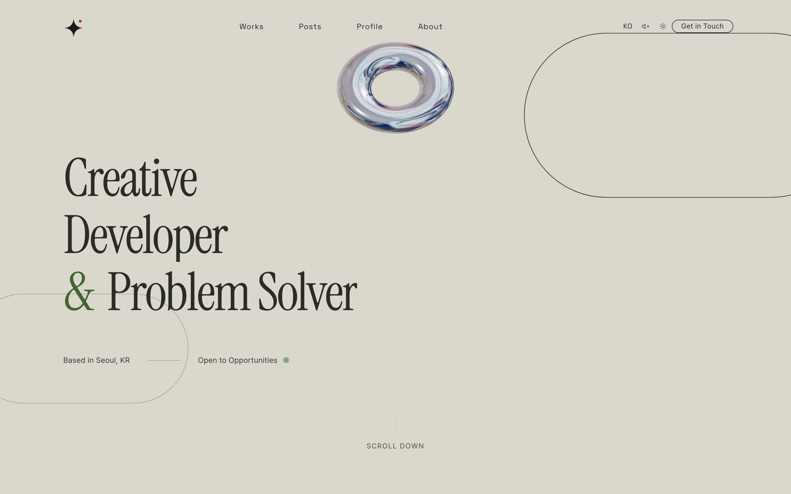
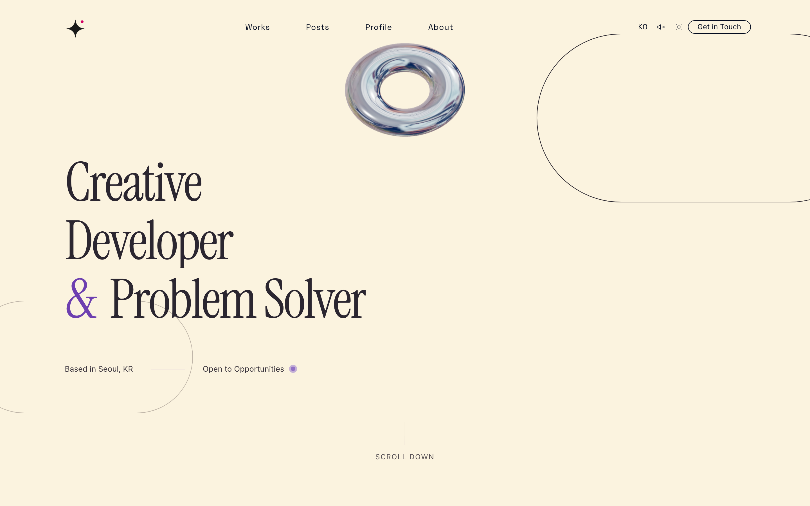
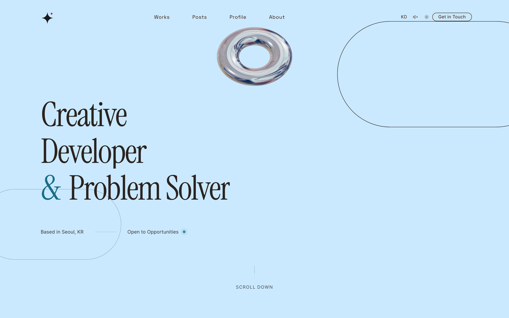

<div align="center">

English | **[한국어](./README.md)**

# HYEONIVERSE

A personal portfolio built with Next.js 16, React 19 and TypeScript.
One repository holds both the public site that shows the work and the admin studio where that work is written and edited.

[](./LICENSE)
[](https://nextjs.org)
[](https://react.dev)
[](https://typescriptlang.org)
[](https://supabase.com)

**[www.hyeoniverse.com →](https://www.hyeoniverse.com)**

<br />


</div>

---

## Preview

### Home — dark / light

| Dark | Light |
|:---:|:---:|
|  |  |

Scrolling past the hero walks through the works and then the posts.


### Works

Six layouts, switchable with the `?layout=` query or from the admin settings — Flow (default) · Grid · Cylinder · Fullscreen · Cinematic · Split.

| Flow | Grid | Cylinder |
|:---:|:---:|:---:|
|  |  |  |

<details>
<summary><strong>Remaining layouts and the detail page</strong></summary>

<br />

| Fullscreen | Cinematic | Split |
|:---:|:---:|:---:|
|  |  |  |


</details>

### Posts

| List | Detail |
|:---:|:---:|
|  |  |

### Profile · About

| Profile (Three.js) | About |
|:---:|:---:|
|  |  |

### Editor · Design system

The editor is built on Plate.js. The top toolbar is grouped by what each tool acts on, and the bar that floats over a selection applies text and background colors on the spot.

| Editor | Color tools |
|:---:|:---:|
|  |  |

Tokens and components are inspected live at `/design-system`.

| Design system | Mobile |
|:---:|:---:|
|  |  |

### Admin · CMS

> These images come from `npx tsx scripts/screenshots-cms.ts` (needs a logged-in session — see [scripts/SCREENSHOTS.md](./scripts/SCREENSHOTS.md)). Continuous actions are also saved as `.webm` (and `.gif` when ffmpeg is installed) under the same names.

#### Narrated gallery

Each slide of a work's gallery can carry **narration and captions**. Playback prefers a prepared audio file (TTS or a recording), falls back to reading the script with browser speech, and otherwise waits four seconds before advancing. Captions are cut from the script by character ratio to follow the audio. If the browser blocks sound, the gallery first asks "with voice / without voice".


In the admin work editor, the **gallery narration editor** takes a script per slide, a voice, and generates audio. Long scripts are chunked at about 600 characters and merged; if the chosen provider fails, the server moves down the fallback order from Settings (Fish Audio → Google Cloud TTS → Edge) with a voice of the same gender. During preview the script fills in **like lyrics**, character by character, and clicking a word seeks to it.

| Script · voice · generate | Preview — lyric highlight |
|:---:|:---:|
|  |  |

The **pronunciation lexicon** pairs script text with what should be spoken, e.g. `?all=true → "all true condition"`. It applies only when generating audio, longest match first; captions keep the original text. Korean and English scripts have separate dictionaries, and an inline `[text|reading]` in the script wins over the lexicon.

The **recording editor** records from the microphone, then lets you drag a range on the waveform and split, cut, paste, or trim silence to shape clips. Clips can be reordered by dragging and pasted into another slide. Finishing uploads a WAV as that slide's audio (up to six minutes).

| Lexicon | Recording editor — range selected, clips split |
|:---:|:---:|
|  |  |

**Drop a PPTX onto the gallery** and each slide is rendered in the browser to a JPEG (max 1600px) and uploaded; each slide's **speaker notes become its script**. PDFs go through the same path.

| Converting — "rendering n/N" | Done — a slide whose notes became the script |
|:---:|:---:|
|  |  |

#### Auto-translation and AI summary

Flip the editor's KO/EN switch to **EN** and, when the source has content and every target field is empty, title, excerpt, body and gallery scripts are filled in one pass. The result arrives under a "machine-translated, please review" banner and any field can be retranslated. **Settings › Services** sets, per feature (translation · summary · TTS · AI cover), a primary provider and an ordered fallback list; a provider that keeps failing is paused by the health panel.

| Editor — EN filled by translation | Settings › Services — providers and fallback order |
|:---:|:---:|
|  |  |

On the public site, a **translation banner** appears when the viewed language has no body, and one button fetches an AI translation in place. The **AI summary** box above a post shows the summary generated at publish time and can be collapsed.

| Translation banner | AI summary |
|:---:|:---:|
|  |  |

#### Theme

**Settings › Appearance › Theme colors** sets five colors: the accent plus light/dark background and text. The 17 presets (Default · Ruby · Meadow · Coral · Azure · Sand · Harvest · Honey · Forest · Rosewood · Dusk · Arctic · Baltic · Sorbet · Twilight · Tropica · Petal) keep their accents at least ΔE 20 apart, and picking one updates the **WCAG contrast report** for body text, muted text, accent links and button text in both modes. When the accent is used as text, the site shifts only its lightness to reach 4.5:1.

| Presets | Contrast report |
|:---:|:---:|
|  |  |

**Color suggestions** come from the color wheel (analogous · complementary · split · triadic · monochrome) or from an image, whose six dominant colors become candidates. The image is read locally and never uploaded.

| Color wheel | From an image |
|:---:|:---:|
|  |  |

The same home page under three presets.

| Forest | Twilight | Arctic |
|:---:|:---:|:---:|
|  |  |  |

#### Linking posts and works · SEO check

Works link related posts and series; posts link related projects, all through a searchable picker with drag-sortable chips that show up in the public detail header. The **SEO check** pill at the editor's bottom right counts six items (title · slug · excerpt of 30+ chars · cover · category · tags); clicking an item scrolls to that field and flashes it.

| Relation picker | SEO check |
|:---:|:---:|
|  |  |

---

## At a Glance

| Area | Highlights |
|:---|:---|
| **Interaction** | Infinite scroll loop, mouse parallax, StaggerText, a Three.js coffee cup, direction-aware scroll cascade |
| **Works** | Six layouts (Flow · Fullscreen · Cinematic · Grid · Split · Cylinder) and detail pages |
| **Posts** | SSR + ISR, series, banner slider, six list layouts, guest comments (markdown + emoji reactions) or giscus |
| **Admin** | Plate.js editor (diagram · code playground · math blocks, color tools, publish toggle), `.md` sync, AI translation and summaries, narrated galleries (TTS · recording · PPTX speaker notes), theme presets with WCAG contrast report, revision history, member invites and roles |
| **Performance** | Lighthouse 98 — LCP 1.9s, 449KB initial bundle |
| **Security** | RLS with four roles, CSRF origin checks (fail-closed in production), five-attempt lockout plus new-device email approval |
| **Design system** | Three-tier tokens (Raw → Semantic → Component) with role tokens, all colors in OKLCH |

---

## Tech Stack

| Category | Technology |
|:---|:---|
| Framework | Next.js 16 (App Router, Turbopack) · React 19 · TypeScript 5 |
| Styling | CSS Modules + CSS variables in three tiers, enforced by stylelint |
| Animation | Framer Motion · GSAP · Lenis |
| 3D | Three.js · React Three Fiber · Drei |
| Backend | Supabase (PostgreSQL · Auth · Storage · RLS) |
| Editor | Plate.js (Slate) + Markdown · React Flow · Sandpack · CodeMirror 6 · KaTeX |
| Comments | Built-in (marked + isomorphic-dompurify) or giscus — switchable from the admin |
| Integrations | Unsplash · Pexels (cover images), DeepL · OpenAI and others (translation), Resend (mail), NanoBanana · Hugging Face (AI images) |
| Testing | Vitest + Testing Library · Playwright smoke suite |

---

## Getting Started

```bash
npm install
cp .env.example .env.local   # fill in the Supabase URL and keys
npm run dev                  # http://localhost:3000
```

Posts, works and the admin need a Supabase project. Table SQL, storage buckets, creating the admin account and the optional keys for cover images and translation are laid out in order in **[docs/supabase-setup.en.md](./docs/en/supabase-setup.md)**.

Commands used often:

```bash
npm run build          # production build
npm test               # unit tests (Vitest)
npm run test:smoke     # smoke e2e (needs a build)
npm run audit:full     # typecheck + eslint + stylelint + knip
npm run sync-all       # sync content/*.md with the database
```

---

## Documentation

| Document | Contents |
|:---|:---|
| [Features](./docs/en/features.md) | Every feature by screen — interaction, works, posts, admin, performance, security |
| [Supabase setup](./docs/en/supabase-setup.md) | Environment variables, tables, storage, admin account, cover images |
| [Deployment](./docs/en/deploy.md) | Vercel, domains, mail, post-deploy checks |
| [Testing](./docs/en/testing.md) | Vitest suites, smoke e2e, preparing the admin session |
| [Design system](./docs/design-system.md) | Three token tiers, per-axis rules with enforcement status, `@layer` and migration plan (token values in the [generated table](./docs/tokens.md)) |
| [Troubleshooting](./docs/en/troubleshooting.md) | What broke, why, and how it was fixed |
| [Components](./docs/en/components.md) · [DB design](./docs/en/db-design.md) · [Security](./docs/en/security.md) · [User flow](./docs/en/user-flow.md) | Area deep dives |
| [Editor guide](./docs/en/editor-guide.md) | Editor usage and `.md` authoring rules |
| [Refactoring guide](./docs/refactoring-guide.md) · [Performance baseline](./docs/perf-baseline.md) | Structural cleanup notes and the performance baseline |

---

## Project Structure

```
src/
├─ app/           # App Router — (home) · works · posts · about · profile · admin · api
├─ components/    # per-screen components plus shared ui/
├─ styles/        # tokens/ (raw) · globals/ (semantic · component)
├─ providers/     # theme · language · scroll
├─ lib/ hooks/ stores/ utils/
└─ locales/       # Korean · English
content/          # .md sources (posts · works · about), synced with the database
docs/             # documentation
e2e/ scripts/     # smoke tests · sync and screenshot scripts
supabase/         # migration SQL
```

---

## Commit Convention

Follows [Conventional Commits](https://www.conventionalcommits.org/en/v1.0.0/). The type list and examples live in **[docs/commit-convention.md](./docs/commit-convention.md)**.

---

<div align="center">

## License

[PolyForm Noncommercial License 1.0.0](./LICENSE)

Free to use, modify and distribute, but **not for commercial use**.

</div>
