<div align="center">

**[English](./README.en.md)** | 한국어

# HYEONIVERSE

Next.js 16 · React 19 · TypeScript 로 만든 개인 포트폴리오입니다.
작업물과 글을 보여주는 공개 화면부터, 그 글을 직접 쓰고 고치는 관리자 화면까지 한 저장소에 들어 있습니다.

[](./LICENSE)
[](https://nextjs.org)
[](https://react.dev)
[](https://typescriptlang.org)
[](https://supabase.com)

**[www.hyeoniverse.com →](https://www.hyeoniverse.com)**

<br />


</div>

---

## 미리보기

### 홈 — 다크 / 라이트

| 다크 | 라이트 |
|:---:|:---:|
|  |  |

홈 아래쪽은 작업물과 글을 차례로 스크롤로 훑는 구성입니다.

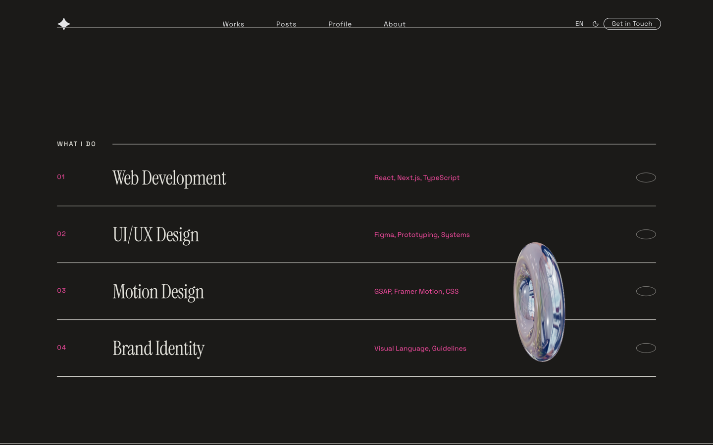

### 작업물

`?layout=` 쿼리나 관리자 설정으로 여섯 가지 레이아웃을 바꿔 끼웁니다 — Flow(기본) · Grid · Cylinder · Fullscreen · Cinematic · Split.

| Flow | Grid | Cylinder |
|:---:|:---:|:---:|
| 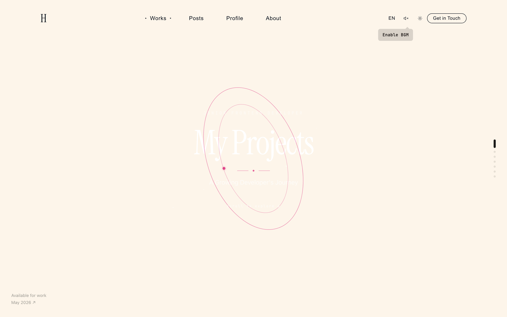 |  | 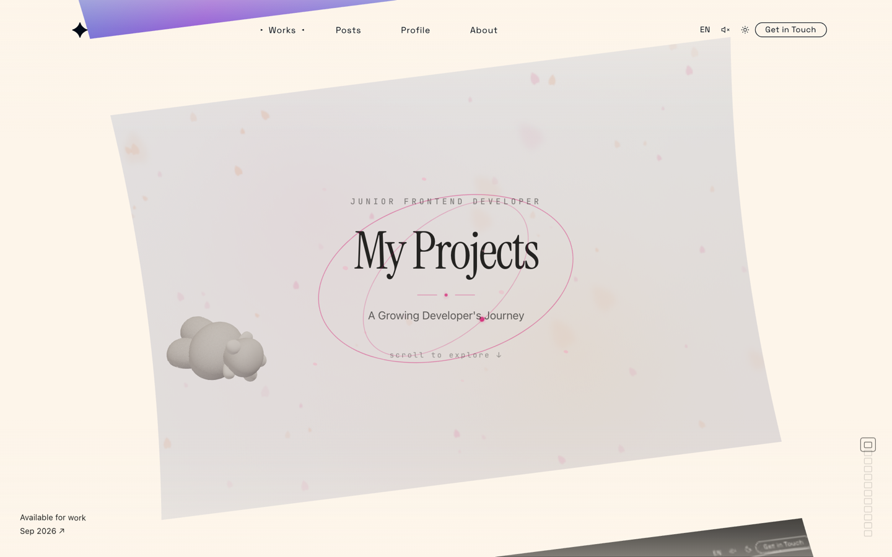 |

<details>
<summary><strong>나머지 레이아웃과 상세 화면</strong></summary>

<br />

| Fullscreen | Cinematic | Split |
|:---:|:---:|:---:|
|  | 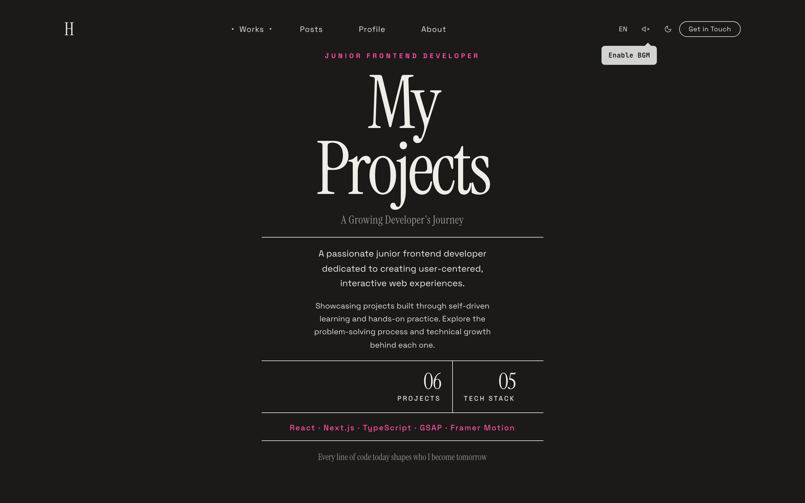 | 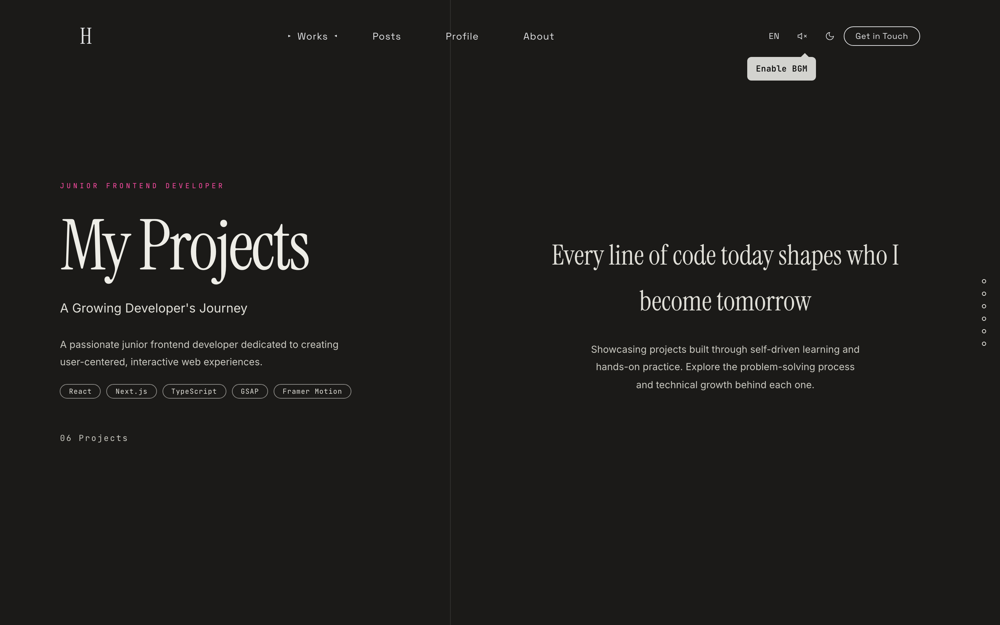 |

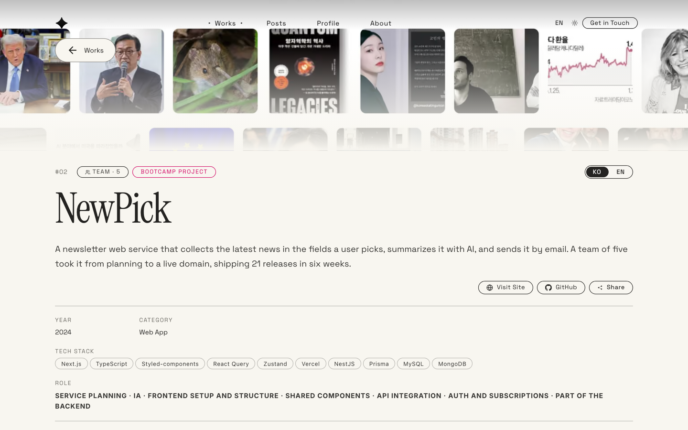

</details>

### 글

| 목록 | 상세 |
|:---:|:---:|
| 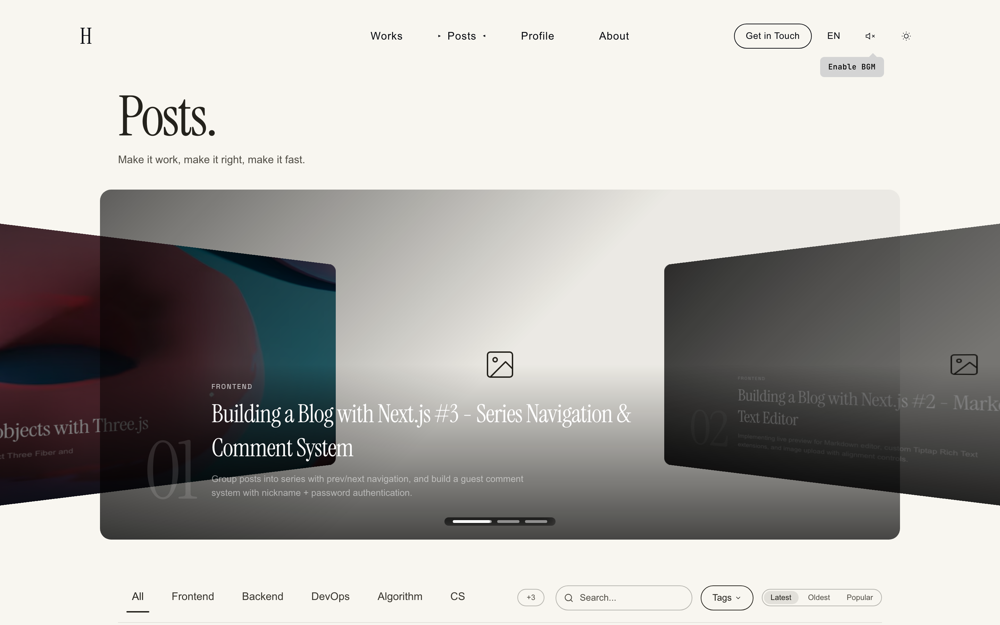 | 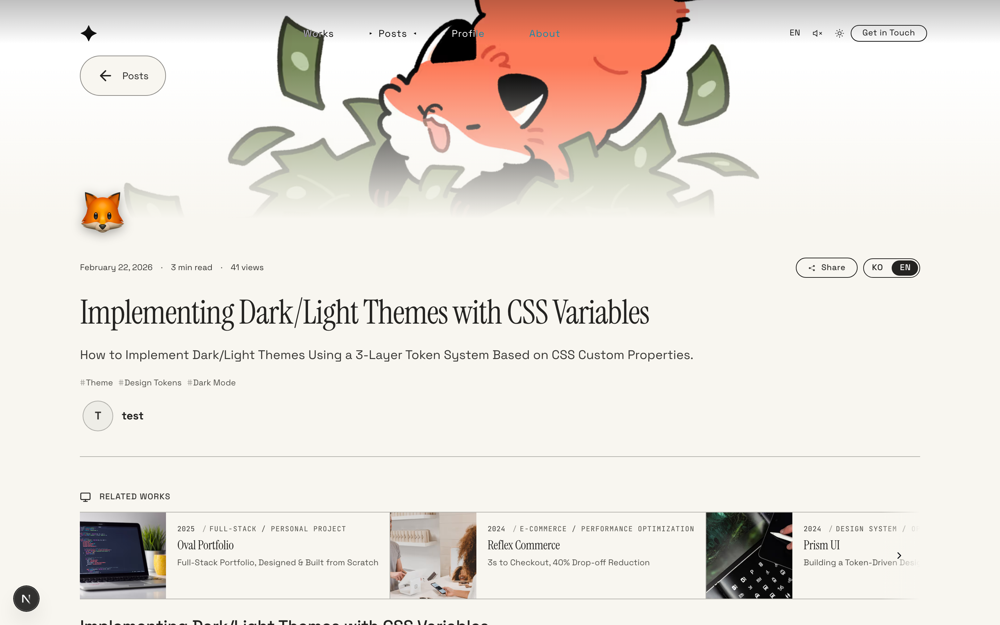 |

### 프로필 · 소개

| 프로필 (Three.js) | 소개 |
|:---:|:---:|
| 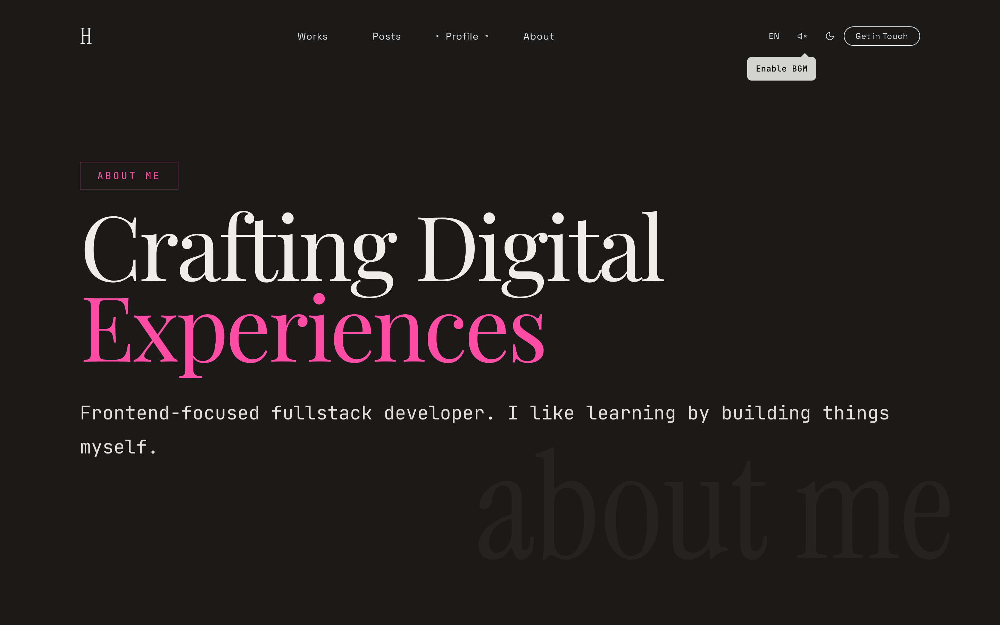 | 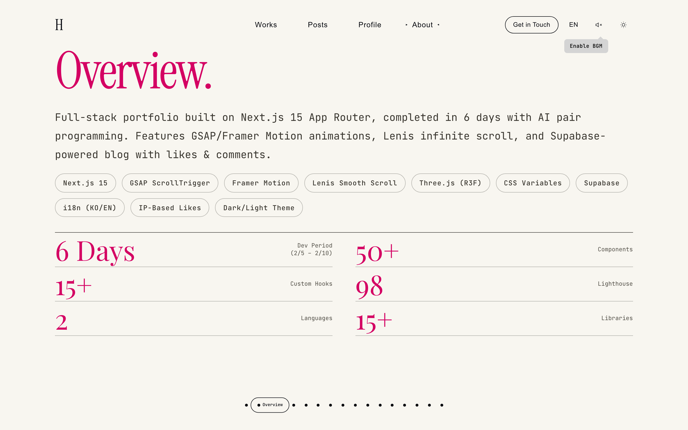 |

### 편집기 · 디자인 시스템

Plate.js 로 만든 편집기입니다. 위 툴바는 작용 범위별로 묶여 있고, 글을 선택하면 떠오르는 바에서 글자색·배경색을 바로 입힙니다.

| 편집기 | 색 도구 |
|:---:|:---:|
| 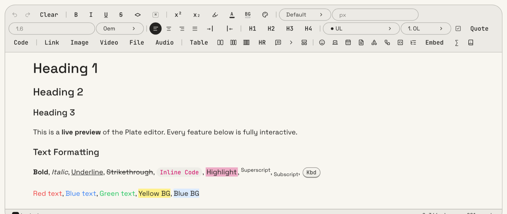 | 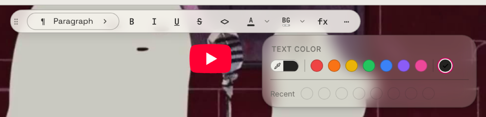 |

토큰과 컴포넌트는 `/design-system` 화면에서 바로 확인합니다.

| 디자인 시스템 | 모바일 |
|:---:|:---:|
|  |  |

---

## 한눈에 보기

| 영역 | 핵심 |
|:---|:---|
| **인터랙션** | 무한 스크롤 루프, 마우스 패럴랙스, StaggerText, Three.js 3D 커피잔, 방향별 Scroll Cascade |
| **작업물** | 여섯 가지 레이아웃(Flow · Fullscreen · Cinematic · Grid · Split · Cylinder), 상세 페이지 |
| **글** | SSR + ISR, 시리즈, 배너 슬라이더, 여섯 가지 목록 레이아웃, 게스트 댓글(마크다운 + 이모지 반응) 또는 giscus |
| **관리자** | Plate.js 편집기(다이어그램 · 코드 플레이그라운드 · 수식 블록, 색 도구, 발행 상태 전환), `.md` 동기화, AI 번역·요약, 리비전 히스토리, 멤버 초대와 역할 |
| **성능** | Lighthouse 98 — LCP 1.9s, 초기 번들 449KB |
| **보안** | RLS 4단계 권한, CSRF Origin 체크(운영은 fail-closed), 로그인 5회 실패 잠금 + 새 기기 메일 승인 |
| **디자인 시스템** | 3층 토큰(Raw → Semantic → Component) + 역할 토큰, 전체 색 OKLCH |

---

## 기술 스택

| 분류 | 사용 |
|:---|:---|
| 프레임워크 | Next.js 16 (App Router, Turbopack) · React 19 · TypeScript 5 |
| 스타일 | CSS Modules + CSS 변수 3층 토큰 · stylelint 규칙으로 집행 |
| 애니메이션 | Framer Motion · GSAP · Lenis |
| 3D | Three.js · React Three Fiber · Drei |
| 백엔드 | Supabase (PostgreSQL · Auth · Storage · RLS) |
| 편집기 | Plate.js (Slate) + Markdown · React Flow · Sandpack · CodeMirror 6 · KaTeX |
| 댓글 | 자체 구현(marked + isomorphic-dompurify) 또는 giscus — 관리자에서 전환 |
| 외부 연동 | Unsplash · Pexels (커버 이미지), DeepL · OpenAI 등 (번역), Resend (메일), NanoBanana · Hugging Face (AI 이미지) |
| 테스트 | Vitest + Testing Library · Playwright 스모크 |

---

## 빠른 시작

```bash
npm install
cp .env.example .env.local   # Supabase URL·키 채우기
npm run dev                  # http://localhost:3000
```

Supabase 프로젝트가 있어야 글·작업물·관리자가 돕니다. 테이블 생성 SQL, Storage 버킷, 관리자 계정 만들기, 커버 이미지·번역 같은 선택 키까지 **[docs/supabase-setup.md](./docs/supabase-setup.md)** 에 순서대로 정리해 두었습니다.

자주 쓰는 명령:

```bash
npm run build          # 프로덕션 빌드
npm test               # 단위 테스트 (Vitest)
npm run test:smoke     # 스모크 e2e (빌드 산출물 필요)
npm run audit:full     # typecheck + eslint + stylelint + knip
npm run sync-all       # content/*.md ↔ DB 동기화
```

---

## 문서

| 문서 | 내용 |
|:---|:---|
| [기능](./docs/features.md) | 화면별 기능 전체 — 인터랙션, 작업물, 글, 관리자, 성능, 보안 |
| [Supabase 세팅](./docs/supabase-setup.md) | 환경변수, 테이블, Storage, 관리자 계정, 커버 이미지 |
| [배포](./docs/deploy.md) | Vercel, 도메인, 메일, 배포 후 점검 |
| [테스트](./docs/testing.md) | Vitest 목록, 스모크 e2e, admin 세션 준비 |
| [디자인 시스템](./docs/design-system.md) | 토큰 3층, 규칙 R1~R7, 네이밍과 특이도 |
| [트러블슈팅](./docs/troubleshooting.md) | 막혔던 지점과 원인·해결 기록 |
| [컴포넌트](./docs/components.md) · [DB 설계](./docs/db-design.md) · [보안](./docs/security.md) · [사용자 흐름](./docs/user-flow.md) | 영역별 상세 |
| [편집기 가이드](./docs/editor-guide.md) · [글](./docs/md-posts-guide.md) · [작업물](./docs/md-works-guide.md) · [소개](./docs/md-about-guide.md) | 편집기 사용법과 `.md` 작성 규칙 |
| [리팩토링 가이드](./docs/refactoring-guide.md) · [성능 baseline](./docs/perf-baseline.md) | 구조 정리 기록과 성능 기준선 |

---

## 프로젝트 구조

```
src/
├─ app/           # App Router — (home) · works · posts · about · profile · admin · api
├─ components/    # 화면별 컴포넌트 + ui/ 공통 컴포넌트
├─ styles/        # tokens/ (Raw) · globals/ (Semantic · Component)
├─ providers/     # 테마 · 언어 · 스크롤
├─ lib/ hooks/ stores/ utils/
└─ locales/       # 한국어 · 영어
content/          # .md 원본 (posts · works · about) — sync 스크립트로 DB 왕복
docs/             # 문서
e2e/ scripts/     # 스모크 테스트 · 동기화와 스크린샷 스크립트
supabase/         # 마이그레이션 SQL
```

---

## 커밋 컨벤션

[Conventional Commits](https://www.conventionalcommits.org/ko/v1.0.0/) 를 따릅니다. 타입 목록과 예시는 **[docs/commit-convention.md](./docs/commit-convention.md)** 에 있습니다.

---

<div align="center">

## 라이선스

[PolyForm Noncommercial License 1.0.0](./LICENSE)

자유롭게 사용·수정·배포할 수 있으나, **상업적 이용은 불가**합니다.

</div>
