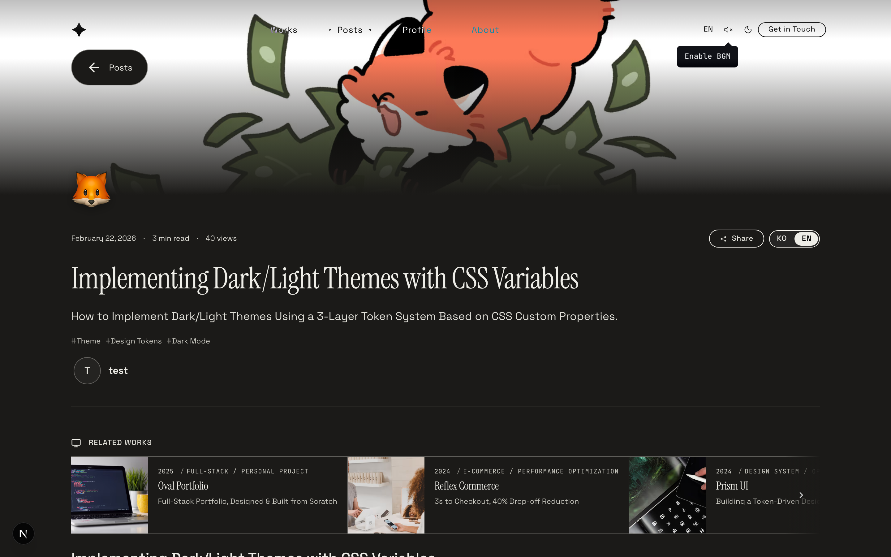
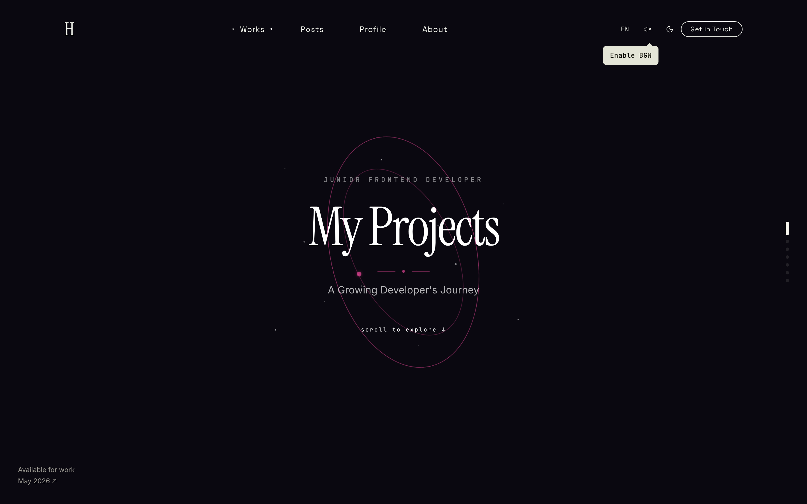
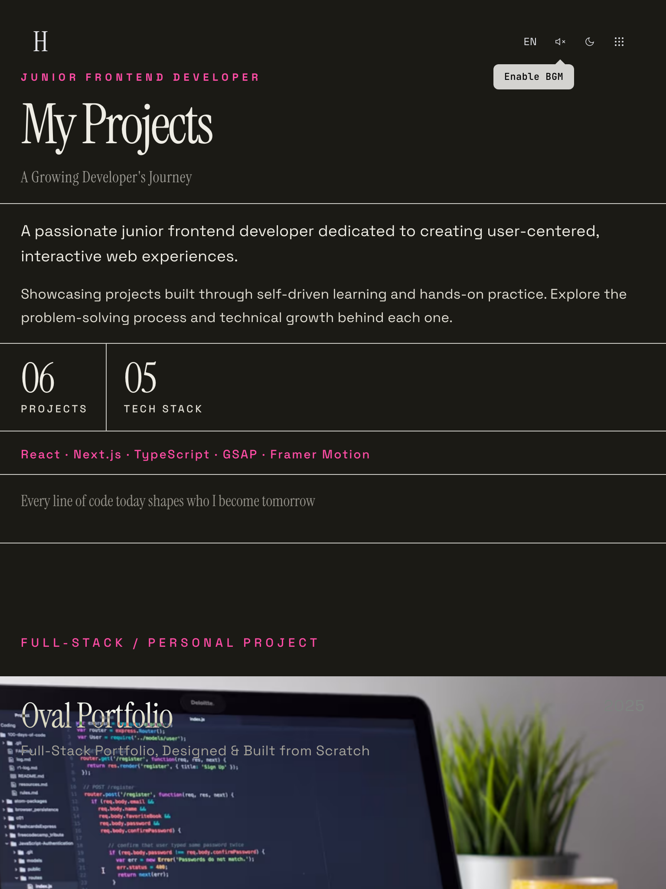
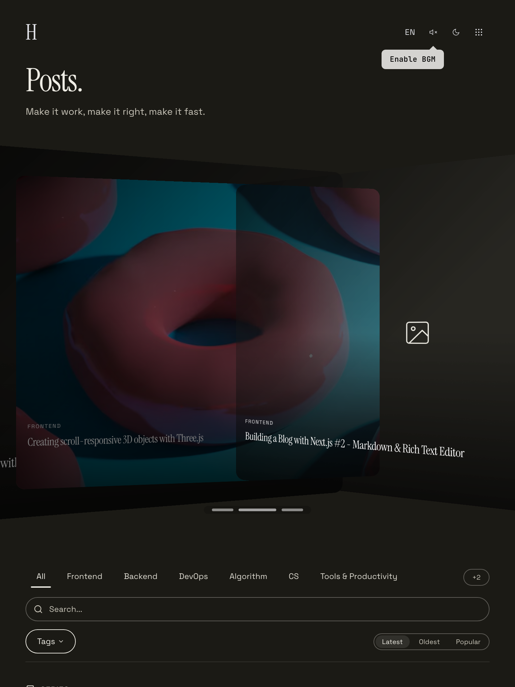
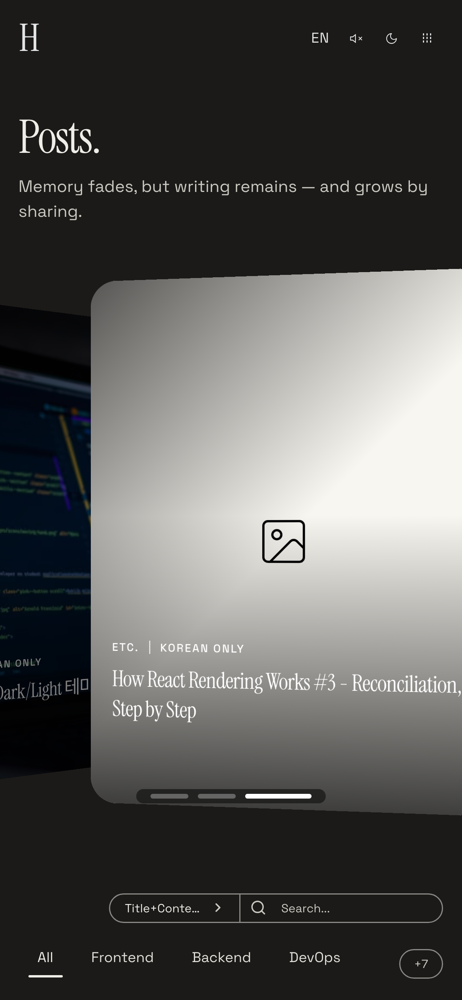

<div align="center">

**[English](./README.en.md)** | 한국어

# Arc — Where Growth Takes Shape

개인 포트폴리오 웹사이트입니다. Next.js 16, React 19, TypeScript로 구축되었으며, GSAP, Framer Motion, Lenis를 활용한 인터랙티브 애니메이션이 특징입니다.

[](./LICENSE)
[](https://nextjs.org)
[](https://react.dev)
[](https://typescriptlang.org)
[](https://supabase.com)

**[Live Demo →](https://your-domain.vercel.app)** _(배포 후 URL 교체 예정)_

<br />


</div>

---

## 미리보기

### 다크 / 라이트 테마

| Dark | Light |
|:---:|:---:|
|  |  |
|  |  |
|  |  |

<details>
<summary><strong>더 보기 — Profile / About / Work Detail / Post Detail / Design System</strong></summary>

| Dark | Light |
|:---:|:---:|
|  |  |
|  |  |
|  |  |
|  |  |
|  |  |

</details>

### Works — 6종 레이아웃

`?layout=` 쿼리 (또는 Admin 설정) 으로 전환 — Flow (기본) · Fullscreen · Cinematic · Grid · Split · Cylinder

| Flow | Fullscreen | Cinematic |
|:---:|:---:|:---:|
|  |  |  |

| Grid | Split | Cylinder |
|:---:|:---:|:---:|
|  |  |  |

### 반응형 — PC / Tablet / Mobile

| PC (1440px) | Tablet (768px) | Mobile (390px) |
|:---:|:---:|:---:|
|  |  |  |
|  |  |  |
|  |  |  |

---

## 한눈에 보기

| 영역 | 핵심 |
|:---|:---|
| **인터랙션** | 무한 스크롤 루프, 마우스 패럴랙스, StaggerText, Three.js 3D 커피잔 + 라떼아트, 방향별 Scroll Cascade |
| **Works** | 6종 레이아웃 (Flow · Fullscreen · Cinematic · Grid · Split · Cylinder) |
| **Blog** | SSR + ISR, 시리즈, 배너 슬라이더, 게스트 댓글 (비번 단일 인증) |
| **Admin** | Plate.js 에디터, `.md` 동기화 + 내보내기, AI 번역/요약, 리비전 히스토리 |
| **성능** | Lighthouse 98 — LCP 1.9s, 449KB (-70%), atomic 카운터 + AbortController + bulk Promise.all |
| **보안** | RLS + service-role gate, PostgREST `.or()` injection escape, view IP·date dedup, CSRF Origin 체크 (production fail-closed), middleware admin 다층 가드, 5회 실패 잠금 + 새 기기 이메일 승인 + 전기기 로그아웃 |
| **디자인 시스템** | 4-tier 토큰 (Raw → Semantic → Component → Context) + 라이브 프리뷰, **전체 색 토큰 OKLCH 전환** (culori 정확 변환, hue 무관 균일한 지각 밝기) |

---

## 기술 스택

| Category | Technology |
|:---|:---|
| Framework |  (App Router, Turbopack) |
| Language |  |
| UI |  |
| Styling |  + CSS Variables |
| Animation |    |
| 3D |    |
| Typography | Instrument Serif, Space Grotesk, JetBrains Mono (관리자 설정에서 카테고리별 30+ 프리셋 + Google Fonts 직접 입력 지원) |
| Backend |  (PostgreSQL, Auth, Storage) |
| Editor |  (Slate 기반 WYSIWYG) + Markdown |
| AI Image | NanoBanana / Hugging Face (우선순위 기반 fallback chain) |

## 주요 기능

### Animation & Interaction

- **Infinite Scroll Loop**: Lenis smooth scroll + Bridge Section 기반 무한 순환 스크롤 — **default OFF** opt-in 패턴. 기존엔 모든 페이지가 mount 시 `setInfinite(false)` / unmount 시 `(true)` 로 되돌리는 opt-out 방식이라 페이지 간 navigation 도중 잠깐 무한 스크롤이 켜져 의도치 않은 점프가 일어났음. HomeClient 만 mount 시 `setInfinite(true)` 호출하도록 반전 — 그 외 모든 라우트는 기본값 false 로 안전
- **Mouse Parallax**: Framer Motion useSpring/useTransform 기반 마우스 반응형 패럴랙스
- **Scroll-Triggered Animations**: GSAP ScrollTrigger를 활용한 스크롤 기반 등장 애니메이션
- **Scroll Velocity Parallax**: Lenis velocity 기반 스크롤 속도 연동 이미지 패럴랙스 (Works 이미지 160% buffer로 원 밖으로 새지 않도록 보정)
- **Directional Scroll Cascade**: Services 항목이 스크롤 방향별로 cascade — 위로 스크롤 시 item0, 아래로 스크롤 시 item3가 leader, velocity 기반 overlap 축소 + 상·하단 border hard stop
- **Hero Oval Spread**: 위쪽 원 그룹은 위로 누적 스크롤 거리, 아래쪽 원 그룹은 아래로 누적 스크롤에 비례해 벌어짐 (방향별 독립 spread)
- **StaggerText**: 호버 시 글자별 순차 외곽선 애니메이션, mouseEnter 시점의 실제 글자 색을 JS로 캡처해 stroke 색을 동적으로 동기화
- **CTA 3D Coffee**: Three.js(R3F) 기반 세라믹 커피잔 — LatheGeometry 둥근 프로파일, 마우스 추적 회전, Canvas 2D로 그린 parametric heart 라떼아트(cream↔coffee wave + 엽맥 blur) + 갈색 halo + contact shadow disc
- **Glass Hover Buttons**: CTA 컨택트/이력서 버튼 hover 시 backdrop-filter blur로 뒷 커피 canvas가 유리창 너머처럼 흐려짐 (transform 기반 compositing 이슈를 marginTop 엔트런스로 해결)
- **3D Scroll Torus**: Three.js(R3F) 기반 3D 메탈릭 토러스 — 리사주 곡선 경로 회전, 테마별 머티리얼, 모바일 터치 반발 인터랙션

<p align="center">
  
  
</p>

### Works Gallery

- **6종 레이아웃**: Admin 설정 또는 `?layout=` 쿼리 파라미터로 전환 — Flow(기본 가로 스크롤) · Fullscreen(배경 크로스페이드) · Cinematic(패럴랙스 시네마) · Grid(벤토 그리드) · Split(좌 메타 + 우 스크롤) · Cylinder(Three.js 3D 실린더)
- **레이아웃 UX 재설계**: 네 레이아웃을 영상 인트로 + 인터랙션 강화로 통일. **Fullscreen** — 비디오 배경 + 4코너 라이브 HUD(LOC/TIME/WORKS/STACK, 시계 + FPS) + 스크롤-driven 타이틀 morph(CSS `animation-timeline: view()`) + DOM duplication 기반 seamless infinite wrap. **Split** — 비디오를 풀스크린 배경으로 fixed, 우측 panel 만 `backdrop-filter: blur(40px)` 로 frosted glass, 텍스트는 화이트 + 강조부(카테고리 라벨, 번호 워터마크, 큰따옴표)는 accent. **Grid** — 기존 디자인 폐기, About Key Features 의 `DynamicFrameLayout` 을 bento 베이스로 재사용 (100vw·100vh, gap 0). 인트로 셀 + 프로젝트 셀 1~6개를 12×12 그리드에 빈공간 없이 채우는 adaptive position. hover 전 title+subtitle / hover 시 desc+tech 노출, `mix-blend-mode: difference` + `clamp()` 폰트 + 이미지 hover blur + dimmed gradient. **Cylinder** — 3D 메시 자체가 클릭 영역(R3F `onClick`), 메시 hover 시 `data-more` 토글로 CursorTrail "More" 커서 표시, intro 텍스처는 `--bg-primary` 와 매칭(`getComputedStyle` chain resolve)
- **DynamicFrameLayout — bento span 지원**: `defaultPos.w/h` 값을 `gridColumn/Row: span N` 으로 변환해 12-grid 위에서 임의 크기 셀 배치 가능. About 페이지 Key Features 와 Works Grid 가 같은 컴포넌트 공유
- **인트로 영상 외부 호스팅**: `siteConfig.works.introVideoUrl` 에 외부 CDN URL 지정 (Fullscreen / Split / Grid 공통). 빈 값이면 로컬 `/public/intro-bg.mp4` fallback — GitHub 100MB 제한 회피 위해 로컬 파일은 `.gitignore`
- **Flow 레이아웃**: GSAP 기반 가로 스크롤 갤러리 — 양방향 무한 래핑, 마우스 3D tilt, 이미지 hover 확대, 메타데이터 reveal 시차
- **Cylinder 레이아웃**: Three.js 세로 원통 회전 + HTML 오버레이, 우주 테마 인트로 + 바운싱 버니 캐릭터
- **Cylinder 반응형**: 뷰포트 크기에 따라 카메라 자동 후퇴, 태블릿 이하에서 기울기(tilt) 비활성, 스크롤 기반 제목 slide-in reveal (CSS variable `--reveal` + clip-path 마스크)
- **Cylinder 메타 분리**: mix-blend-mode: difference는 제목·카테고리만 적용, 설명·상세(연도/역할/기술 marquee)·CTA는 별도 overlay로 분리해 항상 흰색 텍스트 유지
- **Floating Comments**: 인트로 슬롯에 최신 작품 댓글이 RAF 물리 기반으로 떠다님, 클릭 시 해당 작품으로 전환 효과와 함께 이동
- **Breakpoint Guard**: Cylinder 레이아웃은 리사이즈 시 리로드 없이 실시간 대응, 나머지 레이아웃은 breakpoint 전환 시 자동 remount

<p align="center">
  
  
</p>

### Blog System

- **Posts (Blog)**: Supabase 기반 블로그 시스템 — SSR + ISR 캐싱, Markdown/Rich Text 전환 에디터, 검색/태그 필터, 조회수 추적, GitHub 링크
- **시리즈(Series)**: 포스트를 시리즈로 묶어 순서대로 발행 — `/series` 별도 페이지 폐지 후 `/posts` 안으로 통합, 카테고리 필터 후 타임라인(스텝 번호 + 세로 connector) 형태로 노출, 상세 페이지 이전/다음 네비게이션
- **Series Deck Cards**: 가로 스크롤 row — 카드를 hover 하면 0.8s 후 deck 형태로 펼쳐지며 소속 글 4개의 미리보기 layer가 0.4s 간격 stagger로 순차 등장 (transform 기반 stack offset, JS state 기반 timer 로 CSS transition-delay snap 회피), 펼침 상태에서 우측으로 next 카드를 밀어내고 `::after` pseudo 로 hit-area 확장해 flicker 없이 hover 유지. **deck 가 가로 스크롤 컨테이너 우측 밖으로 넘치면 rAF 루프로 매 프레임 `scrollLeft` 직접 증가** — 카드 `margin-right` 가 transition 으로 점차 늘어나면서 `scrollWidth` 도 함께 커지므로 단발 `scrollBy` 는 시작 시점 `maxScrollLeft` 에 즉시 clamp 되어 부족함. auto-scroll 종료 후 `card.matches(":hover")` 한번 더 확인해 cursor 가 떠나 있으면 deck 닫음(스크롤로 카드가 cursor 밑에서 빠져나간 false-positive mouseleave 방지)
- **Series Auto Cover**: cover/소속 글 cover 둘 다 없는 시리즈는 SSR 시점에 Unsplash 에서 자동으로 cover 1장 fetch → `series.auto_cover_url` 컬럼에 영구 캐시 (다음 요청부터 외부 호출 0회)
- **Posts 배너 슬라이더**: 피닝된 포스트를 배너로 표시 — 4가지 레이아웃 x 4가지 오버레이 x 2가지 전환 모드, Admin에서 선택. 좌·우 화살표 버튼에 `data-cursor="prev"` / `"next"` 부여 → CursorTrail 의 `CursorType` 에 `next` / `prev` variant 추가해 hover 시 "Prev" / "Next" 라벨 커스텀 커서로 표시
- **Posts 필터 바**: 카테고리 접기/펼치기(+N more), hover indicator(layoutId), sticky + 스크롤 방향 감지, 콘텐츠 blur 효과 — sticky 진입 anchor 시점은 IntersectionObserver `rootMargin` 을 컴포넌트의 실제 sticky `top` 값으로 동기화해 인기글 등 사이드 위젯과 1px 도 안 어긋나게 보정
- **Posts Bento Masonry**: 3/4/6 column CSS Grid + `grid-auto-rows: 1px` + JS 가 각 카드 `scrollHeight` 측정 후 `grid-row: span N` 적용 → 진정한 masonry. wide / banner(21:9) / square(1:1) / portrait(3:4) / standard 5종 variant 가 `grid-auto-flow: dense` 로 빈틈 없이 packing. 모바일은 변형 비활성화 + 16:10 통일. **PC(4·6col) 빈공간 최소화 템플릿 재배열** — banner(21:9, 가장 짧음)는 사이클 앞쪽에 두어 이후 standard 들이 dense backfill 가능, wide(2col 16:10)와 portrait(1col 3:4)는 height 가 비슷해 같은 row 매칭, standard 비중 확대(5/cycle) + square 1개로 축소해 평균 height 변주 줄여 packing 안정화
- **PopularPosts/RecentComments hover 효과**: 사이드 위젯 항목 hover 시 `translateX(var(--spacing-2xs))` 로 부드럽게 들여쓰기 — compound selector `(0,2,0)` 로 글로벌 theme transition `(0,1,1)` 우회 (transform 은 글로벌 규칙에 없어 일반 선택자로는 덮어쓸 수 없음)
- **Posts Sort Capsule**: 최신순(↑/↓) · 인기순(↑/↓) · 제목순(↑/↓) 3-way capsule + 별도 Shuffle(랜덤) 버튼. 방향 화살표는 transform: rotate 로 트위닝, hover indicator(Framer Motion `layoutId`) + 화살표 줄바꿈 방지(`white-space: nowrap`). 랜덤 정렬은 mulberry32 시드 셔플로 페이지네이션 일관성 유지
- **Popular 정렬 sub-option**: 인기순 활성 시 그 옆에 별도 SegmentedControl(종합 / 조회 / 댓글 / 좋아요) 노출 — API 는 `sort=views|likes|comments` 분기(`comments` 는 댓글 join 후 서버 JS 정렬). HOT 배지 · admin 삭제 보호 · TTL 90일 대상은 `src/lib/popularity.ts` 의 `scoreOf({view, like, comments})` + `getPopularPostIds(limit=5)` 한 함수가 산정해 PostsClient · admin · trash 자동삭제 셋 모두 동일 기준
- **RandomPosts 사이드바 위젯**: 사이드바에 신규 추가 — `/api/posts?sort=random&seed=` + Shuffle 버튼(180° 회전 hover) 로 즉시 재추첨
- **TagCloud3D 라벨 + drag cursor**: 라벨에 Tags 아이콘 추가 + 회전 드래그 중 `data-cursor="grab"` 으로 CursorTrail 과 통합
- **Posts Tooltip-everywhere**: 모든 필터·정렬·태그·카테고리·SearchCapsule 트리거에 `<T>` 컴포넌트 + Tooltip(번역 + 설명) 적용 — long hover(600ms) 로 반대 언어 + 짧은 설명 동시 노출, 모바일은 터치 토글
- **SearchCapsule 공통 컴포넌트**: `components/admin/SearchCapsule` → `components/ui/SearchCapsule` 이동. `searchType` prop optional, padding 을 태그/정렬 캡슐 톤에 맞춰 슬림화 (`var(--spacing-2xs) var(--spacing-sm)`). PostsClient · `/admin/comments` 등 모든 인라인 검색 input 을 일괄 교체
- **Seeded Color Generator (OKLCH)**: `src/utils/seededColor.ts` — FNV-1a 해시 + **12 hue 앵커**(orange/amber/yellow/lime/green/teal/cyan/sky/blue/purple/magenta/pink, 모두 brand accent hue 0–30° 배제) × **5 tone 프리셋**(vivid / pastel / muted / deep / soft) = **60가지 결정적 OKLCH 조합**. 같은 seed 는 항상 같은 색, 인접 카드는 anchor + tone 둘 다 cycle 되어 시각적 분리 보장. **HSL → OKLCH 로 전환** — 동일 lightness 가 hue 와 무관하게 동일한 지각 밝기를 보장해 어떤 hue 든 균일한 톤. 각 anchor 마다 `safeChroma` 를 정의해 sRGB gamut clipping 회피. 옵션 `tone` 으로 페이지 단위 톤 통일 가능(예: SeriesCard 가 페이지 안의 카드들 톤을 같이 통일하면서 hue 만 랜덤)
- **PostCard 메타 i18n**: 날짜는 `language === "ko" ? ko-KR : en-US` 로 locale-aware 포맷, min read / views / likes 는 번역 키 사용, Eye/Heart 아이콘 + 0 도 항상 표시, `metaGroup` span 으로 그룹별 줄바꿈 단위 통일
- **PostCard 메타 wrap 시 separator 자동 숨김**: 좁은 카드에서 metaGroup 이 두 줄로 wrap 되면 줄 첫머리 항목의 `::before` separator(`·`) 가 어색하게 떠 있던 문제 — `useLayoutEffect` 로 각 metaGroup 의 `offsetTop` 을 첫 그룹과 비교해 wrap 된 그룹에 `data-meta-wrapped` 부여, CSS 가 해당 그룹의 `::before` 를 숨김. ResizeObserver 로 카드 폭 변화에도 재계산
- **IP 기반 좋아요**: Posts/Works/댓글에서 단일 `likes` 테이블 + `target_type` 구분, IP 기반 UNIQUE 제약으로 중복 방지, 연타 방지(ref lock + busy disabled), formatCount(1k/1.2m) 숫자 축약
- **댓글 시스템**: 게스트 대댓글(threaded) 지원 — 이중 인증(commenter_hash + bcrypt), 닉네임 셔플, 이메일 답글 알림, 관리자 댓글, 관리자 tombstone 2회 삭제로 완전 제거, 닉네임 보존 tombstone
- **첫 댓글 축하**: 첫 댓글 등록 시 confetti 효과 + 카드 플립 축하 메시지 (sparkle 별 장식 + accent 라인), 관리자 댓글 전체 선택 / 드래그 선택 / tombstone 일괄 완전 삭제
- **댓글 신고**: 댓글마다 신고 버튼 + 사유 입력 모달, 신고 즉시 `/admin/notifications` 의 "신고" 탭에 누적 — 관리자에서 resolve / dismiss / 완전 삭제 인라인 처리
- **Posts 태그 스위트**: ① **TagCloud3D** — Posts 사이드바 3D 회전 워드 클라우드, 피보나치 구면 분포 + rAF 루프에서 DOM transform 을 직접 갱신해 React 리렌더 0회, hover 시 자동 회전 정지 / drag 로 수동 회전, 클릭 시 `/posts/tags/[tag]` 이동 (`setPointerCapture` 는 자식 Link click 을 흡수해 제거하고 document-level pointer listener 로 drag-after-threshold click 차단). ② `/posts/tags` 인덱스 — 전체 태그 그리드 + 무한 스크롤 + 검색 + admin 전용 태그 설정 바로가기. ③ `/posts/tags/[tag]` 상세 — 서버사이드 fetch, Lenis `setInfinite(false)` 로 무한 스크롤 OFF, 상/하단 검색바(420px cap), 공통 `Pagination`, 라벨 hover 시 관련 태그 툴팁. ④ 공통 `TagPill` 컴포넌트 (`src/components/ui/TagPill.tsx`) 로 통일
- **Posts 그리드 fluid 컬럼**: bento masonry 가 고정 3/4/6 col → `auto-fit minmax(220px, 1fr)` 기반 fluid 로 전환. viewport 폭에 따라 컬럼 개수가 자연스럽게 변하면서 카드 폭이 220~300px 범위에 머무름 — wide/banner 처럼 2col span 카드도 절대 폭이 안정. 모바일은 명시적 2-col(`grid-template-columns: 1fr 1fr`) 로 분기해 너무 잘게 쪼개지지 않게 가드
- **Posts skeleton vs dim hybrid loading**: 초기 페이지 로드는 각 카드 variant(wide/banner/square/portrait/standard) 에 맞춰 height 가 정확히 매칭되는 skeleton 렌더 — 카드 mount 시점에 layout shift 없음. 페이지/필터/정렬 변경 등 이미 카드가 그려진 상태에서의 재요청은 기존 카드를 그대로 유지하면서 `opacity: 0.5 + pointer-events: none` 으로 dim 처리해 jump 방지. 상단에 indeterminate progress bar 추가해 "지금 로딩 중" 시그널 분리
- **Posts 태그 다중 선택**: `activeTag` (단일 문자열) → `activeTags` (Set<string>) 로 전환. 태그 칩 클릭 시 toggle add/remove, URL 도 `?tags=a,b,c` 로 직렬화. 필터 바에 "전체 태그 →" 링크(`/posts/tags`) 도 추가 — 사이드바 태그 클라우드 + 다중 선택 + 전체 인덱스 세 진입점 통합
- **Posts 태그 dropdown 검색 모델 전환**: 기존 \"40개씩 IntersectionObserver 페이지네이션\" 을 폐기하고 **공통 `SearchCapsule` 입력 + 70vh 캡 + 양방향 mask + wheel fallback** 으로 교체. 검색은 태그 이름뿐 아니라 **태그 description 까지 함께 매칭** 해서 \"Three.js\" 같은 키워드로도 관련 태그를 잡아냄. 스크롤 영역 위·아래에 `mask-image` linear-gradient 로 fade — \"더 있다\" 시그널을 자연스럽게 표현. dropdown 내부 wheel 이 위/아래 끝에 도달하면 페이지 스크롤로 fallback 안 됨 → 외부 페이지 스크롤로 빠지는 기존 quirks 해결. 무한 스크롤 제거로 hover-prefetch 같은 후속 인터랙션이 \"보이지 않는 태그\" 에 갇히지 않음
- **Posts 페이지 레이아웃 polish**: 모바일에서 검색창 100% 너비, select max-width 12자 (긴 카테고리/태그 이름이 가로로 폭주하지 않도록 `ch` 단위 cap), sort `SegmentedControl` + 검색 묶음을 윗줄에 단독 배치하고 filter / perPage 가 아래줄. perPage 는 오른쪽 끝으로 정렬 — admin 의 새 필터 바 패턴과 톤 통일
- **Posts 사이드바 Tags 위치 + 링크화**: 사이드바 위젯 순서에서 Tags(TagCloud3D) 를 최상단으로 이동. 위젯 label 자체를 `/posts/tags` 로 가는 `<Link>` 로 만들고 `ChevronRight` 화살표 아이콘 추가 — 클라우드 인터랙션 외에도 인덱스 페이지로 명시적 진입 가능
- **`/posts/tags` 전면 개편 — tag cloud + index hybrid**: ① **정렬 SegmentedControl** (인기순 / 제목순) — 인기는 글 수 desc, 제목은 한글 → 영문 → # 순. ② **알파벳 인덱스** — 한글 초성 (쌍자음은 묶음 ㄱ←ㄱㄲ 등) + A-Z + 숫자/기호 `#`, 클릭 시 해당 그룹으로 즉시 필터. ③ **카운트 기반 폰트 크기** — 글 수에 따라 12~22px 선형 보간 (`fontSize = 12 + (count/maxCount) * 10`) 으로 진정한 tag cloud 시각화. ④ **인기 top 8 강조** — 가장 자주 쓰인 태그 8개는 light accent 배경으로 한 번 더 도드라지게. ⑤ **연관 태그 halo glow** — pill 위에 hover 시 같은 태그가 동시에 쓰인 post 들 (co-occurrence top 5) 의 pill 에도 accent 흐림이 동시에 들어와 \"이 태그랑 같이 쓰이는 다른 태그\" 가 한눈에 보임. ⑥ **터치 디바이스 — 바텀 시트** — `pointer:coarse` 면 hover 인터랙션 전부 끄고, pill 탭 시 바텀 시트가 슬라이드 업해 description + 연관 pill + \"이 태그의 글 보기\" CTA 노출 (ESC / backdrop / X 닫기, `body { overflow: hidden }` scroll lock). ⑦ 태그 관리 버튼 → 공통 `Button` 컴포넌트로 통일, 헤더 padding / margin 축소
- **`lib/posts.ts` `getAllTagsData` — co-occurrence 계산**: 모든 post 의 tags 배열을 순회하며 **pair-frequency 맵** 을 작성, 각 태그마다 같이 등장한 빈도가 가장 높은 5개를 `related[]` 로 반환. `/posts/tags` 페이지가 SSR 시점에 한 번만 계산해 client 로 내려보내 — hover 마다 다시 계산 없음. 데이터 모델: `{ name, count, description, related: [{ name, count }] }`
- **`/posts/series`, `/posts/categories` 인덱스 페이지 신규 — tags 패턴으로 통일**: 기존 `/posts/tags` 의 패턴(정렬 SegmentedControl + 검색 + featured top 3 + 카드 그리드 + 모바일 바텀 시트)을 series · categories 에도 동일하게 적용. ① **`getAllSeriesData` / `getAllCategoriesData`** (`lib/posts.ts`) SSR 시점에 글 수 · 카테고리 · 첫 글 cover 까지 계산해 한 번에 내려보냄. ② 관리자 로그인 중이면 상단에 admin 이동 버튼 노출. ③ 검색은 시리즈 제목/설명, 카테고리 이름 매칭. ④ 모바일 바텀 시트 — pill 탭 시 description + CTA 슬라이드 업
- **SeriesCard — deck navigation + tilt + 화살표 long-press**: ① **deck 클릭 → 해당 글로 page transition** — preview cover_image 또는 자동 생성 색(layerBg) 을 morph 시드로 전달, image 없어도 솔리드 색이 hero 위치로 morph. cover thumb/label 클릭은 기존대로 시리즈 필터. ② **active 시리즈 tilt 효과** — 선택된 시리즈 thumb 가 `rotate(-2.5deg)` 로 살짝 기울어져 강조 (기존 glow 대비 가벼움). ③ **시리즈 row 양쪽 화살표 + long-press 가속 스크롤** — 누르고 있는 시간만큼 RAF 루프로 `scrollLeft` 증가 속도가 가속. hit-area 를 위/아래 세로 전체 + 좌/우 마스크 영역까지 확장, hover 시 `data-cursor="prev"/"next"` 커스텀 커서. ④ **시리즈 전용 검색창** — 기본 닫힘 → 클릭 시 펼침 morph (notify-capsule 패턴), 검색 옵션(제목/내용/제목+내용) 토글. ⑤ **활성 시리즈 메타 패널** — 선택 시 헤더 라인에 시리즈 description + post 수 + X clear 버튼 표시. ⑥ **`getInitialPostsData` post_count 계산** — 기존엔 SSR 시점에 시리즈에 `post_count` 가 누락되어 deck 자체가 안 보이던 버그를 수정 (`previewPosts` 동일 쿼리 결과를 reduce 1줄로 카운트)
- **SegmentedControl — nested/inline sub variant 통합**: 기존엔 main sort buttons 와 popular sub menu 가 inline JSX 로 분리 구현되어 있던 걸 단일 컴포넌트로. `SegmentedControlItem<T, S>` 에 `subItems?` 추가 + `subVariant: "nested" | "inline"` prop. ① **nested** (default) — selected main 에 sub 가 있으면 다른 main items 접고 [back chevron + active main label (Button variant=primary) + vertical divider + sub SegmentedControl] 렌더, outer `motion.div + layout` 으로 main↔nested 전환 시 spring morph. ② **inline** — main + chevron + sub 같은 row. active main label click 시 `onBack` 호출 → toggle. PostsClient 의 popular 그룹이 이 패턴 적용해 inline JSX 약 70줄 제거
- **HorizontalCarousel 공통 컴포넌트**: 가로 캐러셀 동작 — overflow-x scroll + scroll-snap + scrollbar hidden + ResizeObserver 로 `scrollWidth > clientWidth` 측정 → `data-scrollable` attribute 노출. ① **좌우 mask** linear-gradient fade — 끝 도달 여부에 따라 opacity 분기. ② **arrow 버튼** (Button variant=difference, mix-blend-mode 로 배경 무관 가독성) — 220ms 누르고 있으면 raf 루프로 가속 스크롤 (long-press scroll). ③ **mouse drag scroll** pointerdown/move/up + setPointerCapture, drag 4px 넘으면 click capture 단계에서 preventDefault (카드 navigation 충돌 방지). ④ **wheel 수직 → 가로 redirect** + 양 끝 도달 시 페이지 native scroll 패스스루 (Windows 마우스 휠 친화). ⑤ **drag 중 `data-cursor="grab"`** 동적 attribute → CursorTrail 가 "Drag" label 표시. relatedSection / 시리즈 row 모두 이걸로 교체
- **Button — `difference` variant**: `mix-blend-mode: difference` + hover 시 `backdrop-filter: blur(8px)` 추가. transparent + border-none. carousel arrow / image overlay 등 contrast 가변 영역에서 자동 가독성. button branch 의 rest props pass-through 도 같이 추가 (link branch 만 spread 하던 비대칭 수정 → `data-cursor` 등 attribute 전달 가능)
- **좋아요 button — water wave fill 애니메이션**: lucide `<Heart>` 를 inline SVG (`<defs><clipPath id={useId}>` Heart path + `<g clipPath>` 안 3 layer rect — back / mid / front) 로 교체. ① **차오름 (Rise)** — 6 단계 keyframes (0% 100% 80% 60% 40% 20%) polygon 각 step 에서 surface y 가 위로 + control points peak/valley phase 토글 → 출렁이며 점진적 상승. 끝 frame 은 `.likeBtnActive` stable d 와 동일해 jump 없음. ② **출렁임 (Wave)** — rise 끝 frame 과 from 동일한 alternate keyframes 가 영구 oscillate. 3 layer 가 서로 다른 duration (2.4s / 2s / 1.7s) + opacity (0.45 / 0.7 / 0.95) 로 depth. ③ **가라앉음 (Drain)** — 좋아요 취소 시 반대 방향. ④ `useLikeToggle` 의 busy state 를 DetailLayout 에서 wrap 해서 **최소 2초 보장** (DB 응답이 빨라도 animation 끝까지 재생). ⑤ `useLikeToggle` 자체는 `inFlightRef` 차단 제거 + `AbortController` 로 **Optimistic UI (last-write-wins)** — 빠른 toggle 가능, button disabled 안 함 (SNS 표준 패턴)
- **`posts.series_order` 자동 정합화 trigger**: admin reorder 외 글 삭제/시리즈 이동 시점에 `series_order` 가 비연속/중복/1부터 안 시작하던 경계 케이스를 DB 단에서 강제. ① `normalize_series_order(p_series_id)` RPC — 해당 series 의 post 들을 `series_order ASC, created_at ASC, id ASC` sort 후 0-based sequential 재할당 (변경 있는 row 만 UPDATE). ② `AFTER INSERT OR UPDATE OF series_id, series_order OR DELETE ON posts` trigger 가 NEW/OLD 양쪽 series 정합화. ③ `pg_trigger_depth() > 1` 시 skip 으로 재귀 trigger 발동 차단 (normalize 안의 UPDATE 가 같은 trigger 재실행해도 0 row → 종료). ④ 표시는 `series_order ?? idx` 대신 `idx + 1` 사용 (API 가 ASC sort 보장하므로 idx 가 곧 표시 순서). migration 파일에 기존 데이터 일회성 normalize 포함
- **API likes/views 정렬 stable tie-break**: 동률 `like_count` / `view_count` 인 post 들이 매 응답마다 DB 의 unspecified order 로 다른 순서로 정렬되어 페이지 1, 2 사이 동일 카드 중복 표시 + 깜빡임 발생. `.order("created_at", { ascending: false })` secondary sort 추가로 stable. PostsClient 의 `fetchPosts` 에 `AbortController` 도 추가 — 빠른 sort 메트릭 변경 시 이전 응답이 새 데이터 덮어쓰는 race condition 차단
- **Next.js Image aspect ratio warning 광범위 해결**: 한 차원 (width / height) 만 CSS override 시 다른 차원이 attribute 값 그대로 → aspect ratio 깨진다는 warning 이 여러 페이지에서 발생. `src/styles/globals/_base.css` 의 `img, picture` 에 `height: auto` 추가 — Next Image 의 width/height attribute 가 size hint 만 주고 CSS 가 한쪽 변경해도 다른 쪽 자동 비율 유지. 사용처별 개별 수정 없이 근본 해결
- **전체 페이지 title 통일 — root template + Hyeoniverse fallback + admin 별도**: root layout 의 siteName 에 `|| "Hyeoniverse"` fallback + template `${siteName} | %s`. 디테일/시리즈/태그 페이지의 `title.absolute` 제거 (root template 위임). admin (auth)/(preview)/(dashboard) 모두 `Admin | %s` template. `posts/layout.tsx` 의 metadata 가 child segment 의 root template inheritance 를 깨뜨려 제거하고 `posts/page.tsx` 로 이동. home page 는 title 필드 제거 (root default 가 처리, "Hyeoniverse | Hyeoniverse" 중복 방지)
- **카드 layout 일관성 정리 — recommendedItem / AdjacentNav / relatedCard**: 디테일 페이지의 함께 읽어보면 좋은 게시물 + 이전글/다음글 + 관련 시리즈 글 카드들이 height / thumb / body 가 미묘하게 달라 시각 일관성 부족 → 동일 floor (height 100 또는 124px, 16:9 또는 1:1 thumb), body 의 `align-items: center` 통일. recommendedItem 의 mobile-only grid layout (title + category 우측 vertical-center + excerpt) 을 PC 도 적용 (`min-height: 2lh` 로 1줄/2줄 모두 시작 지점 동일). relatedCard 는 가로 캐러셀 (HorizontalCarousel 사용) + cards border 구분 + minimal library tone (mono 메타 + serif title + " / " separator). image stretch + 1:1 cyclic dependency 회피 위해 card height 명시
- **postsLabel / seriesLabel — sectionHeader 통합**: 게시물 헤더와 시리즈 헤더의 동일 layout 을 `sectionHeader / sectionHeaderMain / sectionHeaderTitle / sectionHeaderText / sectionHeaderTitleLink / sectionHeaderChevron` 공통 클래스로 통합. 두 헤더 모두 sectionHeaderMain (icon + text + secondary controls) + sortWrap (정렬 SegmentedControl) 구조. mobile 에서 sectionHeaderMain width 100% → sortWrap 만 자연스럽게 다음 줄
- **페이지 트랜지션 morph 재설계 — image / color / placeholder 통합**: ① `navigateWithTransition(href, image, rect, color?)` 4번째 인자 추가 — image 없을 때 morph 블록의 background. color 도 없으면 `--bg-tertiary` placeholder 로 fallback. ② **morph 단계 중 backdrop opacity 1 → 0 fade** — 끝나는 시점에 morph 블록만 hero 위치에 떠있고, 그 아래로 destination 의 loading.tsx skeleton 이 자연 노출. 사용자 시점에 "이미 다음 페이지로 들어와 있다" 는 인상. ③ **`/posts/[slug]/loading.tsx` 를 실제 PostDetailClient 와 1:1 구조 매칭** — `.hero` + `.headerSection > .articleHeader` + `.contentRow > .content` 까지 정렬. metaRow + title + excerpt + tags + headerDivider + AISummary placeholder + 단락 + code/image placeholder. morph fade 후 real page 로 swap 시 layout 점프 0. ④ **`/posts/loading.tsx` 제거** — Next.js 가 자식 segment 코드 미컴파일 시 부모 fallback (9 카드 그리드 스켈레톤) 을 잠시 노출하던 문제 차단. `/posts/page.tsx` 에 `<Suspense fallback={null}>` 인라인 wrapper 로 `useSearchParams()` prerender 대응. ⑤ **isTransitioning gating** — PostDetailClient 의 4개 `motion.div` (articleHeader / seriesBox / prose / commentSection) 가 마운트 시점에 `initial.opacity` 가 0 → fade-in delay 동안 morph fade 직후 빈 영역 노출되던 문제를 `initial={isTransitioning ? opacity:1 : opacity:0}` 로 해결. DetailLayout 의 hero 가 쓰던 패턴과 동일. ⑥ **타이밍** — EXPAND 380ms / MORPH 260ms / FADE 170ms (총 ~810ms). ⑦ **prefetch on hover** — BannerSlide / TickerBanner / CardsBanner / SplitBanner 가 `<div onClick>` 패턴이라 Link 자동 prefetch 가 없음. hover/focus 시 `router.prefetch(/posts/${slug})` 수동 호출 (Set 으로 중복 차단). SplitBanner 는 한 번에 1 슬라이드만 보여 현재 슬라이드 useEffect 로 자동 prefetch

<p align="center">
  
  
</p>

### Works Detail & Project Pages

- **Works Admin CRUD**: Supabase DB 기반 작업물 관리 — 단일 에디터(MD/Rich Text) + 8섹션 템플릿, TOC 자동 생성, 한/영 이중언어, 갤러리/팀멤버. **다중 카테고리** (`categories_ko/en text[]` + GIN index, `?category=foo → categories @> ARRAY['foo']`), **nature** (제작 동기 — 토이/사이드/실무/학습/클론), **slug 기반 라우팅** (`/works/[slug]`, JS · SQL 양쪽 `generateSlug` / `_sql_slugify` 동기), **역할별 작업 내용** (`contributions_ko/en jsonb` — `{ "Frontend": ["페이지 구현"] }`), **기술별 메모** (`tech_notes jsonb` — `{ "React": "왜 / 어떻게" }`), 팀멤버 **GitHub/SNS 자동 아바타 추론** (`avatar_url > github.com/{user}.png > unavatar.io > favicon`)
- **Work Detail**: 프로젝트 상세 페이지 — `/works/[slug]` 라우팅, 콘텐츠 내 `##` 헤딩 파싱 TOC, 갤러리 이미지, 좋아요/댓글, GitHub 링크 버튼, DB 미연결 시 정적 데이터 fallback

<p align="center">
  
  
</p>

### Navigation & UX

- **Mix-Blend Navigation**: mix-blend-mode: difference 자동 반전 네비게이션 — 이미지 로고(숏/풀/다크 전용), 글리치 효과 Admin 제어. **메뉴는 좌측 로고와 우측 actions 사이 남는 공간의 가운데로 자동 정렬**(`flex: 1; justify-content: center`)되어 어떤 viewport 너비에서도 actions 와 겹치지 않음. **active link 의 sliding indicator** 는 일반 hover/이동 시 부드러운 transition, **창 너비 resize 중에는 `transition: none` 인라인으로 즉시 snap** 되어 메뉴 위치를 1프레임 단위로 따라감(120ms 디바운스 후 transition 복원)
- **Tooltip & Translation Tooltip**: 범용 Tooltip + 번역 `<T>` 컴포넌트 — long hover(600ms)로 반대 언어 표시, createPortal 기반, 모바일 터치 토글
- **Footer Sliding Indicator**: Navigation과 동일한 슬라이딩 인디케이터 — hover 시 화살표 이동, ResizeObserver + fonts.ready 정확도
- **Banner (default / cylinder)**: 공통 Banner (구 Carousel rename) — default(CSS opacity) / cylinder(3D perspective) 모드, autoPlay/loop/dots/arrows
- **About 가로 스크롤**: `useHorizontalScroll` 훅으로 GSAP 기반 가로 스크롤(데스크톱), 모바일 자동 세로 스택
- **About 모바일 IDE 패널**: 모바일/태블릿 Troubleshooting 패널을 VSCode 스타일 IDE 로 — 가로 스크롤 탭바 + line-numbered 에디터 + breadcrumb + status bar. 탭 전환은 (a) edge 도달 후 release & 재스크롤 (b) 손 안 떼고 누적 push (c) 가로 swipe 세 가지로 발화, fling 으로 edge 에 닿기만 한 케이스는 300ms grace 동안 흡수 → 의도치 않은 cascade 차단. 탭바 마우스 드래그 시 5px 임계 넘으면 cursor 가 `grab` 으로 전환되어 "Drag" 라벨로 시각화. 추천 항목은 별표 + recommendReason 한 줄 (왜 추천하는지 면접자 1인칭) 노출
- **About 핀스크롤 throttle**: `useMobilePinScroll` 의 onUpdate 가 progress 차이를 ±1 step 으로 잘라 200ms throttle — 강한 fling 으로 progress 가 한 번에 여러 칸 점프해도 한 윈도우당 1탭만 전환, 패널 통과는 그대로 허용
- **Page Transition**: 모든 detail 페이지 이동 시 이미지 확대→hero 위치 모핑→그라데이션 페이드 전환 효과 (PageTransitionProvider, root layout 레벨에서 페이지 간 유지)
- **PostCard hover prefetch**: 카드에 마우스가 올라가는 순간 `router.prefetch(href)` 호출(production-only) — 클릭 시점엔 chunk + 데이터 모두 캐시 → 즉시 mount. dev 에선 compile 미완료된 route 의 prefetch 가 "Failed to fetch RSC payload" + hard reload fallback 을 유발해 의도적으로 skip
- **LoadingScreen 세션 영속**: 초기 로딩 완료 플래그를 `sessionStorage` 에 저장 — dev 모드에서 RSC payload fetch 실패로 hard reload fallback 이 일어나도 같은 세션 안에선 LoadingScreen 이 다시 풀로 노출되지 않음. sessionStorage 읽기는 `useEffect` 안에서만(모듈 로드 시 읽으면 server=false / client=true 로 hydration mismatch)
- **ImageViewer 방향 슬라이드**: 이전/다음 이동 시 반대 방향에서 slide-in (mode wait), 좌/우 영역 hover로 화살표 노출
- **Select 드롭다운 애니메이션**: portal 기반 드롭다운에서 mount 후 rAF 2회 대기로 CSS transition 보장 (compound selector로 글로벌 theme transition 우회). **외부 스크롤 시 dropdown 위치 재계산이 아니라 dropdown 자체를 닫음** — trigger 따라 이동해 산만해지는 걸 방지(내부 옵션 list overflow 스크롤은 유지). `Select.option` 에 `white-space: nowrap + overflow hidden + text-overflow ellipsis` — 옵션 한 줄 + 잘림. `SearchCapsule .selectWrap` + 자식 모두 `width: fit-content` 강제로 옵션 라벨 길이 적응
- **LanguageToggle 동적 측정**: EN 버튼 위치를 useLayoutEffect로 실측해 indicator 정확한 정렬
- **Navigation 폴리시**: 햄버거 점 9개를 `<span>` → SVG `<circle>` 로 교체(2~3px 에서 sub-pixel 렌더링 차이로 타원처럼 보이던 문제 해결). Space Grotesk 폰트 로딩을 `display: optional + preload: false` → `display: swap + preload: true` 로 변경 — optional 은 100ms 윈도우를 놓치면 fallback(시스템 sans) 이 영구 고착되어 늦게 열리는 메뉴 드로어에 적용. 로그아웃 버튼에 관리자 이메일 Tooltip, 드로어 open 시 알림 드롭다운 자동 닫힘, ActionBtn circle radius + 모바일 size md 유지(기존엔 모바일에서 sm 으로 축소되던 회귀 수정)
- **Tooltip 동적 max-width**: 콘텐츠 natural width 를 측정해(max-width 제거 후 재측정) 최대 720px / vw-16 까지 동적 적용 — 긴 텍스트가 세로로 쌓이지 않고 가로로 자연스럽게 퍼짐. z-index 도 인라인 `10001` → `var(--z-tooltip)` (700) 로 낮춰 drawer / modal overlay 가 Tooltip 위로 올라오도록 정정
- **Pagination 정비**: 버튼 size `button-h-sm → button-h-md`, font `xs → sm`, gap `xs → sm` 으로 통일 — 다른 컨트롤 톤과 동일하게
- **Checkbox 히트영역 정리**: wrapper padding+margin (히트영역 트릭) 제거 — 시각 레이아웃은 동일하지만(서로 상쇄됐던 값들) 더 이상 상위 row 높이를 부풀리지 않음

<p align="center">
  
  
</p>

### Admin & CMS

- **Admin Dashboard**: `/admin` 홈 — 누적 게시물 조회수, 좋아요, 방문자, 댓글 카운트 + 일별 조회 추세 차트(Recharts), 최근 활동 피드, 예약 발행 대기 목록
- **CRUD & 일괄 관리**: Posts/Works CRUD, 드래그 일괄 선택 + 발행/삭제, 시리즈 관리, 휴지통(soft delete + 복원)
- **휴지통 자동 영구삭제 + 인기글 보호**: posts/works `purge_after` 컬럼 + partial index(`deleted_at NOT NULL`) — soft delete 시 일반은 30일, **인기글(score top 5)** 은 90일 retention. `/api/cron/purge-trash` 가 매일 03:00 (vercel.json) 로 `purge_after < NOW()` hard delete. 휴지통 row 마다 "연장" 버튼 + 만료일 표시(`getTrashDaysLeft`), `/api/posts/[id]/extend-retention` · `/api/works/[id]/extend-retention` 가 +30일 연장. 본문 삭제 시점에 인기글이면 ModalConfirm 한 번 더 띄워 실수 방지
- **SegmentedControl (구 SortGroup) 범용화**: `src/components/ui/SortGroup.tsx` → `SegmentedControl.tsx` (`git mv`) — type (`SortItem` → `SegmentedControlItem`) · CSS 모듈 · 9개 사용처(PostsClient / TagPageClient / admin dashboard·posts·works·notifications·reports·settings) 일괄 마이그레이션. sort 외에 admin 탭 / filter / segmented 등 범용 사용처가 많아 iOS 표준 명칭으로 rename. `.btn` padding `box-sm → 2xs md`, font `2xs → xs` 로 Select / SearchCapsule 와 동일 높이
- **Admin posts/works 필터 통합**: sort `Select` → `SegmentedControl` 일괄 교체(main/series/trash 영역 모두), newest/oldest 두 옵션 → date 한 그룹 + dir 토글로 통합. `subFilterBar` / `subPageSize` / `subFilterSelect` / `subFilterSearch` 별도 클래스 제거 → main 의 `shell.filterBar` / `filterPageSize` / `filterItem` / `filterSearch` 재사용. `filterItem button` / `filterPageSize button` padding `0 → 2xs` + `border-color: var(--border-default-color)` → SearchCapsule 과 높이/색 통일
- **Admin works/posts 필터 바 — 2-row 재구성**: \"검색 + sort SegmentedControl\" 을 윗줄 단독으로 빼고, 아래줄에 filter 셀렉트들 + perPage 를 배치. perPage 는 항상 오른쪽 끝 (`margin-left: auto`) — 동선상 가장 \"앵커\" 같은 항목을 끝에 고정. 검색 input 은 데스크탑 280px 고정 너비, 모바일에서 100% width 로 분기 (`.search input { width: 280px; @media mobile: 100% }`). select max-width 는 12자 (`max-width: 12ch`) 로 cap — 긴 카테고리 / 태그 이름이 들어와도 셀렉트가 가로로 폭주하지 않음
- **AdminTable 액션 버튼 ghost 스타일**: `moveBtn` (Move dialog 트리거) / `exportIconBtn` (개별 .md 내보내기) 둘 다 기존엔 1px solid border 가 있어 행 안에서 \"버튼\" 으로 강하게 도드라졌음. border 를 제거하고 **옅은 색 (default `text-tertiary`) + hover 시 accent** 로 ghost 패턴 통일 — 행이 \"테이블 데이터 + 액션\" 이라는 시각적 위계를 회복. 두 컴포넌트가 같은 스타일을 공유하도록 `.ghostIconBtn` mixin 추출
- **Admin works 수동 정렬 — 인라인 편집 (`EditableRowNumber`)**: 기존엔 drag handle / Move dialog / 위치 input 세 가지로 정렬했는데, 가장 빠른 경로 — \"행 번호 자체를 클릭해서 새 위치 입력\" — 이 없었음. 행 번호 (`<td class=\"colNum\">`) 클릭 시 `<span>` 이 `<input type=\"number\">` 으로 swap, Enter / blur 시 저장, ESC 로 취소. 공통 컴포넌트 `src/components/admin/AdminTable/EditableRowNumber.tsx` 로 추출해 works 외에도 향후 재사용 가능. 기존 DnD + Move dialog 는 그대로 유지 — \"한 번에 큰 점프\" 가 필요할 때만 dialog, 일상적인 한 칸 / 두 칸 이동은 인라인 입력이 가장 빠름. 서버 PATCH 에선 전체 `sort_order` 를 dense `1..N` 으로 매번 renumber 해 누적 결함 (0 잔재 / 중복 / 빈자리) 도 같이 정리
- **공통 `Popover` + `RowActionsMenu` — MoveDialog 제거**: ① **`src/components/ui/Popover`** — anchor element 기준 position 계산 + portal 렌더 + 외부 클릭/ESC 자동 닫힘. `Menu` 서브셋 (`MenuItem` / `MenuDivider`) 로 드롭다운 표준화. 터치 디바이스(`pointer:coarse`) 에선 dropdown → bottom sheet 자동 분기. ② **`src/components/admin/AdminTable/RowActionsMenu`** — 케밥 트리거(`MoreVertical`) + inline expand 영역에 \"맨앞 / 맨뒤 / 특정 위치 input\" + 다운로드 / 수정 / 삭제 통합. 모달 매번 열렸다 닫히는 흐름 끊김 해소. ③ **`MoveDialog` 삭제** — RowActionsMenu 안으로 흡수. AdminTable / SubTable 의 row 액션 영역이 \"개별 아이콘 묶음\" → \"케밥 1개\" 로 시각적 노이즈 감소. admin/works · admin/posts (메인 + 휴지통) 모두 동일 컴포넌트로 통일
- **체크박스 컬럼 — drag 와 multi-select 분리**: row 전체가 `draggable` 이지만, 체크박스 컬럼 (`.colCheck`) 위에서 시작한 drag 는 \"reorder 의도\" 가 아니라 \"여러 row 선택\" 의도. `onDragStart` 에서 `e.target.closest('.colCheck')` 면 `e.preventDefault()` 로 reorder 를 캔슬, 이후 pointer 추적은 multi-select drag logic 으로 분기. 같은 row 의 다른 영역에서 시작하면 기존대로 reorder
- **CursorTrail — draggable 자손 button hover 보강**: 행 전체가 draggable 인 admin 테이블에서 작은 액션 버튼 (preview / edit / delete) 위에 마우스를 올려도 cursor 가 `grab` 으로 박혀 \"Click\" 라벨이 안 나타나던 문제. `runHitTest` 에 \"button 이 draggable 의 자손이면 button 의 click 이 이긴다\" 분기 추가 (`hitDraggable.contains(hitButton) → click`) — 사용자 mental model 인 \"가장 가까운 컨텍스트 우선\" 과 일치. 행 빈 공간에서는 여전히 grab
- **Pagination jump input**: `showJump?: boolean` prop (default true, totalPages ≤ 5 자동 숨김) — "Go to [n]" capsule input 추가, Enter/blur 시 onChange (clamp), 외부 page 변경 시 sync. number input spinner 는 Firefox + WebKit 모두 제거
- **예약 발행 + 휴지통 자동 영구삭제 (pg_cron)**: `scheduled_at` / `purge_after` 컬럼 + **Supabase pg_cron 직접 실행** (기존 Vercel cron 의존 제거). `publish_scheduled()` 가 매분, `purge_trash_scheduled()` 가 매일 UTC 18:00 (KST 03:00) 실행. **pg_net** 으로 Vault 의 `resend_api_key`/`admin_email`/`notify_from` secret 읽어 Resend API 호출 → 발행/삭제 건수를 `admin_notifications` insert + 이메일 발송. Vault 미등록 시 DB 작업은 정상, 이메일만 skip (fail-soft). DateTimePicker UI(날짜 + 시간 분리, 12h/24h 토글)
- **Posts ↔ Works 양방향 연결**: Notion Relation 스타일 — `post_work_relations` 다대다 테이블, 양쪽 어디서 추가하든 detail 페이지에 자동 노출, `RelationPicker` 검색·썸네일·발행 상태 표시
- **SEO 체크리스트**: 에디터 하단 위젯 — title/slug/excerpt(30자+)/cover/category/tags 6항목 점검, score 진행 바, 항목 클릭 시 해당 필드로 스크롤 + label accent 강조 (다음 인터랙션 전까지 유지)
- **`.md` 동기화**: `content/posts/` · `content/works/` 폴더 → DB 단방향 싱크 (Jekyll-style, `pnpm sync-all`)
- **`.md` 내보내기**: 전체/선택/개별/시리즈 단위로 frontmatter 포함 `.md` 다운로드
- **PlateEditor 요소별 floating toolbar 개편**: 노션식 인라인 편집 경험으로 재설계. ① **이미지 floating bar** — 레이아웃(Inline / Block / Float) · 정렬(block 좌·중·우, float 좌·우) · 캡션 · 교체 · 삭제(확인 팝오버) · ⋯(비율 잠금 / 크기 / 필터)을 한 줄 컴팩트 바로. W/H 입력은 공통 `NumberInput`(캡슐형, blur·Enter 확정 + 스텝퍼), 필터는 공통 `Select`. 캡션 줄바꿈 + 200자 제한(초과 시 toast), 리사이즈·이동 핸들 위치/깜빡임 정리, float 이미지는 인라인 void 클릭 선택을 capture 단계에서 처리. ② **노션식 `+` 버튼 + 블록 도구 popover** — 이동 핸들 왼쪽 `+` 클릭 시 빈 블록은 그 자리, 내용 있으면 아래(⌥/Alt+클릭=위)에 빈 블록 추가 후 슬래시 메뉴 오픈(취소 시 자동 제거). 이동 핸들 클릭 → 전환 / 복제 / 블록 링크 복사 / 글자색 / 삭제 popover. ③ **슬래시 메뉴 그룹화** — 기본 / 목록 / 미디어 / 고급 그룹 + lucide 아이콘 + 항목 확장(이미지·비디오·2·3단 컬럼·토글) + Lenis 호환 스크롤. ④ **리스트 단계별 자동 마커**(`•→◦→▪`, `1.→a.→i.`) + 첫 단계 들여쓰기 0, 빈 블록 문장형 placeholder, 다중 블록 드래그 시 텍스트 하이라이트 대신 블록 배경(float 이미지 영역은 `::before`/`::after` 로 분리). floating 포맷 바는 선택(드래그) 시에만 표시
- **Plate.js 에디터**: Markdown ↔ Rich Text 양방향 변환 (파일/오디오 첨부 포함), 커스텀 각주, 5종 템플릿, 에디터 전환 skeleton, 직접입력 font size/line height
- **works 표시 번호 (#01) — `sort_order` 단일 source**: 기존 `works.number text` 컬럼을 제거하고 표시 번호는 매퍼(`workToProject`) 시점에 `formatProjectNumber(sort_order)` 로 derive. number 와 sort_order 가 어긋날 가능성 자체를 차단. DB 마이그레이션(`ALTER TABLE works DROP COLUMN IF EXISTS number`) + setup.sql 동기화 + API ALLOWED_FIELDS 정리 + admin 리스트 표시까지 일괄 정리
- **WorkEditor 정비**: ① **연도 → PeriodPicker** — 단순 연도가 아닌 시작/종료/진행중 까지 표현, JSON 직렬화로 기존 단순 year 문자열과 back-compat. ② **역할 multi-select + 역할별 작업 내용** — combobox 캡슐 + chip (preset 10종 + 직접입력, IME composition Enter 가드), 선택된 각 역할 아래에 공통 `TagNotesEditor` (`contributions_ko/en jsonb` — role → KO/EN pair[]) 펼침, 항목별 drag-reorder + 체크박스 일괄 삭제 + 편집/취소 3-state 토글. ③ **기술 스택 + 기술별 메모** — Select combobox 에 100+ tech preset (`src/data/techIcons.tsx`, SimpleIcons + FontAwesome) + 한글 alias 검색 ("리액트" → React), 추가된 각 기술 아래에 공통 `TagNotesEditor` (`tech_notes jsonb` — tech → KO/EN pair[]) 펼침, multiLine 모드로 항목 여러 개 추가 가능. ④ **다중 카테고리** — `categories_ko/en text[]` 로 한 작품이 여러 형태 가질 수 있음 ("웹앱 + 라이브러리"), KO/EN inline 캡슐. ⑤ **nature** — 별도 축으로 제작 동기 single select (토이 / 사이드 / 실무 / 클론 / 학습). ⑥ **팀 멤버 add-card** — 아바타 (GitHub/SNS 자동 추론) + 이름/이메일/URL inline 편집 (더블클릭 → input, `field-sizing: content` 로 폭 자동), 한글/영문 이름은 공통 `BilingualInputPair` 로 KO/EN 동시 입력, 역할 select + 역할별 작업 내용 (멤버에도 동일 `TagNotesEditor` 적용). ⑦ **slug 입력 + 자동 생성** — title 변경 시 generateSlug 자동 채움 + 수동 override, SQL `_sql_slugify` 와 동일 로직 (마이그레이션 backfill 호환). ⑧ **정렬 순서 drag list** — 다른 작품들과 같은 list 에서 grip handle drag, 페이지네이션(5개씩) + 위치 input + 맨앞/맨뒤 jump, edge(60px) hover 시 `apply()` 로 인접 페이지 첫/끝 reorder 자체 수행해 source unmount 방지. ⑨ **capsule button group** — add input + add button 을 outer border + inner `border: none` 으로 캡슐 한 덩어리로 묶음 (Select dropdown portal 충돌 회피 위해 `overflow: hidden` 미사용)
- **PostEditor 태그별 설명 (`tag_notes`)**: 게시물 태그마다 KO/EN 설명을 붙일 수 있는 새 필드 — `posts.tag_notes jsonb` (`{ tag: { ko, en } }`). 공통 `TagNotesEditor` 로 works `tech_notes` 와 동일 UI 공유 (item drag-reorder · KO/EN bilingual notes · 편집/취소/삭제 3-state capsule). 태그 자체 chip 옆 grip 으로 표시 순서 변경, 설명은 inline 펼침/닫힘 + IME composition 안전 Enter 닫힘
- **공통 `BilingualInputPair` + `TagNotesEditor`**: ① `src/components/admin/BilingualInputPair` — KO/EN 배지가 인풋 좌측 안쪽에 박힌 bilingual input 쌍, 값 있을 때 X 클리어, IME composition 안전 onEnter, `data-cursor="text"`. ② `src/components/admin/TagNotesEditor` — 항목별 KO/EN 설명 + drag-reorder. multiLine 모드(works tech/contributions, posts tag_notes)에서 + 설명 추가 standalone capsule, 편집 모드 진입 시 모든 pair input 전환 + 항목별 체크박스로 일괄 삭제, pair 자체 drag-reorder, 빈 pair 자동 정리(normalizeEntry). PostEditor / WorkEditor 전반에서 4곳 공유 (works 역할별 작업 · 기술별 메모 · 멤버 작업 · posts 태그별 설명)
- **RelationPicker 강화**: chip 좌측 grip handle 로 **pointer-based drag-reorder**(HTML5 D&D 의 source-unmount cancel / 자식 click 흡수 / state-driven `draggable` 토글 등 quirks 회피), `framer-motion` `layout` prop 으로 재정렬 시 FLIP spring 자동 애니메이션, drag 위치에 따라 chip 좌/우 가장자리에 `::before/::after` 삽입 indicator. 입력 영역 닫힘 시 안내 placeholder("+ Add" / "No more items"), 화살표는 `ChevronRight` + 열림 시 90° 회전. 썸네일 로드 실패 시 동일 사이즈 ImageIcon placeholder 로 fallback
- **PostEditor 커버 picker 애니메이션**: ① 닫기 버튼 텍스트 "선택 ↔ 닫기" 가 `AnimatePresence mode="wait"` 로 부드럽게 swap. ② picker 펼친 상태에선 같은 row 의 excerpt textarea 가 picker 높이만큼 함께 stretch(`align-items: stretch` + `flex-direction: column`). ③ 닫기 시 `closingCoverPicker` state 로 ~450ms collapse 애니메이션 끝난 뒤 unmount(즉시 unmount 면 닫는 모션이 안 보임). 시리즈 순서 list 는 grip 핸들 가장 앞 + framer `layout` 으로 drop indicator + spring reorder
- **CursorTrail HTML5 drag 지원**: HTML5 native drag 가 활성이면 브라우저가 `pointermove` 를 시스템 차원에서 억제 → CursorTrail 이 freeze + 다른 요소 hover 마다 cursor type 흔들림. `dragover` 를 `handleMouseMove` 로 forward 해 좌표 stream 복원 + `dragstart` 시점에 `cursorType="grab"` lock + `runHitTest` 진입부 early-return 으로 "내가 잡고 있는 것" 의 cursor 를 끝까지 유지
- **CursorTrail press 피드백**: `.grab.clicking` 조합에 명시 룰 추가 — drag 가능 영역을 누르는 동안 cursor inner 가 0.85x 로 축소 (`width` 직접 변경 + `transform`/`animation` 무효화). 일반 `.clicking` 의 `transform: scale(0.8)` 만으론 시각적으로 잘 안 드러나던 케이스 해결
- **이미지 깨짐 placeholder 시스템**: 모든 이미지 surface(에디터 cover, Plate inline, MarkdownRenderer, RelationPicker chip/option, ImagePanel 썸네일, WorkEditor main/gallery)에서 로드 실패 시 `/images/placeholder.svg` 로 통일 swap. React 컴포넌트는 `onError` + state, `dangerouslySetInnerHTML` 영역(MarkdownRenderer / useRichtextEnhance)은 `attachImageFallback(root)` — `addEventListener("error")` + 즉시 `complete && naturalWidth===0` 체크 + MutationObserver 로 dynamic 추가 img 자동 추적, swap 시 `removeAttribute("srcset")` 로 srcset 재시도 차단
- **자동저장 / 리비전 분리 (v2)**: ① **continuous draft (`localStorage`, `useEditorDraft`)** — 폼 변경마다 즉시 저장, 페이지 재진입 시 silent 자동 복원 (모달 없음, Notion/Linear 스타일). ② **DB revision (`useEditorAutoSave`, save point)** — 30s debounce + 10자 이상 변경분일 때만 생성, 페이지 이탈은 임계 무관 강제 1개 (`sendBeacon` + `keepalive fetch`). 글자별 row 폭증 / 모달 흐름 끊김 해결. `savingRef` mutex + leave 핸들러 baseline 선갱신으로 중복 row race 차단
- **리비전 패널 UX**: ① **header sticky** (back + timestamp / restore + delete, glass bg + blur). ② **detail meta** — title / 부제목 / 설명 label|value grid (form 식). ③ **meta groups** — `fields` (단일 pairs) / `items` (sub-header + rows) / `secondary` (content 아래) / `bulletValues` / `separateRows` 옵션. ④ **이미지 URL** thumb 96×96 + 새 탭 / 일반 URL clickable / multi-line `<ul>` + 2-space indent → nested sub-bullet. ⑤ **KO/EN 토글** editor lang sync + 패널 내 독립 전환 (`getCurrentSnapshot(lang)`, `onLoadRevisionDetail(index, lang)`). LCS diff 비교, 기기 간 공유, 50개 초과 자동 정리는 기존대로
- **AI 번역/요약**: DeepL/Google/Gemini/Claude fallback chain, 발행 시 자동 요약 생성
- **카테고리 일괄 재할당**: `BulkCategoryModal` — 선택한 게시물들의 카테고리를 한 번에 변경, 시리즈 매핑 보존
- **댓글 관리**: `/admin/comments` 통합 패널 — Posts/Works 댓글 동시 표시, 일괄 tombstone/완전 삭제, 신고 필터
- **알림 + 신고 통합 (`/admin/notifications`)**: 4탭(전체 / 댓글 / 시스템 / 신고) — "신고" 탭에 `ReportsList` 컴포넌트(기존 `/admin/reports` 에서 추출)를 임베드해 resolve / dismiss / 완전 삭제 인라인 처리. 제목 우측 아이콘(LayoutDashboard / Bell / Settings), `SearchCapsule` 로 제목·메시지 클라이언트 필터(신고 탭에서는 숨김), 로딩 중 RefreshCw 회전 새로고침 버튼. `navigationData.ts` 의 `admin-reports` 메뉴는 `admin-notifications` 로 교체
- **시스템 알림 9종 확장**: 기존 댓글·좋아요·신고만 다루던 `admin_notifications` 를 운영·보안·인프라까지 커버. 신규 type 9종 — `device_login`(새 기기 로그인, pending 진입) · `device_approved`(승인 토큰 사용) · `login_lockout`(5회 실패 잠금) · `signout_all`(전기기 로그아웃) · `ai_failure`(AI 요약/번역 전 provider 실패) · `email_failure`(Resend 메일 발송 실패, `opts.type === "email_failure"` 가드로 무한루프 차단) · `cron_error`(pg_cron 실행 중 예외) · `config_changed`(siteConfig 저장 시 prev JSON.stringify diff 후 변경된 키만) · `migration_applied`(schema migration 최초 적용). pg_cron silent failure 는 `safe_publish_scheduled` / `safe_purge_trash_scheduled` PL/pgSQL wrapper 가 EXCEPTION 블록에서 catch 후 알림 insert, migration 추적은 `applied_migrations` 테이블 + `log_migration_applied(name, description)` 헬퍼가 `GET DIAGNOSTICS was_new = ROW_COUNT` 로 첫 적용만 감지해 알림 발생
- **Settings 충돌 리스트 리디자인**: 양옆 트인 flat list(border-top + 행별 border-bottom, 좌·우 border 없음, capsule row 제거) 로 통일
- **Admin 로그인 잠금**: 5회 실패 → 15분 잠금 (`admin_login_attempts` 테이블 기반 서버 사이드 체크). 로그인 UI 는 남은 시도 횟수 + 잠금 카운트다운 메시지 표시. `/api/admin/auth` 와 `/api/admin/auth/approve-device` 는 middleware public-paths 에 추가해 인증 전 호출 허용
- **모든 기기에서 로그아웃**: Settings → Account → Security 의 신규 버튼 — Supabase `signOut({ scope: "global" })` 호출로 모든 디바이스 세션 일괄 무효화
- **새 기기 인증**: UA 지문(SHA-256) 을 `admin_known_devices` 테이블과 비교 — 미등록 기기는 자동 signOut + 승인 토큰(24h TTL) 이메일 발송. 링크 클릭 시 기기 승인 → 로그인 페이지에서 비밀번호 재입력. 승인 응답 HTML 페이지는 `error.tsx` 패턴(원형 border 아이콘 + Instrument Serif 헤딩 + 캡슐 버튼 + 데코 ovals) 으로 리디자인, Accept-Language 헤더 ko/en 자동 감지
- **이메일 템플릿 헬퍼**: `src/lib/mail/template.ts` — 새 기기 알림 + 보안 알림 메일이 공유하는 레이아웃(Space Grotesk + Instrument Serif Google Fonts, 캡슐 CTA, prefers-color-scheme dark/light)
- **Settings 5탭**: General/Content/Appearance/Services/Account — 브랜드, SEO, 이중언어 편집
- **Cover Image Picker 고도화**: 5탭 구조(프리셋 / Unsplash / Pexels / AI 생성 / 이력) + 클라이언트 이미지 WebP 압축. **프리셋 = Adobe Color 스타일 그라데이션 에디터** — base color + 8 scheme(유사 / 단색 / 삼각형 / 보색 / 분할 보색 / 정사각형 / 혼합 / 음영) + linear/radial 토글 + 각도/크기/속도 슬라이더 + drag-to-reposition stop bar(2~4 stop, capsule bar + 핸들 아래 아이콘), **이미지 업로드 → 색 추출** 또는 **클립보드 색상표 붙여넣기**(`#rrggbb` / `#rgb` 둘 다 인식, 모달 prompt fallback)로 stop seed, **완전 랜덤 버튼**(pattern/크기/속도/색/개수/위치 모두 random) + presets[0] 자동 시드 — picker 첫 진입 시 현재 cover 이미지에서 palette 추출해 stops seed (사용자가 preset 클릭/수동 편집하면 seed 비활성). **이력 탭** 은 ai/unsplash/preset 통합, Supabase 영구 저장(cover_image_history 테이블, RLS) — 선택/삭제/키워드 복사/색상표 복사/다운로드 버튼이 좌상단에 cluster, active 체크는 우상단
- **CoverImageField 공용 컴포넌트**: `src/components/admin/CoverImageField` — 라벨 + inline 액션(Upload / Choose / Remove) + 썸네일 + 추출 팔레트 swatch row. 깨진 이미지 placeholder fallback, 클릭으로 picker open. PostEditor / WorkEditor / SeriesEditor 가 동일 UI 공유
- **ColorPicker 커스텀 구현**: `src/components/ui/ColorPicker` — native `<input type="color">` 의 OS 별 일관성 부재 해결. SV pad + hue slider + Hex/RGB 입력, render-prop trigger(부모가 swatch 모양 자유), createPortal popover(`overflow:hidden` 부모 escape). **wrapper span 이 0×0 으로 collapse 되는 케이스**(자식이 `position: absolute` 인 stop handle 등) 는 `firstElementChild.getBoundingClientRect()` fallback 으로 popover 위치 정확. PlateEditor / Settings / RichTextEditor / MainToolbar / TableToolbar 등 13곳 native input 일괄 교체
- **SortOrderDragList 공용 컴포넌트**: `src/components/admin/SortOrderDragList` — 페이지네이션(5/페이지) + grip handle pointer 드래그 + 페이지 edge hover 시 즉시 reorder + 위치 input + 맨앞/맨뒤 jump. WorkEditor 정렬 + PostEditor 시리즈 순서 동일 UI 공유
- **글로벌 Toast**: `src/stores/toastStore.ts` + `src/components/ui/Toast` — zustand 기반 싱글톤, success/error/info variant, 자동 dismiss(기본 2.4s), 하단 중앙 stack. 팔레트 swatch / 팔레트 row 복사 등 non-blocking 피드백 ("Copied!") 에 사용
- **카테고리 직접입력 모드 유지**: PostEditor / WorkEditor 카테고리 select 가 별도 `categoryCustomMode` flag 를 추적 — "직접 입력" 선택 시 값을 지워도 input 은 사용자가 다른 옵션을 고를 때까지 유지(이전엔 빈 값 → 첫 카테고리로 자동 복귀해 input 이 사라지던 회귀 해결)
- **미디어 업로드 관리**: 허용 파일 형식 화이트리스트 (MIME 타입별 크기 제한), 차단 확장자 블랙리스트, 인프라 키 읽기 전용 표시 — 추가 가능한 MIME은 그룹별 chip UI(이미지/비디오/오디오/문서/압축)로 클릭 한 번에 허용 목록에 추가되며, 같은 그룹(예: JPEG/PNG/WebP)의 크기 제한을 공유
- **HEIC / TIFF 자동 변환**: 업로드 시점에 sharp로 HEIC/HEIF/TIFF → WebP(quality 85) 서버 변환, 브라우저 네이티브 미지원 포맷도 모든 브라우저에서 표시 가능
- **문서 뷰어**: 파일 첨부 시 PDF(iframe) · 오피스(MS Viewer) · 텍스트(fetch+pre) 인라인 미리보기, 다운로드 원본 파일명 유지
- **아이콘 일관화**: 모든 인라인 SVG를 `lucide-react`로 통일 (~200개 교체), 브랜드 마크(GitHub)는 `src/components/icons/` 커스텀 컴포넌트로 분리 — 트리 셰이킹 + 일관된 strokeWidth/size API
- **About 페이지 패널 인라인 편집 (Hero / Features / Architecture / Tech Stack)**: ① **Hero 패널** — `[Line 1] [Line 2 (accent)] [Subtitle] [Watermark]` 4개 텍스트마다 ⚙ 버튼으로 dropdown(데스크탑) / bottom sheet(모바일) 안에서 **줄별 독립** 컬러 / 폰트 크기 / 굵기 / 폰트 패밀리 편집. 배경은 CoverImagePicker 로 이미지 / 동영상 통합 선택 + 동영상 시 opacity 슬라이더 + accent overlay (color + 강도) 별도 컨트롤. 모든 변경 사항은 inline style CSS 변수 (`--_hero-line1-color` 등) 로 panel 에 주입 — `.heroSubtitle` 같은 컴포넌트 CSS 가 `var(--_hero-subtitle-color, fallback)` 으로 받아씀. ② **Features 패널** — 카드 hover 시 backdrop-filter blur 적용으로 텍스트 가독성 확보, admin 에서 각 카드 image 를 CoverImagePicker (Pexels 포함) 로 교체. ③ **Architecture 패널** — `architectureItems` (path · description ko/en · indent level) 를 admin compact row 에디터로 추가 / 수정 / 삭제 / 위 · 아래 reorder. config 우선 적용, 비어있으면 정적 `projectStructure` fallback ④ **Tech Stack 패널** — 칩(chip) 형태 에디터: 100+ 프리셋(`src/data/techIcons.tsx`, SimpleIcons + FontAwesome) + 칩별 아이콘(검색/업로드/URL), **카테고리 combobox 자동완성**(기존 항목 제안 + `koSearch` 초성/한글 alias 검색), **그룹(카테고리) 간 chip drag&drop** — framer-motion `layout`/`layoutId` FLIP 애니메이션, 내용물 비어도 그룹 유지, 칩 전체에 `data-cursor="grab"`
- **ColorPicker 모바일 bottom sheet + copy / paste / 잘못된 입력 흔들기**: 모바일 (`width ≤ 768px`) 에서 dropdown popover → Modal 의 sheet 패턴 (top radius / handle bar / max-height 85vh) 으로 자동 전환. backdrop-filter blur 10px + `pointer-events: none` 으로 trigger 클릭 통과 — outside-click effect 가 tap-to-close 처리. Lenis smooth scroll 환경이라 `useLenis().stop()` 까지 추가 안 그러면 메인 페이지 스크롤이 같이 움직임. 툴바에 Copy / Paste 버튼 — Copy 는 현재 format (HEX / RGB / HSL / HSV / OKLCH) 으로 클립보드 write, Paste 는 `parseAnyColorToOklch` 로 모든 5가지 포맷 + bare `r, g, b` 까지 자동 인식. HEX 형식 오류 / 붙여넣기 인식 실패 시 popover 좌우 0.4s 흔들기 + Toast `error`. picker input wrapper 폭 정렬 — `padding: var(--spacing-sm)` 균일 + min-width OKLCH 6자 기준 (`0.2249`) 으로 통일

<p align="center">
  
  
</p>

### Performance

- **번들 최적화**: react-icons를 inline SVG로 교체, Three.js dynamic import, About 6개 패널 코드 스플리팅(JS 62% 절감), 미사용 패키지/이미지(22MB) 삭제
- **성능 최적화**: Hero/마퀴 CSS animation 전환(컴포지터 스레드), useMagneticRepel ref 직접 DOM 조작(60fps), Three.js FrontSide + dispose, AudioContext 지연 초기화
- **Detail page server-side 슬림화**: posts/[slug] · works/[id] 의 `page.tsx` 에서 매 요청마다 호출하던 `getSiteConfig` + `getSecret` 두 DB query 제거 — root layout 의 `SiteConfigProvider` 에 이미 로드된 값을 client `useSiteConfig()` 로 직접 읽음. cold cache 시점에서 약 2 query 분의 latency 감소
- **Middleware graceful degradation**: `/admin/*` · `/api/admin/*` 요청마다 도는 `supabase.auth.getUser()` 가 fetch 실패(네트워크 끊김 / Supabase 프로젝트 paused / DNS) 시 throw 하면서 500 응답으로 죽는 걸 try/catch 로 막음 — 세션 쿠키 리프레시만 skip 되고 응답은 정상 통과. 실제 인증 차단은 admin layout 에서 한 번 더 수행

| 메트릭 | Before | After |
|:---|:---:|:---:|
| Lighthouse Performance | 60 | **98** |
| LCP | 7,294ms | **1,979ms** |
| 페이지 용량 | 1,489KB | **449KB** (-70%) |
| 네트워크 요청 | 63건 | **28건** |

### Design System

- **Design System 프리뷰**: `/design-system` 라우트로 토큰/컴포넌트/배너 레이아웃 확인 — Tooltip, Select(portal 기반 dropdown + combobox + **오른쪽 말풍선(bubble) variant**), **NumberInput**(캡슐형 숫자 입력 — blur·Enter 확정 + 스텝퍼 + label/suffix), 공통 **Chip**(capsule/bare · grip handle · leftIcon · count · drag), Pagination(smart ellipsis), DatePicker / PeriodPicker, CloseButton(X ↔ minus morph), ModalTemplates(Confirm/Alert/Prompt — 28px action 버튼), Banner (구 Carousel), BilingualInputPair(KO/EN 배지 in-input), TagNotesEditor(item drag-reorder + multiLine KO/EN notes), Gradient Tokens, 3-phase scroll 애니메이션
- **한글 초성 검색 (`src/lib/koSearch.ts`)**: `getChosung()` + `matchesSearch()` — 부분 문자열 + 한글 초성("ㄹㅇㅌ" → 리액트) + 한글 alias 매칭. 태그/카테고리/Tech Stack 등 짧은 이름 필터에 사용(본문 검색은 `@/lib/searchQuery` 별도)
- **OKLCH 색 토큰 전체 전환**: 모든 raw color token + module CSS 의 산발 hex/rgba 가 [culori](https://culori.js.org) 를 통해 `oklch(L% C H)` 로 일괄 변환됨. **`oklch(L C H / α)` alpha syntax**, hue 무관 균일한 지각 밝기. fallback 없이 `var(--color-*)` 만 참조 (component CSS hex 직접 사용 금지). 신규 색 추가 시 culori 의 동일 정밀도(5 dp L/C, 2 dp H) 유지

<p align="center">
  
  
</p>

> **상세 문서**: [Security](./docs/security.md) · [DB 설계 결정](./docs/db-design.md) · [User Flow](./docs/user-flow.md)

## 시작하기

```bash
# 1. 의존성 설치
npm install

# 2. 개발 서버 실행
npm run dev
```

[http://localhost:3000](http://localhost:3000)에서 결과를 확인할 수 있습니다.

> **Supabase 없이도 동작합니다.** 환경변수가 없으면 Works, Profile, Settings의 정적 데이터로 자동 fallback됩니다. Posts/댓글/좋아요 등 DB 연동 기능을 사용하려면 아래 Supabase 세팅 가이드를 참고하세요.

---

> **Supabase 없이도 동작**: 환경변수가 없으면 정적 데이터로 자동 fallback. Posts/댓글/좋아요 기능은 **[Supabase 세팅 가이드](./docs/supabase-setup.md)** 참고.

<!-- supabase-setup-start: 아래 블록은 docs/supabase-setup.md로 분리됨 -->
<details>
<summary><strong>Supabase 세팅 가이드 (빠른 참조)</strong></summary>

Posts 기능을 사용하려면 Supabase 프로젝트 세팅이 필요합니다.

### 1. 환경변수 설정

`.env.local` 파일을 프로젝트 루트에 생성:

```env
NEXT_PUBLIC_SUPABASE_URL=https://YOUR_PROJECT_ID.supabase.co
NEXT_PUBLIC_SUPABASE_ANON_KEY=eyJhbGci...
SUPABASE_SERVICE_ROLE_KEY=eyJhbGci...

# production 도메인 — middleware 의 CSRF Origin 체크 기준
# production 에 미설정 시 admin mutation 이 모두 403 (fail-closed). dev 는 비워둬도 통과
NEXT_PUBLIC_SITE_URL=https://your-domain.com

# Cover Image Picker — Unsplash (선택사항)
UNSPLASH_ACCESS_KEY=your_unsplash_access_key

# Cover Image Picker — Pexels (선택사항, Unsplash 대안)
PEXELS_API_KEY=your_pexels_api_key

# Cover Image Picker — AI Generate (provider에 맞는 키 하나만 설정)
# site.config.ts의 aiCover.provider 값에 따라 해당 키 사용
HUGGINGFACE_API_KEY=hf_...          # provider: "huggingface"
NANOBANANA_API_KEY=your_key         # provider: "nanobanana"

# Translation — 선택한 provider에 맞는 키만 설정
# site.config.ts의 translation.provider 값에 따라 해당 키 사용 (기본: deepl)
DEEPL_API_KEY=your_deepl_key                   # provider: "deepl" (기본)
GOOGLE_TRANSLATE_API_KEY=your_google_key        # provider: "google"
GEMINI_API_KEY=your_gemini_key                  # provider: "gemini"
ANTHROPIC_API_KEY=your_anthropic_key            # provider: "claude" (번역 + AI 요약)
```

**값 확인 방법:**

1. [Supabase Dashboard](https://supabase.com/dashboard) → 프로젝트 선택
2. **Settings** → **API** 탭
3. `Project URL` → `NEXT_PUBLIC_SUPABASE_URL`
4. `anon` `public` key → `NEXT_PUBLIC_SUPABASE_ANON_KEY`
5. `service_role` `secret` key → `SUPABASE_SERVICE_ROLE_KEY`

> **주의**: `service_role` 키는 RLS를 우회하므로 절대 클라이언트에 노출하면 안 됩니다. `SUPABASE_SERVICE_ROLE_KEY`는 `NEXT_PUBLIC_` 접두사 없이 서버 사이드에서만 사용됩니다.

### 2. 데이터베이스 테이블 생성

[`supabase/setup.sql`](supabase/setup.sql) 파일에 전체 테이블 생성 + RLS 정책이 포함되어 있습니다.

Supabase Dashboard → **SQL Editor**에서 파일 내용을 복사하여 한 번에 실행하면 됩니다.

**생성되는 테이블 (15개) + RPC 함수 (3개):**

| 테이블 | 용도 |
|--------|------|
| `site_settings` | 사이트 설정 + 프로필 데이터 + secrets/API 키 (JSONB) |
| `series` | 블로그 시리즈 (sort_order — admin 정렬, auto_cover_url — Unsplash 캐시) |
| `posts` | 블로그 포스트 (post_number 시퀀스 + `scheduled_at` 예약 발행 + `purge_after` 휴지통 TTL) |
| `comments` | 포스트 댓글 (대댓글, 이중 인증: commenter_hash + password) |
| `likes` | 좋아요 (포스트/작업물/댓글 통합, target_type으로 구분, IP 중복 방지) |
| `works` | 포트폴리오 작업물 (slug, `categories_ko/en text[]` + GIN, `nature_ko/en`, `contributions_ko/en jsonb`, `tech_notes jsonb`, team_members jsonb, `scheduled_at`, `purge_after`) |
| `site_visits` | 방문자 통계 (IP+날짜 1회) |
| `post_views` | 게시물별 시계열 조회 기록 (대시보드 일별 추세 차트) |
| `work_comments` | Works 댓글 (대댓글, 이중 인증) |
| `admin_notifications` | 관리자 알림 로그 |
| `revisions` | 에디터 리비전 히스토리 (posts/works 공용, JSONB snapshot) |
| `post_work_relations` | posts ↔ works 양방향 다대다 (Notion Relation 스타일) |
| `cover_image_history` | Cover Image Picker 통합 이력 (admin user 별, ai/unsplash/preset 구분, RLS) |
| `admin_login_attempts` | 관리자 로그인 실패 카운터 (5회 실패 → 15분 잠금) |
| `admin_known_devices` | 승인된 관리자 기기 UA 지문 (SHA-256, 미등록 기기는 이메일 승인 24h TTL) |

**RPC 함수**: `sum_post_views()` (누적 조회수 합계), `daily_post_views(start, end)` (일별 시계열), `publish_scheduled()` (예약 시간 도달한 게시물/작품 발행 + 알림 + 이메일 — **pg_cron 매분**), `purge_trash_scheduled()` (`purge_after` 지난 휴지통 hard delete + 알림 — **pg_cron 매일 KST 03:00**)

**pg_cron 자동화 — Vault Secret (선택)**: `publish_scheduled()` 와 `purge_trash_scheduled()` 의 Resend 이메일 알림은 Supabase **Vault > Secrets** 에 아래 3개 등록 시 동작 (미등록 시 DB 작업은 정상, 이메일만 skip):
- `resend_api_key` : Resend API key ([resend.com/api-keys](https://resend.com/api-keys))
- `admin_email` : 알림 수신 이메일
- `notify_from` : 발신 이메일 (Resend 인증된 도메인)

`Database > Extensions` 에서 `pg_cron` + `pg_net` 활성화도 필요 (setup.sql 의 `CREATE EXTENSION` 이 시도하지만 dashboard 권한이 필요한 환경도 있음).

> `IF NOT EXISTS`를 사용하므로 이미 존재하는 테이블은 건너뜁니다. 기존 배포 DB에 누락된 컬럼(commenter_hash, updated_at 등)은 파일 하단의 마이그레이션 섹션에서 `ALTER TABLE ADD COLUMN IF NOT EXISTS`로 안전하게 추가됩니다.

> **Supabase 없이도 동작**: 환경변수가 설정되지 않으면 Works(`data/projects.ts`), Profile(`data/profile.ts`), Settings(`config/site.config.ts`)의 정적 데이터로 자동 fallback됩니다.

**주요 API 엔드포인트:**

> **Posts API**: `GET/POST /api/posts`, `GET/PATCH/DELETE /api/posts/[id]`, `POST /api/posts/[id]/view`, `GET/POST /api/posts/[id]/like`, `GET /api/posts/export` (단일/전체/시리즈 .md 내보내기)
>
> **Series API**: `GET/POST /api/series`, `GET/PATCH/DELETE /api/series/[id]`
>
> **Works API**: `GET/POST /api/works`, `GET/PATCH/DELETE /api/works/[id]`, `GET/POST /api/works/[id]/like`, `GET /api/works/export` (단일/전체 .md 내보내기)
>
> **Comments API**: `GET /api/comments?post_id=`, `POST /api/comments`, `PATCH /api/comments` (수정), `DELETE /api/comments/[id]`
>
> **Work Comments API**: `GET /api/work-comments?work_id=`, `POST /api/work-comments`, `PATCH /api/work-comments` (수정), `DELETE /api/work-comments/[id]`
>
> **Comment Likes API**: `GET /api/comment-likes?comment_type=&comment_ids=` (좋아요 상태 일괄 조회), `POST /api/comment-likes` (댓글 좋아요 토글)
>
> **Admin API**: `POST /api/admin/auth`, `GET/PATCH /api/admin/settings`, `GET/PATCH /api/admin/profile`, `GET/PATCH /api/admin/account`, `GET/PUT /api/admin/secrets`, `POST /api/admin/upload`, `POST /api/admin/translate`
>
> **Revisions API**: `GET /api/revisions?entity_type=&entity_id=` (목록, snapshot 제외), `POST /api/revisions` (저장 + 50개 초과 정리), `GET /api/revisions/[id]` (snapshot 포함 단건), `DELETE /api/revisions/[id]`
>
> **Categories API**: `GET /api/categories` (Posts 이중언어 카테고리 목록), `GET /api/works-categories` (Works 이중언어 카테고리 목록)
>
> **Utility API**: `POST /api/translate` (공개, Gemini 단일 텍스트), `POST /api/posts/reassign-category` (카테고리 일괄 재할당), `GET /api/fonts/search?q=` (Google Fonts 자동완성 검색)

### 3. Storage 버킷 생성

이미지·이력서·BGM 업로드용:

1. Supabase Dashboard → **Storage**
2. **New bucket** 클릭
3. 버킷 이름: `uploads`
4. **Public bucket** 체크 (파일을 공개 URL로 접근 가능하게)
5. **Create bucket**

> 업로드 API가 폴더별로 파일을 구분합니다: `logos/`, `resume/`, `bgm/`, `covers/`, `images/` 등

**Storage 정책 설정:**

```sql
-- 인증된 사용자만 업로드 가능
CREATE POLICY "Authenticated users can upload"
  ON storage.objects FOR INSERT
  WITH CHECK (bucket_id = 'uploads' AND auth.role() = 'authenticated');

-- 누구나 읽기 가능 (public bucket)
CREATE POLICY "Anyone can view uploads"
  ON storage.objects FOR SELECT
  USING (bucket_id = 'uploads');
```

### 4. Admin 계정 생성

Supabase Dashboard → **Authentication** → **Users** → **Add user**:

- Email과 Password 입력
- **Auto Confirm User** 체크 (이메일 인증 건너뛰기)

### 5. Admin 로그인 방법

사이트에 별도 로그인 버튼은 없습니다. 관리자만 URL을 직접 입력하여 접속합니다.

**로그인:**

1. `/admin/login` 접속
2. Supabase에서 생성한 이메일/비밀번호 입력
3. 로그인 성공 → `/admin/settings` (설정)으로 리다이렉트

> 로그인 폼: 에러/정보 메시지를 submit 버튼 아래 전용 행으로 분리(기존엔 "이메일 기억" 체크박스 옆에 끼어 있음) + `min-height` 예약으로 메시지 표시/숨김 시 레이아웃 시프트 없음. 이메일·비밀번호 input 은 `.inputGroup` 으로 묶어 form gap (`xl → md`) 축소. 5회 실패 시 잠금 안내가 같은 행에 표시됨

**로그인 후 사용 가능한 기능:**

- `/admin/posts` — 포스트 목록 (발행/비공개 상태 확인, 호버 미리보기, 행 번호, 썸네일)
- `/admin/posts/new` — 새 포스트 작성 (Markdown ↔ Rich Text 전환, 자동 번역, 재번역, 자동 저장 + DB 리비전 히스토리 + diff 비교 + Revert)
- `/admin/posts/[id]/edit` — 기존 포스트 수정 (PlateEditor 로딩 스켈레톤)
- `/admin/posts/series/new` — 새 시리즈 생성
- `/admin/posts/series/[id]/edit` — 시리즈 편집
- `/admin/works` — 작업물 목록 (테이블 뷰, 발행/비공개 토글, 정렬 순서, 썸네일, .md 업로드)
- `/admin/works/new` — 새 작업물 생성 (단일 콘텐츠 에디터 + 템플릿, 한/영 이중 언어, 기술 스택, 갤러리)
- `/admin/works/[id]/edit` — 기존 작업물 수정
- `/admin/settings` — 사이트 설정 (General, Content, Appearance, Services, Account 5개 탭). General 탭에서 브랜드·SEO·푸터 저작권·BGM 파일 업로드·음원 출처(곡명/아티스트/URL) 관리. Content 탭은 Home/Profile/About/Posts/Works 서브 네비게이션으로 분리. Services 탭에서 이메일 서비스, AI 커버, reCAPTCHA 설정 및 API 키 편집. Account 탭에서 관리자 이메일/비밀번호 변경

### 6. Cover Image Picker 사용법

포스트·시리즈·작업물 에디터의 Cover Image / Main Image 영역에서 **Upload**(직접 업로드)과 **Choose cover**(피커) 중 선택할 수 있습니다.

**Choose cover** 클릭 시 5개 탭 + 로컬 파일 영역이 표시됩니다 (모바일에서는 bottom sheet 으로 자동 전환):

| 탭 | 설명 | 필요한 환경변수 |
|----|------|----------------|
| **Presets** | 16종 그라데이션/패턴 — 클릭 시 Canvas API 로 1200×630 이미지를 생성하여 Supabase 에 업로드. `public/cover/images/` · `public/cover/videos/` 의 로컬 미디어도 같은 패널에서 노출 (공용 `/api/admin/cover`) | 없음 |
| **Unsplash** | 키워드로 Unsplash 사진 검색 → 클릭 시 다운로드 트래킹 + Supabase 업로드 | `UNSPLASH_ACCESS_KEY` |
| **Pexels** | 키워드로 Pexels 사진 검색 → 클릭 시 다운로드 + Supabase 업로드. Unsplash 보완 대안 (API 정책 변경 시 fail-safe) | `PEXELS_API_KEY` |
| **AI Generate** | 프롬프트 + 스타일 선택 → AI 로 이미지 생성 → Supabase 업로드 | provider별 API key (아래 참고) |
| **History** | 과거 선택한 cover 영구 보관 (`cover_image_history` 테이블, RLS) — preset / Unsplash / Pexels / AI 통합. 키워드·색상표 복사 · 다운로드 · 재선택 인라인 | 없음 |

> **참고**: Unsplash · Pexels · AI Generate 탭은 각각 API key 가 필요합니다. Presets 탭과 History 탭은 환경변수 없이 사용 가능합니다.

---

#### AI Generate — Provider 설정

`src/config/site.config.ts`의 `aiCover.provider`에서 사용할 서비스를 선택합니다:

```ts
aiCover: {
  provider: "huggingface",  // "nanobanana" | "huggingface"
},
```

| Provider | 모델 | 환경변수 | 가격 | 발급 방법 |
|----------|------|----------|------|-----------|
| **huggingface** | FLUX.1-schnell | `HUGGINGFACE_API_KEY` | 무료 (rate limit 있음) | [huggingface.co/settings/tokens](https://huggingface.co/settings/tokens) → New token → `Inference Providers` 권한 체크 |
| **nanobanana** | Gemini 2.5 Flash | `NANOBANANA_API_KEY` | ~$0.02/장 (가입 시 무료 크레딧) | [nanobananaapi.ai/api-key](https://nanobananaapi.ai/api-key) → 회원가입 → API Key 복사 |

**설정 예시 (.env.local):**

```env
# Hugging Face 사용 시 (권장 — 무료)
HUGGINGFACE_API_KEY=hf_xxxxxxxxxxxxxxxxxxxxxxxxxxxxxxxx

# 또는 NanoBanana 사용 시
# NANOBANANA_API_KEY=nb_xxxxxxxxxxxxxxxx

```

> provider를 변경한 후 `.env.local`에 해당 키만 설정하면 됩니다. 사용하지 않는 provider의 키는 비워두어도 무방합니다.

---

#### Hugging Face API Key 발급 (권장)

1. [huggingface.co](https://huggingface.co/join) 회원가입
2. [Settings → Access Tokens](https://huggingface.co/settings/tokens) 이동
3. **Create new token** 클릭
4. Token type: **Fine-grained** 선택
5. Token name: 아무 이름 (예: `portfolio-cover`)
6. Permissions 설정:
   - **Inference Providers** → **Make calls to Inference Providers** 체크 (필수)
   - 나머지 권한은 모두 체크 해제해도 됨
7. **Create token** → `hf_...` 형식의 토큰 복사
8. `.env.local`에 `HUGGINGFACE_API_KEY=hf_...` 입력

> 무료 계정 기준 시간당 수백 건 호출 가능. 커버 이미지 생성 용도로는 충분합니다.

#### NanoBanana API Key 발급

1. [nanobananaapi.ai](https://nanobananaapi.ai) 회원가입
2. [API Key 관리 페이지](https://nanobananaapi.ai/api-key) 이동
3. API Key 복사 (별도 권한 설정 없음 — 키 하나로 전체 API 접근)
4. `.env.local`에 `NANOBANANA_API_KEY=...` 입력

> 가입 시 무료 크레딧 제공. 이후 ~$0.02/장. 비동기 방식(생성 요청 → 폴링)이라 응답까지 수~십 초 걸릴 수 있습니다.

---

#### Unsplash API Key 발급

1. [Unsplash Developers](https://unsplash.com/developers) 가입
2. **Your apps** → **New Application** 클릭
3. 가이드라인 동의 체크 후 앱 이름/설명 입력 → **Create application**
4. 생성된 앱 페이지에서 **Access Key** 복사 (Secret Key 아님)
5. `.env.local`에 `UNSPLASH_ACCESS_KEY=...` 입력

> Demo 앱 기준 시간당 50건 제한. Production 승인 시 5,000건/시간.

#### Pexels API Key 발급

1. [Pexels API](https://www.pexels.com/api/) 가입
2. **Your API Key** 페이지에서 Key 복사 (별도 신청 없이 즉시 발급)
3. `.env.local`에 `PEXELS_API_KEY=...` 입력

> 무료 — 시간당 200건, 월 20,000건. Unsplash 정책 변경 / rate limit 시 대안으로 활용.

**인증 플로우:**

```
/admin/login (폼 제출)
  → POST /api/admin/auth
    → supabase.auth.signInWithPassword()
    → 세션 쿠키 설정
  → /admin/settings로 리다이렉트

/admin/* 접속 시
  → Dashboard layout에서 세션 확인
  → 세션 없으면 → /admin/denied (접근 거부 페이지)
  → 세션 있으면 → 정상 접근

/admin/login 접속 시
  → Auth layout에서 세션 확인
  → 이미 로그인 → /admin/settings로 리다이렉트
```

> **포인트**: 일반 방문자는 `/posts`에서 글 읽기 + 댓글만 가능하고, 관리자(본인)만 `/admin/login`을 직접 입력해서 접속합니다. 포트폴리오 사이트이므로 로그인 UI를 노출하지 않습니다.


</details>

<details>
<summary><strong>테스트</strong></summary>


**스택**: Vitest + React Testing Library + jsdom

```bash
# 전체 테스트 실행
npm test

# 워치 모드 (파일 변경 시 자동 재실행)
npm run test:watch
```

**테스트 대상**:

| 파일                       | 테스트 수 | 설명                                                                |
| -------------------------- | --------- | ------------------------------------------------------------------- |
| `cn.test.ts`               | 6         | 클래스명 조합 유틸 (`cn`)                                           |
| `date.test.ts`             | 6         | 날짜 포맷 유틸 (`formatDate`, `getYear`)                            |
| `random.test.ts`           | 8         | 랜덤 요소 생성 (`generateRandomElements`, `generateRandomDroplets`) |
| `mobileCheck.test.ts`      | 6         | 모바일 레이아웃 판별 (`checkMobileLayout`)                          |
| `renderHighlight.test.tsx` | 4         | 하이라이트 마크업 변환 (`renderHighlight`)                          |

설정 파일: `vitest.config.ts`, 테스트 위치: `src/__tests__/`

---


</details>

> **컴포넌트 상세**: [StaggerText · BreakpointGuard · Modal](./docs/components.md)

## Trouble Shooting

> 개발 과정에서 마주친 60+ 건의 이슈 중 핵심 25건만 추려 About 페이지에서 노출 (난이도 + 일반화 가능성 기준, `HIDDEN_PROBLEMS` Set 으로 필터 — 데이터는 보존되어 언제든 다시 노출 가능). 6개 섹션(아키텍처 / 성능 / 레이아웃 / Plate 에디터 / 애니메이션·인터랙션 / 컴포넌트) + 난이도(1~3) + 추천(★) 표시. 주요 항목은 아래에서, 전체 목록은 **[docs/troubleshooting.md](./docs/troubleshooting.md)** 또는 About 페이지에서 확인할 수 있습니다.

| # | 이슈 | 핵심 |
|:---:|:---|:---|
| 4 | GSAP ScrollTrigger 수평 무한 스크롤 | 프로젝트 세트 래핑 + 스크롤 위치 순간 이동으로 이음새 없는 양방향 무한 루프 |
| 5 | Lighthouse reCAPTCHA 지연 로딩 | 스크립트 로딩을 폼 인터랙션까지 지연하여 LCP 7.2s → 1.9s |
| 12 | 전체 성능 최적화 (Lighthouse 60→98) | react-icons→SVG, Three.js dynamic import, About 패널 코드 스플리팅 — 페이지 1,489KB→449KB |
| 19 | 글로벌 theme transition이 컴포넌트 애니메이션 덮어쓰기 | compound selector (0,2,0)로 specificity 역전 — max-height, transform 등 개별 transition 복원 |
| 32 | LoadingScreen SSR 미포함 → 콘텐츠 flash | dynamic({ ssr: false }) → 일반 import으로 서버 HTML에 로딩 배경 포함 |
| 33 | CTA 버튼 backdrop-filter가 Chrome에서 동작 안 함 | `.home` entrance 애니메이션을 `y: transform` → `marginTop: layout` 으로 교체 — 상위 transform이 만든 compositing layer 때문에 backdrop 샘플링이 차단되던 이슈. `-webkit-backdrop-filter` 접두사도 Chrome에서 역으로 파싱을 꼬이게 해서 제거 |
| 34 | Portal 기반 드롭다운에서 CSS transition 미작동 | mount 시 이미 open 상태 클래스가 적용되어 초기값=최종값이 됨 — `animateOpen` state + rAF×2 지연으로 mount→close→open 순서 보장, compound selector(0,2,0)로 글로벌 theme transition 우회 |
| 35 | mix-blend-mode: difference 자식 요소 색상 강제 | parent에 difference를 걸면 자식 전체가 blending되어 개별 override 불가 — 제목/카테고리만 difference 적용 div에 두고 설명/상세는 별도 형제 요소(overlay)로 분리, JS rAF에서 동일 위치 동기화 |
| 36 | About 페이지 첫 패널 시작 위치 오류 | dynamic import 패널의 skeleton 너비와 실제 너비 불일치(ErdPanel: 350vw→100vw) + strict mode cleanup에서 GSAP transform/animate 리셋 제거 + initializedRef guard |
| 37 | Plate 인라인 코드 커서 점프 | CodePlugin의 affinity 오버라이드("directional")가 기본값("hard")의 mark 경계 처리를 무력화 — 설정 제거로 해결 |
| 38 | Admin 테이블 모바일 가로 스크롤 시 row border 중간 끊김 | `.row`/`.tableHeader`/`.bulkBar`가 독립된 grid 컨테이너라 track 확장이 row별로 따로 계산 — header에는 `col.className` 누락으로 title track 미확장, row만 확장되어 너비 불일치 발생. 헤더에도 `col.className` 적용 + `.tableInner` wrapper(`display: flex; width: max-content; min-width: 100%`)로 모든 자식을 가장 넓은 row 너비로 stretch하여 border 연속성 확보 |
| 39 | Page transition hold 멈춤 + morph 후 skeleton 노출 | DetailLayout hero motion 의 `onAnimationStart` 에 endTransition 을 묶었는데 `initial===animate`(opacity:1) 일 때 framer-motion 이 콜백을 안 부름 → hold 영구 정체. morph 가 새 페이지 mount 전에 끝나 Suspense fallback 노출. 해결: `onAnimationStart` → `useEffect` 기반 endTransition 으로 교체, hold 단계에서 backdrop fullscreen 유지로 스켈레톤 가림, `SAFETY_MS=5000` 안전망 + `endRequestedRef` short-circuit |
| 40 | CSS Grid masonry — `grid-template-rows` 만으로는 카드별 높이 차이가 빈칸을 만듦 | bento 의 wide / banner / square / portrait variant 가 섞이면 row track 이 가장 큰 카드 기준으로 잡혀 빈 셀 발생. 해결: `grid-auto-rows: 1px` 로 잘게 쪼개고 JS 가 각 카드 `firstElementChild.scrollHeight` 측정 → `grid-row: span N` (N=ceil(h/rowUnit))을 동적으로 부여. `grid-auto-flow: dense` 로 작은 카드가 빈 자리에 backfill. ResizeObserver + 이미지 onLoad 로 재계산 |
| 41 | sticky filterBar IntersectionObserver — 인기글 위젯과 1px 어긋남 | sentinel 의 `rootMargin` 을 고정값으로 두면 filterBar 의 `top: var(--nav-height)` 같은 동적 sticky 오프셋과 불일치. `getComputedStyle(filterBar).top` 으로 실측한 값을 `rootMargin: -${stickyTop+1}px 0px 0px 0px` 로 동기화하고, `resize` 이벤트마다 observer 를 재등록해 PC ↔ 모바일 nav-height 변화에도 정확히 anchor |
| 42 | Series Deck — hover 펼침이 "사라졌다 나타나는" 느낌 | CSS `transition-delay` 로 stagger 를 주면 hover out 시 delay 가 같이 cancel 되어 layer 가 동시 사라짐 + transform overshoot 이징(0.34, 1.45)에서 미리 펼쳐 보임. 해결: `setTimeout(setOpen, 800)` JS state 기반 트리거 + `cubic-bezier(0.4, 0, 0.2, 1)` standard ease + `calc(1s + (var(--deck-i) - 1) * 0.4s)` 명시적 stagger 로 layer 가 한 장씩 완전히 펼쳐진 뒤 다음 layer 시작 |
| 43 | Deck spread 시 setPointerCapture 가 자식 click 차단 + flicker | 부모가 `setPointerCapture` 를 잡으면 펼쳐진 deck layer 의 click 이 부모로 흡수되어 SeriesCard 클릭이 안 됨. margin-right 만으로 next 카드를 밀면 visual 만 이동, 실제 hit-area 는 안 늘어나 마우스가 layer 사이로 빠지면 hover 종료 → flicker. 해결: `setPointerCapture` 제거 + document-level `pointermove`/`pointerup` 로 이동 (click suppression flag), `::after { width: <펼쳐진 너비> }` pseudo 로 hit-area 를 layer 끝까지 확장 |
| 44 | HTML5 drag 가 pointermove 를 막아 커스텀 커서가 멈추고 type 도 계속 바뀜 | 브라우저는 HTML5 drag 동안 `pointermove` 발화를 시스템 차원에서 억제하고 그 자리를 `dragover` 가 채움 — CursorTrail 이 freeze 되고, hit-test 도 hover 한 요소에 따라 cursor type 이 흔들림. 해결: `dragover` 를 `handleMouseMove` 로 forward 해 좌표 stream 복원 + `dragstart` 시점에 `cursorType="grab"` lock + `runHitTest` 진입부 early-return |
| 45 | HTML5 D&D quirks 회피 — chip 드래그 정렬을 pointer 기반으로 전환 | `draggable={dragId === id}` state 토글이 React batching 과 안 맞아 드래그 시작 안 되고, "앞→뒤" 만 비대칭 실패, 페이지네이션된 list 에서 source unmount 시 drag cancel 등 quirks 누적. 해결: handle `pointerdown` → document `pointermove`/`pointerup` 추적 + `elementFromPoint` hit-test, 페이지 edge hover 시 `apply()` 로 reorder 자체 수행해 source 가 살아남도록 함, `setPointerCapture` 미사용 (자식 click 보존) |
| 46 | Navigation 메뉴가 좁은 viewport 에서 우측 actions 와 겹침 + indicator 가 resize 중 메뉴 위치 못 따라감 | viewport 정중앙 absolute 고정은 좌·우 cluster 폭을 모름 → 겹침. flex 로 옮긴 뒤엔 indicator 의 `transition: left ... var(--duration-moderate)` lag 으로 메뉴 위치보다 ~300ms 뒤처짐. 해결: `.navCenter { flex: 1; justify-content: center }` 로 좌·우 사이 가운데 배치, resize event + `ResizeObserver(navCenter+nav)` 발화 시 `transition: "none"` inline 으로 즉시 snap, 120ms 디바운스 후 transition 복원 |
| 47 | 이미지 깨짐 placeholder — `dangerouslySetInnerHTML` 로 렌더된 markdown img 에는 React onError 가 안 붙음 | React 합성 이벤트는 `dangerouslySetInnerHTML` 영역 밖이고, 이미 fetch 가 끝난 img 는 `error` 가 retroactive 발화 안 됨, dynamic 추가 img 도 querySelectorAll 단발로 못 잡음. 해결: `attachImageFallback(root)` — 컨테이너 내 모든 img 에 `data-fallback-bound` gate + `addEventListener("error")` + 즉시 `complete && naturalWidth===0` 체크 + MutationObserver 로 새 img 자동 추적, swap 시 `removeAttribute("srcset")` 로 srcset 재시도 차단 |
| 48 | `.row { grid-template-columns: 1fr 1fr }` 안의 cover 팔레트가 viewport 밖으로 잘려 나감 | `1fr` 은 `minmax(auto, 1fr)` 의 단축형 — 자식이 trim 안 되면 `min-width: auto` 가 intrinsic content size 를 잡아 트랙이 부풀고 50:50 비율이 무너짐. 해결: 트랙을 `minmax(0, 1fr) minmax(0, 1fr)` 로 명시 + `min-width: 0`. 모바일 break 도 동일하게 `minmax(0, 1fr)` 로 통일하고, 안쪽 `.palette` 에는 `flex-wrap: wrap` + `max-width: 100%` 로 swatch 자체도 wrap 가능하게 보강 |
| 49 | ColorPicker popover 가 trigger 위치에 안 붙음 — wrapper `<span>` 이 0×0 으로 collapse | render-prop 으로 받은 trigger 자식이 `position: absolute`(stop handle) 면 normal flow 에서 빠져 wrapper 자체가 0×0 → 모든 stop 의 popover 좌표가 동일. 해결: `updatePos` 가 wrapper rect 대신 **`firstElementChild.getBoundingClientRect()`** 를 우선 사용, 자식 rect 도 0 이면 wrapper rect 로 fallback — 일반 swatch / absolute handle 둘 다 정확히 anchor |
| 50 ★ | 익명 댓글 수정·삭제 — 클라가 비번 강제, 서버는 hash 경로로 우회 허용 | 폼은 비번을 받지 않으면 제출 차단 → 사용자는 "비번이 유일한 인증" 으로 인식. 그러나 서버는 `password OR commenter_hash` OR 분기로 짜여 있어 `curl` 로 비번 없이 PATCH/DELETE 호출하면 hash 경로로 통과. `commenter_hash` 는 31-bit 비암호 해시 + public GET 응답에 노출 → 단일 코어 ~30분 brute-force 가능. 해결: 서버 분기를 비번 단일 경로로 통일 + `validatePassword` 빈 값 거절. **클라가 강제한다고 서버가 강제하는 것은 아니다** + **OR 분기는 시스템 보안 강도를 가장 약한 경로로 떨어뜨린다** |
| 51 | 공개 API 의 `?all=true` 가 service-role 로 비공개 글까지 반환 | `/api/posts` · `/api/works` 가 admin 화면과 라우트를 공유하면서 `?all=true` / `?trash=true` 시 `createAdminClient()` (RLS 우회) 를 사용. 인증 게이트가 빠져 있어 `curl …/api/posts?all=true` 한 줄이면 모든 draft 노출. 해결: 두 쿼리에 `requireAuth()` 게이트 + 단일 row GET (`/api/posts/[id]`, `/api/works/[id]`) 도 admin only (공개는 slug 기반 read 만 사용) + middleware fail-closed 가드를 다층으로. **service-role 을 쓰는 순간 인증 책임은 라우트 코드로 옮겨진다** |
| 52 ★ | Supabase auth subscription cleanup — `.then()` 안의 `return` 은 useEffect cleanup 이 아니다 | Footer / Nav 에서 `loadSupabaseClient().then(supabase => { ...; return () => sub.unsubscribe(); })` 패턴이 cleanup 처럼 보이지만 React 는 effect 콜백이 **직접** return 한 함수만 인식 — `.then()` 의 return 은 promise 체인으로 흘러갈 뿐. 결과: subscription 영구 생존, remount 마다 listener 누적. 해결: `subscription` 변수를 effect scope 에 두고 `.then()` 안에서 assign + `cancelled` flag 로 늦게 도착한 promise 즉시 unsubscribe. 같은 패턴이 4 곳에 있어 `useIsAuthenticated({ subscribe? })` 헬퍼로 통합 |
| 53 | TagCloud3D — `setPointerCapture` 가 내부 Link 의 click 을 흡수해 태그 페이지 이동 안 됨 | 회전 컨테이너에서 `setPointerCapture(e.pointerId)` 를 잡으면 모든 후속 pointer event 가 부모로 redirect 되어 자식 `<Link>` 의 click 이 발화하지 않음. drag-vs-click 구분은 필요해서 capture 자체는 포기할 수 없는 구조. 해결: capture 제거 + document-level `pointermove`/`pointerup` 추적, threshold(5px) 넘긴 경우에만 다음 click 한 번을 capture-phase listener 로 막아 drag 종료 시점의 의도치 않은 navigate 차단. 일반 클릭은 그대로 통과 |
| 54 | Space Grotesk `display: optional` 이 늦게 열리는 메뉴 드로어에 폴백 폰트로 영구 고착 | `optional` 모드는 폰트 로드가 100ms 윈도우를 놓치면 폴백(시스템 sans) 으로 잠겨 같은 세션 내내 swap 안 함 — 햄버거를 클릭해 메뉴 드로어가 열리는 시점이 그 윈도우 밖이라 모바일 메뉴만 시스템 폰트로 깜빡임. 해결: `display: swap + preload: true` 로 전환 — FOIT 짧게 잡는 대신 swap 보장으로 늦게 mount 되는 UI 도 정상 폰트 적용 |
| 55 | Tooltip 의 inline z-index `10001` 이 drawer / modal overlay 위로 떠 모달 닫을 때까지 가림 | 컴포넌트 안에서 인라인 스타일로 z-index 를 박아 두면 토큰 시스템(`--z-tooltip` 700, `--z-drawer` 800 …) 의 stacking 컨텍스트와 어긋남 — drawer 가 열려도 tooltip 이 그 위에 머물러 UI 가 깨짐. 해결: 인라인 제거하고 `var(--z-tooltip)` 로 환원, drawer / modal 토큰을 그 위로 두어 stacking 일관성 회복 |
| 56 ★ | 인기글 기준이 3곳에 흩어져 PostsClient HOT 배지 · admin 삭제 보호 · 휴지통 TTL 90일이 서로 다른 글을 가리킴 | `lib/posts.ts` 의 `popularIds`, admin 삭제 가드, trash retention 코드가 각자 score 식(`view + like*N + comment*M`)을 갖고 있어 가중치 한 번 바뀌면 일부만 동기화되어 보호 대상이 어긋남. 해결: `src/lib/popularity.ts` 로 `scoreOf({view, like, comments})` + `getPopularPostIds(supabase, limit=5)` 단일 함수 추출 → `/api/posts/popular-ids` endpoint 로 admin 페이지가 mount 시 fetch, server 코드 셋 모두 같은 함수 호출. **"한 가지 사실은 한 곳에서만 산정한다"** — 동일 의미인데 식이 코드에 흩어져 있으면 그 식은 사실상 N개의 다른 정의다 |
| 57 | SortGroup 컴포넌트 이름이 sort 외 사용처(admin 탭/filter/segmented)를 가두던 문제 | 처음엔 sort 캡슐로만 썼지만 admin 페이지에서 탭·필터·세그먼티드 컨트롤로 9곳에 확산. 이름이 의미를 좁히면 사용처마다 "sort 인 척하는 tab" 같이 부자연스러운 코드 + 새 컴포넌트 만들고 싶은 충동이 생긴다. 해결: `git mv SortGroup.tsx → SegmentedControl.tsx` + type (`SortItem` → `SegmentedControlItem`) + CSS 모듈 + 9개 사용처 일괄 마이그레이션, iOS 표준 명칭으로 통일. **컴포넌트 이름은 "지금 어디 쓰이는지"가 아니라 "what it is"로 — 사용처가 늘면 이름이 먼저 좁아진다** |
| 58 ★ | Admin works `sort_order` 정렬 — 부분 shift 가 DB 의 0·중복 잔재를 못 정리 | 기존 PATCH 는 \"내가 만진 위치 ≥ N 영역만 +1 shift\" 라 마이그레이션 잔재 (`0`), 동시 편집으로 생긴 중복, 과거 빈자리는 영원히 그대로. \"맨 앞으로 이동\" 한 행이 새로고침 후 두 번째에 떠 있는 식의 잡음 반복. 해결: 모든 reorder mutation 을 **\"새 위치 반영한 id 배열 → `sort_order` 를 `1, 2, …, N` 으로 전체 재발급\"** 로 통일. N 이 작은 (≤ 수백) 도메인 에선 partial shift 가 코드 양 비슷한데 \"이미 깨져 있던 row 는?\" 에 답이 없음. **invariant (dense 1..N) 를 mutation 책임 안에 포함** 하면 cleanup script 별도로 필요 없고 DB 가 어떤 상태로 들어와도 한 번에 정리됨 |
| 59 | 터치 디바이스 hover 없음 — 데스크탑 hover glow / tooltip 이 모바일에서 사라짐 | `/posts/tags` 의 연관 태그 halo + tooltip 같은 hover 인터랙션이 터치에선 \"발화 자체가 없다\". `@media (hover: none)` 로 CSS 만 끄면 정보는 사라지고 대안이 없음. **\"hover 가 없다\" 와 \"viewport 가 작다\" 는 독립된 차원**: iPad (large + touch), 외부 모니터 mirrored phone (small + mouse). 해결: `useIsMobile` 훅에 `isTouch` (`pointer:coarse`) 추가, **컴포넌트가 모드를 명시적으로 선택** — 데스크탑은 mouseenter/leave hover, 터치는 탭 시 바텀 시트 슬라이드 업 (description + 연관 pill + \"이 태그의 글 보기\" CTA, ESC/backdrop/X 닫기, body scroll lock). 발견과 결정을 한 탭에 욱여넣지 않고 시트로 한 단계 분리 |
| 60 | draggable row 안 button 위에 cursor 가 grab 으로 박힘 — innermost intent 우선 규칙 누락 | admin 테이블 행 전체가 `draggable` 이고, 그 안에 \"미리보기 / 편집 / 삭제\" 액션 버튼이 들어 있음. `CursorTrail.runHitTest` 가 `closest('[draggable]')` 을 먼저 매치해 button 위에서도 `grab` 으로 박힘 → \"Click\" 라벨이 안 나타나 클릭 가능 여부 시각적으로 부정. 해결: `hitDraggable.contains(hitButton) → click` 한 줄 추가 — 두 매치가 nested 구조면 더 안쪽 (innermost) 의 의도가 이긴다. 사용자 mental model (\"가장 가까운 컨텍스트 우선\") 과 일치, 같은 규칙이 link-in-draggable / button-in-link 등 다른 nested 케이스에도 자연스럽게 적용됨 |
| 61 ★ | 페이지 보일러플레이트를 layout 으로 흡수 후 일부 영역 (footer 링크) 의 스타일이 통째로 사라짐 — 오류 없음 | LikeButton / AdjacentNav / CommentSection / footer link / related content 를 `DetailLayout` 의 config props 로 흡수 → footer 영역이 stylesheet 없이 렌더. JSX 는 `className={styles.footerNav}` 였지만 렌더된 HTML 엔 class 속성 없음. 원인: `.footerNav` CSS 가 page module 에만 정의돼 있어 `DetailLayout` 의 `styles.footerNav` 가 `undefined` → React 는 `className={undefined}` 을 silent drop → 스타일 안 먹고 에러도 없음. 해결: CSS 클래스도 layout module 로 동행 이전. **CSS Module 의 dot 접근은 \"없으면 undefined\" + React 의 silent drop** 두 가지가 합쳐져 silent failure 가 되는 함정 — shared component 추출 리팩토링에서 가장 흔함 |
| 62 | TSX 안에서 `typeof obj!.field[number]` non-null assertion 이 JSX close tag 로 오해석 | `typeof project.teamMembers![number]` 작성 시 \"JSX element X has no closing tag\" 에러. parser 가 `<` 와 `!` 조합 lookahead 에서 generic vs JSX 모호성에 빠짐. .ts 는 통과, .tsx 만 실패. 해결: local const 분리 (`const members = project.teamMembers ?? []; type X = typeof members[number]`) — `<` 없는 형태로 풀어 두기. **\"JSX element X has no closing tag\" 에러인데 코드에 JSX 가 없으면** 거의 항상 parser 가 non-JSX 표현을 JSX 로 오해석한 것 |
| 63 ★ | textarea 의 초과 글자만 background highlight — 어떤 overlay 패턴으로도 sync 안 맞음, 결국 contenteditable 로 교체 | native `<textarea>` 는 글자 일부분만 styling 불가 (CSS 한계). invisible mirror `<div>` overlay 깔고 textarea text 를 transparent 로 — 4가지 sync 이슈 누적: (a) line-height sub-pixel 차이 (b) scrollbar gutter 어긋남 (c) macOS rubber-band overscroll (scrollTop 안 변해 onScroll 안 fire) (d) IME composition 중 mismatch. 특히 (c) 는 OS 레벨이라 `overscroll-behavior: none` 으로도 100% 차단 안 됨. 해결: textarea → `<div contenteditable=\"plaintext-only\">` 로 교체. 부분 styling 이 native 로 가능 → mirror 자체 불필요. caret 보존 (Range API offset 저장/복원), IME 동안 sync skip, plaintext-only 로 paste/Enter quirks 차단. **\"브라우저가 직접 그리는 visual artifact 는 JS 로 sync 불가능 — 우회 sync 보다 element replace 가 cheaper\"** |
| 64 ★ | textarea native resize handle 위에서 시스템 `ns-resize` 가 커스텀 cursor (CursorTrail) 덮어씀 — `cursor: none !important` 도 안 통함 | resize handle 은 browser chrome 의 일부로 직접 그려지고 OS 가 cursor 변경. `::-webkit-resizer { cursor: none }` 도 부분 적용 / 브라우저별 다름. 해결: native handle 위에 투명 overlay `<div>` 깔고 `data-cursor=\"resizeV\"` + 자체 pointerdown / pointermove 로 drag 처리. native 의 cursor / resize 로직 자체가 engage 안 됨 (overlay 가 pointer 먼저 catch). native grip 비주얼은 그대로 보임 (`resize: vertical` 유지). **\"native visual + custom pointer\"** 패턴 — visual 은 native 빌리고 인터랙션만 가져옴. scrollbar / select dropdown / file input 등에도 동일 적용 가능 |
| 65 | CSS var() 체인이 JS 의 `getPropertyValue` 로 안 풀려 Canvas/Three.js 텍스처 배경색이 토큰과 어긋남 | `getComputedStyle(document.documentElement).getPropertyValue("--bg-primary")` 는 토큰이 다른 토큰을 참조하는 chain(`--bg-primary → var(--color-neutral-50)`) 이면 raw 문자열 `"var(--color-neutral-50)"` 그대로 반환 — Canvas `fillStyle` 에 넘기면 black. 해결: 임시 `<div>` 만들어 `style.color = "var(--bg-primary)"` 적용 후 `getComputedStyle(tmp).color` 읽기. 브라우저가 chain 을 끝까지 따라가 actual rgb 로 resolve 한 값을 돌려줌. CylinderLayout intro 배경 텍스처가 페이지 `--bg-primary` 와 동기화되어야 할 때 사용 |
| 66 | R3F 메시 영역 위에서 CursorTrail "More" 커서가 안 뜸 — `data-more` 가 HTML 영역에만 매칭 | CursorTrail 은 hit-test 로 `[data-more]` 를 찾는데, R3F `<mesh>` 는 Canvas 안 3D primitive 라 DOM 에 없음. 해결: 메시의 `onPointerEnter`/`Leave` 에서 부모 `wrapRef.current.setAttribute("data-more", "true"/"false")` 로 토글. HTML overlay 는 `pointer-events: none` 으로 클릭 흡수 차단 → 메시 onClick 이 직접 발화. CursorTrail 입장에선 일반 DOM 의 data-attr 토글과 동일하게 처리됨 |
| 67 | Lenis `setInfinite(true)` 단독 사용 시 콘텐츠 끝에서 깜빡임 — DOM 복제 + 수동 scroll wrap 으로 해결 | Lenis 의 native infinite 모드는 wrap point 에서 scroll 위치를 reset 하는데, viewport 가 잠깐 비어 보이는 frame 발생. 해결: sections 자체를 N=2 set 으로 DOM 복제(`Array(sets).fill(projects).flat()`) + Lenis `onScroll` 에서 `scroll > intro + 1.5 * oneSet` 이면 `lenis.scrollTo(scroll - oneSet, { immediate: true })` 로 set1 의 중간 위치로 시각적으로 안 보이는 점프. 사용자는 같은 콘텐츠를 보고 있어 jump 인지 못 함 |
| 68 | works 표시 번호 (#01) 와 정렬 순서가 따로 관리되어 어긋남 — 단일 source 통합으로 해결 | DB 에 `works.number text` 가 별도 컬럼으로 존재해서 admin reorder 시 sort_order 만 갱신되고 number 는 그대로. 사용자가 보는 "#01" 이 정렬 순서와 어긋날 수 있는 구조적 결함. 해결: `number` 컬럼 DROP + `workToProject` 매퍼에서 `formatProjectNumber(sort_order)` 로 derive. **표시 데이터를 derive 가능한 다른 컬럼에서 끌어올 수 있으면 컬럼을 두지 않는다** — 둘이 어긋날 가능성 자체를 없애는 게 동기화 로직 추가보다 cheaper |
| 69 | pg_cron job 실패가 silent — wrapper 함수에서 EXCEPTION 잡아 알림 발송 | `cron.schedule('publish-scheduled', '* * * * *', $$ SELECT publish_scheduled() $$)` 직접 호출 시 함수 안에서 exception 던지면 cron 이 그냥 fail 후 다음 주기 대기 → 관리자는 발행 안 되는 걸 모름. 해결: `safe_publish_scheduled` PL/pgSQL wrapper 에서 `PERFORM publish_scheduled()` + `EXCEPTION WHEN OTHERS THEN INSERT INTO admin_notifications (...)` 로 SQLSTATE/SQLERRM 까지 metadata 에 담아 알림. cron.schedule 은 wrapper 를 호출하도록 변경 |
| 70 | GitHub 100MB 파일 크기 제한 — 인트로 배경 영상 137MB push 거부, 외부 호스팅 + siteConfig URL 로 분리 | `git push` 시 `error: GH001: Large files detected` — Git LFS 도 무료 quota 1GB/월 제약. 해결: 영상 자산을 외부 CDN 에 호스팅하고 `siteConfig.works.introVideoUrl` 에 URL 입력. 빈 값이면 로컬 `/public/intro-bg.mp4` fallback (`.gitignore` 추가로 로컬 dev 만 사용). **사용자 데이터 (siteConfig) 로 환경별 분기하면 코드 변경 없이 자산 교체 가능** — env var 보다 admin UI 에서 직접 바꿀 수 있어 운영 친화적 |
| 71 ★ | ColorPicker 모바일 bottom sheet — content 가 페이지처럼 스크롤됨, body overflow hidden 으론 안 잠김 | `body.style.overflow = "hidden"` 만으론 모바일 sheet 가 열려도 메인 페이지가 같이 스크롤되는 현상. 원인: 사이트 전체가 Lenis smooth scroll 을 사용 중이라 native body scroll lock 만으론 부족 — Lenis 가 자체 RAF 루프로 transform 을 갱신해 페이지를 움직인다. 해결: `useLenis().stop()` 을 sheet open effect 에 함께 호출, cleanup 에서 `start()` 로 복구. **Lenis 같은 가상 스크롤 라이브러리는 native overflow 와 별개 — 두 채널을 모두 lock 해야 모달이 진짜 잠긴다** (CoverImagePicker · ColorPicker 양쪽에 동일 패턴 적용) |
| 72 | `<input type="number">` 의 spinner 가 OKLCH 6자 소수 (`0.2249`) 를 잘라먹음 + 입력 폭이 row 마다 달라 정렬 안 맞음 | ColorPicker 채널 입력 (RGB / HSL / HSV / OKLCH) 들이 row 마다 폭이 달라 시각적 노이즈. 가장 긴 값 (OKLCH C `0.2249` 6자) 기준으로 통일하려고 `width: 88px` 고정 → 짧은 값 (`100`) 에선 비어 보임. 해결: ① `clearable={false}` 로 eraser 24px 자리 회수, ② padding 좌·우 `--spacing-xs` 통일, ③ `width: calc(7ch + var(--spacing-xs) * 2 + 2px)` — HEX `#ffffff` 7자 기준 + border 2px. RGB / HSL 등 짧은 값은 같은 폭 안에서 왼쪽 정렬 (`text-align: left`). 채널 input · format select · 잘못된 입력 시 좌우 흔들기 (`@keyframes pickerShake`) 모두 동일 폭 grid 안에 정렬 |
| 73 ★ | Hero 배경 동영상 opacity 만 조절하던 컨트롤 — 이미지에는 적용 안 됨 (CSS `background-image: url()` 은 opacity 분리 불가) | admin 에서 Hero 배경을 동영상 → 이미지로 바꾼 뒤 opacity 슬라이더가 사라짐. 원인: 동영상은 `<video>` element 라 `opacity` 직접 가능, 이미지는 CSS `background-image: url(...)` 로 panel 표면에 칠해서 opacity 분리 채널이 없음. 해결: 이미지도 `` element 로 동영상과 같은 패턴 — `position: absolute; inset: 0; object-fit: cover` + `opacity: var(--_hero-bg-opacity)`. panel CSS background 는 color / gradient 만, 이미지는 별 element 로 분리. 라벨 `동영상 투명도` → `배경 투명도` 로 통일. **CSS property 의 추상화가 새는 곳 (background-image vs ``) 은 control plane 도 함께 갈라 둔다** |
| 74 | Navigation 모바일 — navCenter 가 `display: none` 으로 사라지자 navActions 가 로고 (fixed) 위치로 박혀 겹침 | `.nav { justify-content: space-between }` 인데 모바일에서 `.navCenter` 만 숨기면 단일 남은 자식 (`.navActions`) 이 flex-start 로 align 되어 fixed 위치의 로고 (`.logoNavBar { left: var(--page-px) }`) 와 같은 자리 겹침. 해결: `@media (max-width: 768px) .nav { justify-content: flex-end }` — 모바일에서만 우측 정렬 강제. 로고는 fixed 라 flex flow 밖이지만 navActions 우측이라 "로고 [space] 버튼들" 자연스러운 레이아웃. **fixed 요소가 있는 컨테이너에서 flex `space-between` 의 단일 자식 분기 처리는 따로 명시** |


## 배포

### Vercel (권장)

1. [Vercel](https://vercel.com)에서 GitHub 레포를 Import
2. **Environment Variables**에 `.env.local`과 동일한 키-값 추가
3. **Deploy** 클릭 — 빌드 설정은 자동 감지됨

```
필수 환경변수:
  NEXT_PUBLIC_SUPABASE_URL
  NEXT_PUBLIC_SUPABASE_ANON_KEY
  SUPABASE_SERVICE_ROLE_KEY
  NEXT_PUBLIC_SITE_URL         # production 도메인 (예: https://your-domain.com)
                               # middleware 의 CSRF Origin 체크 기준. production 에 미설정 시
                               # admin mutation 이 모두 403 으로 차단됨 (fail-closed). dev 는 skip

선택 환경변수:
  UNSPLASH_ACCESS_KEY          # Cover Image — Unsplash
  PEXELS_API_KEY               # Cover Image — Pexels (Unsplash 대안)
  HUGGINGFACE_API_KEY          # Cover Image — AI (HuggingFace)
  NANOBANANA_API_KEY           # Cover Image — AI (NanoBanana)
  DEEPL_API_KEY                # 번역 — DeepL
  GOOGLE_TRANSLATE_API_KEY     # 번역 — Google
  GEMINI_API_KEY               # 번역 + AI 요약 — Gemini
  OPENAI_API_KEY               # AI 요약 — OpenAI
  ANTHROPIC_API_KEY            # 번역 + AI 요약 — Claude
```

> `main` 브랜치에 push할 때마다 자동 배포됩니다. PR을 생성하면 Preview 배포가 별도로 생성됩니다.

### 기타 플랫폼

Next.js를 지원하는 플랫폼이면 배포 가능합니다. 자세한 내용은 [Next.js deployment documentation](https://nextjs.org/docs/app/building-your-application/deploying)을 참고하세요.

## 디자인 시스템

CSS 토큰 3-레이어 구조, 클래스 네이밍 규칙, 특이도 가이드라인 등 스타일 관련 모든 규칙은 **[docs/design-system.md](./docs/design-system.md)** 에 문서화되어 있습니다.

### 개요

| 레이어 | 위치 | 접두사 | 역할 |
|--------|------|--------|------|
| Raw Tokens | `src/styles/tokens/` | `--color-*`, `--spacing-*`, `--size-*` 등 | 원시 값 |
| Semantic Tokens | `src/styles/globals/_semantic.css` (Layer 2) | `--text-*`, `--bg-*`, `--border-*` | 역할 기반 (컴포넌트 무관) |
| Component Tokens | `src/styles/globals/_semantic.css` (Layer 3) | `--button-h-*`, `--input-h` | 컴포넌트 typing (일관성 레일) |
| Context Tokens | CSS Module 내 | `--_*` | 컴포넌트 스코프 local 변수 |

**클래스 네이밍**: CSS Modules + camelCase (BEM 미사용)
**핵심 규칙**: context 토큰은 반드시 글로벌 토큰 참조 / var() fallback 금지 / hex 직접 사용 금지 / 컨트롤 (button/input/select) 은 raw `--size-*` 직접 X, Component 토큰 사용
**디자인 시스템 미리보기**: `/design-system` 라우트

---

## 커밋 컨벤션

[Conventional Commits](https://www.conventionalcommits.org/ko/v1.0.0/) 규칙을 따릅니다. 상세: **[docs/commit-convention.md](./docs/commit-convention.md)**

---

<div align="center">

## 라이선스

[PolyForm Noncommercial License 1.0.0](./LICENSE)

자유롭게 사용·수정·배포 가능하나, **상업적 이용은 불가**합니다.

</div>
