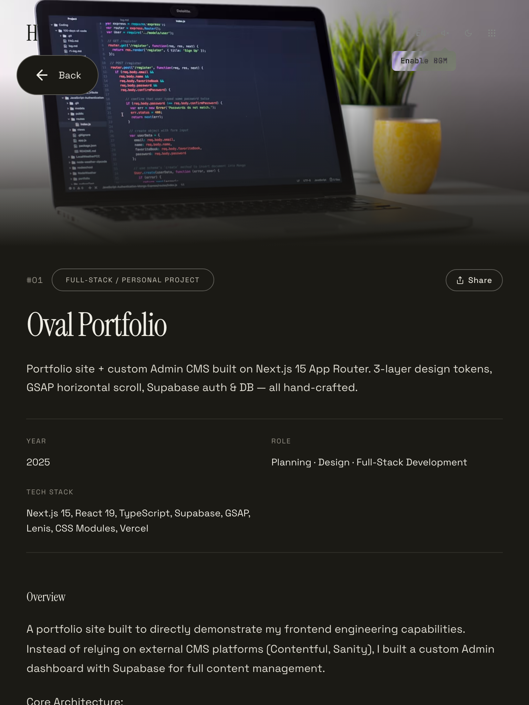

# Key Components

### Pressable · Button

Pressable things are split in two.

| | What it provides | When |
| --- | --- | --- |
| `Pressable` | Behavior only — `type="button"`, click/hover sound, disabled, tap scale | The appearance follows its own context |
| `Button` | Behavior + appearance (`variant` `size` `tone` `shape`) | Things that look like buttons |

```tsx
<Button variant="outline" size="xs">Save</Button>
<Pressable className={styles.sidebarScrollBtn}>…</Pressable>
```

**Never a raw `<button>`.** It loses the sound, and a missing `type` submits the surrounding
form (63 places did). eslint's `react/button-has-type` blocks the latter.

`Pressable` does not reset UA button styles — `globals/_base.css` already does that for every
`<button>`, and repeating it here would override component CSS by class specificity.

Two props: `soundDisabled` for press-and-hold controls (steppers, drag handles), `noTapScale`
for absolutely positioned overlays where a `transform` would shift the layout.

Many places genuinely must **not** share an appearance — absolutely positioned hit areas, page
numbers that inherit the parent font, tabs sized to a filter row, chips drawing an underline with
`::after`. Widening `Button` with props to hold those would break it. Same reasoning as MUI's
`ButtonBase` and React Aria's `useButton`.

### StaggerText

A component that splits text into individual characters and applies sequential outline animation on hover.

**Path**: `src/components/effects/StaggerText`

<p align="center">
  
</p>

**Features**:

- On hover, characters sequentially change to outline (stroke) starting from the first character
- On hover release, colors fill in reverse order starting from the last character (stroke maintained)
- Custom stroke color and width support
- Configurable per-character delay

**Usage**:

```tsx
import StaggerText from "@/components/effects/StaggerText";

// Basic usage
<StaggerText>Hello World</StaggerText>

// Custom options
<StaggerText
  className={styles.title}
  strokeColor="var(--text-primary)"  // Stroke color
  strokeWidth={2}                     // Stroke width (default: 1px)
  delayPerChar={0.05}                 // Per-character delay (default: 0.04s)
  hoverEffect={false}                 // Disable hover effect
>
  Custom Text
</StaggerText>
```

**Props**:

| Prop           | Type      | Default        | Description                          |
| -------------- | --------- | -------------- | ------------------------------------ |
| `children`     | `string`  | (required)     | Text to display                      |
| `className`    | `string`  | -              | Additional CSS class                 |
| `strokeColor`  | `string`  | `currentColor` | Stroke color (CSS variable or color value) |
| `strokeWidth`  | `number`  | `1`            | Stroke width (px)                    |
| `delayPerChar` | `number`  | `0.04`         | Per-character delay (seconds)        |
| `hoverEffect`  | `boolean` | `true`         | Enable hover effect                  |

---

### BreakpointGuard

A component that automatically unmounts/remounts page content when the viewport crosses breakpoint boundaries (768px, 1024px) to reinitialize GSAP ScrollTrigger, RAF-based animations, etc.

**Path**: `src/components/common/BreakpointGuard.tsx`

| PC | Tablet | Mobile |
|:---:|:---:|:---:|
|  |  |  |

**Features**:

- Detects viewport width changes and classifies as `desktop` (>1024px) / `tablet` (768-1024px) / `mobile` (<768px)
- Remounts children via `key` prop on breakpoint change
- Providers (Theme, Language, Lenis) are placed above to maintain state

**Applied at**: `src/app/layout.tsx`

```tsx
// root layout.tsx
<ThemeProvider>
  <LanguageProvider>
    <LenisProvider>
      <Navigation /> {/* maintained */}
      <main>
        <BreakpointGuard>
          {" "}
          {/* remount on breakpoint change */}
          {children}
        </BreakpointGuard>
      </main>
    </LenisProvider>
  </LanguageProvider>
</ThemeProvider>
```

**Breakpoints**:

| Breakpoint | Range          | Description              |
| ---------- | -------------- | ------------------------ |
| `desktop`  | > 1024px       | Horizontal scroll layout |
| `tablet`   | 768px - 1024px | Vertical scroll, tablet spacing |
| `mobile`   | < 768px        | Vertical scroll, mobile spacing |

---

### Modal (Bottom Sheet)

A modal component that behaves as a bottom sheet pattern on mobile. Center dialog on desktop.

| PC (Desktop Dialog) | Tablet | Mobile (Bottom Sheet) |
|:---:|:---:|:---:|
|  |  |  |

**Path**: `src/components/ui/Modal.tsx`

**Mobile behavior**:

- Slides up from bottom (85vh height limit)
- **Handle drag down**: CSS `translate`-based dismiss (closes when threshold exceeds 100px)
- **Handle drag up**: Height-based fullscreen expansion
- Close button hidden — close via handle drag or overlay tap

**Technical decisions**:

- Uses CSS `translate` property for drag dismiss (independent from framer-motion's `transform`)
- framer-motion handles only enter/exit animations; drag is controlled via `--sheet-y` CSS variable
- Global single render in `ClientOverlays` (portal to body)

---

### PostArticleView

A set of **presentational components** that render a post's article. The public detail page (`posts/[slug]`) and the admin preview page **share the exact same components** — the preview matches the published view 1:1, and the duplicate/divergent preview implementation is gone (single source of truth).

**Path**: `src/components/posts/PostArticleView.tsx`

**Exports**:

- `PostArticleHeader` — DetailLayout `header` slot. metaRow (date · read time · views · edit / GitHub · Share · language toggle) · title · excerpt · tags · divider
- `PostArticleBody` — DetailLayout `children` slot body. Renders richtext / markdown plus interactions (code wrap toggle, image viewer, etc.)

**Features**:

- ko/en fallback is resolved by the caller and passed as `displayTitle / displayContent / displayExcerpt` — the component only receives display values
- richtext is pre-processed via `processRichtextHtml`; markdown uses `MarkdownRenderer`
- `isPreview` lets the caller exclude elements that need a saved DB record (likes/comments, etc.)
- `headerActionsLeft` injects preview-only actions (trash restore/purge, etc.) into the header
- `proseViewerRef` connects to the caller's `useProseImageViewer`

**Used by**: `src/app/posts/[slug]/PostDetailClient.tsx` (public detail) + `src/app/admin/(preview)/posts/preview/page.tsx` (preview)

---

### WorkArticleView

A set of **presentational components** that render a work (project) detail article. Like PostArticleView, the public detail (`works/[slug]`) and admin preview share the same components.

**Path**: `src/components/works/WorkArticleView.tsx`

**Exports**:

- `WorkArticleHeader` — DetailLayout `header` slot. meta (#number · team/solo badge · edit · language toggle) · title · description · actions (Visit/GitHub/Share) · info grid (Year/Category/Tech/Role) · AISummary
- `WorkArticleBody` — DetailLayout `children` slot. Body (richtext/markdown) · gallery + ImageViewer
- `WorkArticleTeam` — DetailLayout `afterContent` slot. Renders the team-member polaroid flip carousel at **full page width** (not the narrow content column)

**Features**:

- Takes a single `Project` shape — the preview reuses the same components by converting the editor form via `workFormToProject(form)` (`src/types/work.ts`)
- Holds richtext enhance / gallery & prose ImageViewer interactions internally
- `isPreview` excludes DB-dependent elements such as the edit link

**Used by**: `src/app/works/[slug]/WorkDetailClient.tsx` (public detail) + `src/app/admin/(preview)/works/preview/page.tsx` (preview)

---

### AdminNotFound

A reusable **centered "not found" state** shown when an admin edit/detail page can't find the item. Icon + message + back-to-list link.

**Path**: `src/components/admin/AdminNotFound/index.tsx`

**Props**:

| Prop        | Type     | Description           |
| ----------- | -------- | --------------------- |
| `title`     | `string` | Display message       |
| `backHref`  | `string` | Link back to the list |
| `backLabel` | `string` | Back button label     |

**Used by**: admin posts/works edit pages (`admin/(dashboard)/posts/[id]/edit`, `.../works/[id]/edit`)

---

### StickyGlassBar

A **shared sticky header bar** at the top of the admin list pages. Pinned below the nav, it's a full-bleed (edge-to-edge across the viewport) glass that uses only `backdrop-filter` blur with no background color. A sentinel + scroll detect pinning, so the frost shows **only when pinned**. Extracted from the editor topBar pattern.

**Path**: `src/components/admin/StickyGlassBar/StickyGlassBar.tsx`

**Props**:

| Prop        | Type        | Description          |
| ----------- | ----------- | -------------------- |
| `children`  | `ReactNode` | Bar content          |
| `className` | `string`    | Additional CSS class |

**Notes**:

- `transform` breaks `backdrop-filter`, so the full-bleed stretch to the viewport edges uses margin/left-right (`-page-px`) instead of `transform`
- To blur the sibling (row) behind the element, apply `backdrop-filter` **directly on the element** rather than a `::before` + `z-index: -1`

**Used by**: admin posts/works list pages

---

### MembersList · RoleBadge · ProviderChips

The **member-management UI primitives** in Settings → Account tab. `MembersList` renders the member card list (avatar · name/email · last sign-in · pending invites), attaching a `RoleBadge` (owner/editor/author role badge) and `ProviderChips` (GitHub / email sign-in method chips) to each row. Only the owner gets CRUD (invite / change role / delete); data loads from `/api/admin/authors/members` (owner) and `/api/admin/authors/context` (non-owner).

It also embeds on the dashboard home via `limit` + `hideHeader` to show a top-N summary (with an "+N more" link → Account tab when it overflows); there each member row is a `role="button"` that is clickable and keyboard-navigable (Enter/Space) and opens a `MemberDetailModal` focused on access info (role · sign-in method · last sign-in). When `hideHeader` is set, the list's top border is dropped so it doesn't stack with the section's own divider into a 2px line. The members section is owner-only, so for a non-owner it hides the whole section via `onResolved(false)`.

**Path**: `src/components/admin/MembersList.tsx`, `src/components/admin/MemberBadges.tsx` (`RoleBadge` / `ProviderChips`)

**Used by**: `admin/(dashboard)/settings` Account tab · admin dashboard home members section (both open MemberDetailModal on row click; the Account tab also wires MemberEditModal)

---

### processRichtextHtml (util)

A **shared utility** for post-processing richtext HTML. All processing is centralized here so the detail page and preview **render the body identically**.

**Path**: `src/utils/processRichtextHtml.ts`

**Processing order**:

1. Inject heading ids (TOC anchors)
2. Convert iframe embed URLs
3. Inject the label span into the code block's wrap-toggle button (syntax highlighting is **not done here** — Shiki handles it separately)
4. Insert code wrap-toggle button labels
5. Inject `data-cursor="zoom"` hint on imgs (CursorTrail image viewer)

```ts
import { processRichtextHtml } from "@/utils/processRichtextHtml";

const html = processRichtextHtml(rawHtml, {
  codeScroll: t("common.codeScroll"),
  codeWrap: t("common.codeWrap"),
});
```

> Highlighting & button labels are applied at the **HTML string stage**, not via DOM mutation — so they don't disappear on re-render.

---

### EmojiPicker

A **shared picker** for emoji, icons, and custom images (overhauled). The value format is one of native emoji / `img:url` (custom upload) / `icon:id` (SVG icon).

**Path**: `src/components/ui/EmojiPicker/`

**Features**:

- **476 icons** extracted from lucide (`IconEntry.svg` inner-SVG field + `iconSvgInner` helper), new categories (weather / devices / food / health / tools / education / faces / maps / shapes, etc.)
- **Korean search** (`emojiKo.ts`) + emoji-mart metadata (English names/keywords, `emojiMeta.ts`) + emoji-name tooltip (shared Tooltip)
- Image **drag-and-drop upload**, inline styles → CSS module (`EmojiPicker.module.css`)

---

### RelatedChips

A **related-content chip list** of thumbnail + title + category. More toggle + a hover preview card.

**Path**: `src/components/ui/RelatedChips/`

**Features**:

- Bundles a `useHoverPreview` hook that surfaces a preview card on chip hover (`src/components/ui/RelatedChips/useHoverPreview.tsx`)
- Used to surface related series / related posts on detail pages

---

### ViewModeToggle

The Footer's **PC / mobile mode switch** toggle. Overrides the viewport meta.

**Path**: `src/components/layout/ViewModeToggle.tsx`

**Features**:

- The viewport override is only meaningful as "view PC version" on mobile, so it is **shown only on touch devices (`pointer:coarse`)**

---

### CoverBanner

The admin editor's **cover banner** component.

**Path**: `src/components/admin/CoverBanner/`

---

### FloatingBar

PlateEditor's **floating toolbar shown on block selection**. Closes on interaction with other blocks.

**Path**: `src/components/posts/plate/toolbars/FloatingBar.tsx`

---

### Publish-status Chip · publish modal (editor)

The top-left of the editor (next to the language toggle) shows the current **publish status** as a shared `Chip` (`variant="capsule"`). A colored dot distinguishes it — Published (success) / Scheduled (warning) / Draft (muted).

A draft **consolidates publishing into a single save button** instead of a separate publish button. Saving while unpublished pops a `ModalConfirm` "Publish now?" for one confirmation, choosing between `Publish` (`onConfirm`) and `Save draft` (`onCancel`). An already-published post saves immediately with no modal.

**Path**: `src/components/admin/AdminEditorShell/index.tsx` (chip) · `src/components/posts/PostEditor.tsx` (publish modal)

---

### EditorTextInput

An **IME-safe shared primitive** for in-editor form inputs. `contentEditable=false` + commit-on-blur prevents Korean composition from breaking. (Shared by image caption · poll · tab inputs)

**Path**: `src/components/posts/plate/EditorTextInput.tsx`

---

### Collapsible

A shared wrapper that clamps long content and attaches a **show more / collapse** toggle. Used for long comments, among others.

**Path**: `src/components/ui/Collapsible.tsx`

**Features**:

- Clamps **only when** content exceeds `maxHeight` — if it doesn't, neither the toggle button nor the bottom fade renders
- Overflow is measured by a `ResizeObserver` on an inner, un-clamped div — late-loading images that grow the height are picked up
- **No animation on the first clamp** — animation stays suppressed until the user actually clicks the toggle, so it never looks like the block is collapsing by itself on load
- Expanded height animates via framer-motion `height: "auto"`; the toggle is a `Button variant="ghost" size="sm" shape="capsule"`

**Props**:

| Prop | Type | Default | Description |
| ---- | ---- | ------- | ----------- |
| `maxHeight` | `number` | (required) | Clamp only when content exceeds this height (px) |
| `expandLabel` | `ReactNode` | (required) | Expand label |
| `collapseLabel` | `ReactNode` | (required) | Collapse label |
| `children` | `ReactNode` | (required) | Target content |

---

### HelpButton

A unifying wrapper for the circular `?` help button. Used as a Popover / Tooltip trigger.

**Path**: `src/components/ui/HelpButton.tsx`

**Features**:

- Hardcodes `Button variant="subtle" shape="circle"` + `?` — `variant` / `shape` / `children` are deliberately not overridable; **`size` is the only visual knob**
- All other props spread through to Button (so handlers injected by Popover/Tooltip on the trigger pass through)
- `forwardRef` — the trigger anchor can be measured

**Props**:

| Prop | Type | Default | Description |
| ---- | ---- | ------- | ----------- |
| `size` | `"2xs" \| "xs" \| "sm" \| "md" \| "lg" \| "xl"` | `"sm"` | Default 28px. Use `2xs` (20px) / `xs` (24px) in tight spots like next to a form label |
| `className` | `string` | - | **Layout only** — do not override color/border/radius/padding (use a parent wrapper instead) |
| `soundDisabled` | `boolean` | - | Disable the click sound |

---

### PageTitle

The shared large page title (`<h1>`) for the posts-family pages.

**Path**: `src/components/ui/PageTitle.tsx`

**Props**:

| Prop | Type | Description |
| ---- | ---- | ----------- |
| `icon` | `ReactNode` | Left icon (lucide, etc.). Its size scales automatically in `em` against the title font-size |
| `children` | `ReactNode` | Title text |
| `className` | `string` | Additional CSS class |

> No `"use client"` — this is a server component.

---

### SpinButton

A button with **long-press accelerating repeat**. Used by NumberInput's stepper.

**Path**: `src/components/ui/SpinButton.tsx`

**Features**:

- Fires **once immediately** on pointerDown, then starts repeating after a 380ms hold, with the interval decreasing from 130ms by 12ms per tick down to a **28ms floor**
- `setPointerCapture` — releasing outside the button still stops it. It stops on pointerUp / pointerCancel / lostPointerCapture / unmount
- Mouse input responds only to `e.button === 0`; the latest action is held in a ref so repeat ticks never go stale
- `type="button"` + `tabIndex={-1}` — the stepper doesn't pollute tab order

**Props**:

| Prop | Type | Description |
| ---- | ---- | ----------- |
| `onStep` | `() => void` | (required) One step of the action |
| `children` | `ReactNode` | (required) Icon, etc. |
| `className` | `string` | Additional CSS class |
| `ariaLabel` | `string` | Accessibility label (camelCase prop) |

---

### portalContainer (context)

A context that hands down a portal target so that **popovers opened inside an overlay (modal) stack above that overlay**. A top-layer approach that avoids inflating global z-index.

**Path**: `src/components/ui/portalContainer.ts`

```ts
export const PortalContainerContext = createContext<HTMLElement | null>(null);
export const usePortalContainer = () => useContext(PortalContainerContext);
```

**Behavior**:

- `Modal` renders a `.portalLayer` div and provides that element to the subtree via the Provider
- Consumers pick their portal target with `usePortalContainer() ?? document.body` — outside an overlay it's `body` as before
- Consumers: `Popover` · `Select` · `Tooltip` · `DatePickerPopover` · `TimePickerPopover`

**Technical decisions**:

- `.portalLayer` is a **sibling of the modal panel, not a child** — if the panel's `transform` became the containing block, fixed coordinates would drift, so it is attached on the `inset: 0` backdrop side
- The ref setter is cached in a `Map` per modal id — a fresh arrow function each render causes an infinite cleanup/mount loop ("Maximum update depth")

---

### SqlEditor (About Studio only)

`src/app/admin/(dashboard)/settings/_components/about/SqlEditor.tsx` — the ERD import input. It does not overlay a transparent `textarea` on a `<pre>`: the two render through different paths, so caret, scroll, and wrapping drift apart (the same reason noted in `CodeBlockEditor`). Editing is left to CodeMirror.

| Feature | How |
| ------- | --- |
| SQL highlighting | `sqlLanguage.ts` — a hand-written `StreamLanguage`. `@codemirror/lang-sql` wasn't added because all that's needed is "colour so it reads" (dollar quoting `$fn$ … $fn$` included) |
| Autocomplete | Table and column names from the current ERD, plus SQL keywords. Typing `posts.` narrows to that table's columns. The keyword list is **shared with the highlighter** |
| Diagnostics | No second SQL parser — it surfaces **wherever `parseSqlErd` failed to read**, so the squiggles can't disagree with the result. Errors (syntax, parens, column defs) / warnings (missing ALTER target, a dropped `REFERENCES`) |
| Find & replace | `⌘F` (`@codemirror/search`) |
| Tab indent | Tab accepts the completion first when the popup is open. `Escape` is bound at **low precedence** so it only releases focus when there's no panel to close — keyboard users never get trapped |

To keep diagnostic positions aligned with the source, the parser **blanks comments with spaces of the same length instead of removing them**. Deleting characters would shift every later offset and draw squiggles on the wrong lines.

---

### Shared components — props added this cycle

| Component | Addition | Details |
| --------- | -------- | ------- |
| `Popover` | `variant` | `"glass"` (default) / `"solid"` / `"difference"`. `solid` applies no modifier class — the base `.dropdown` is the solid look |
| `Popover` | `openOnHover` | Default `false`, desktop only (ignored in sheet mode). Opens immediately, closes on a 500ms delay (bridging the trigger↔content travel). A module-level flag keeps **only one hover popover open at a time** |
| `Button` | `tone="accent"` | `tone: "default" \| "danger" \| "success" \| "accent"` |
| `Modal` | `header.actions` | Action area on the right of the header (`ReactNode`, left of the close button) |
| `Modal` | `subButtons` | Sub buttons immediately left of the close (X) button (back/forward, etc.) |
| `Toast` | `pauseAllToasts` / `resumeAllToasts` | Hovering one toast pauses **the whole stack** — prevents re-layout from sliding the cursor off and dismissing it |
| `NumberInput` | `unit` | `ReactNode`. Shows the unit (`px`, `%`) on the right. Tooltip activates **only when the text is actually ellipsis-truncated** |
| `NumberInput` | `gauge` | Default `false`. Active only when both `min` and `max` are set; tints the number by where the value sits (low/mid/high). No bar is drawn |
| `Textarea` | `tabIndent` | Opt-in. Tab inserts a 2-space indent — via `execCommand("insertText")` to preserve the native undo stack, skipped during IME composition, and Shift+Tab keeps native focus traversal. Works **only in EditableTextarea mode**, which requires `maxHint` |
| `Select` | (viewport clamp) | Aligns the selected item's center to the trigger's center, then clamps into the viewport with an 8px margin, setting `max-height` only when the natural height exceeds the available height. On outside scroll it **closes** rather than repositioning |
| `Select` | `editable` + `editableInputProps` | **Direct entry** of values outside the presets. Double-clicking the trigger (two clicks within 250ms) swaps it for an input; type then commit on `Enter`/blur, cancel on `Escape`. `editableInputProps.sanitize` normalizes just before commit (e.g. digits only), plus `maxLength`/`placeholder`. An empty `value` starts in input mode on mount. Used by the editor toolbar's font size, line height, and letter spacing; a current value not in the presets is surfaced as the top option. (For a searchable dropdown with a top input row, use the separate `combobox` mode) |
| `ModalConfirm` | `children` | Optional, rendered after `desc`. For listing **what is about to change** before confirming — About ERD import uses it to name every table/column being removed or overwritten, with before/after values |
| `ModalConfirm` | `onCancel` | Optional (backward-compatible). Gives the **cancel button an action** — falls back to plain close when omitted. X/esc/backdrop always stay plain close. The editor's "Publish?" modal uses the cancel button as "Save draft" |
| `TagNotesEditor` | `renderEditPopover` | Optional `(item, close) => ReactNode`. When provided, wraps each chip's edit trigger in the shared `Popover` so the edit UI appears as a popover next to the chip (open state driven by `activeItem`). Backward-compatible — falls back to the old inline drawer when omitted. The Settings > Content tag / category / work-category editors use this popover edit instead of a fixed bottom edit box |

---
