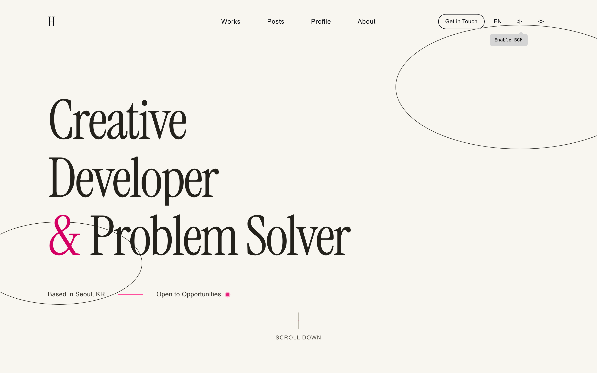
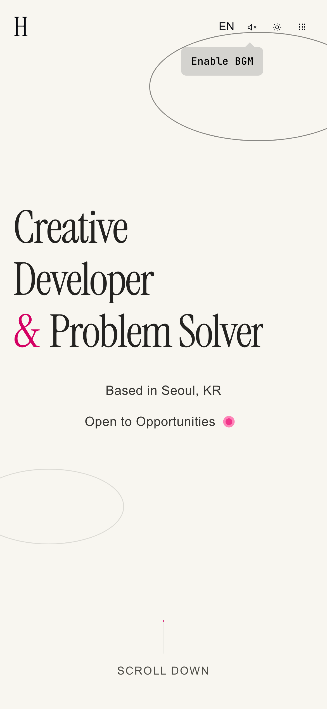
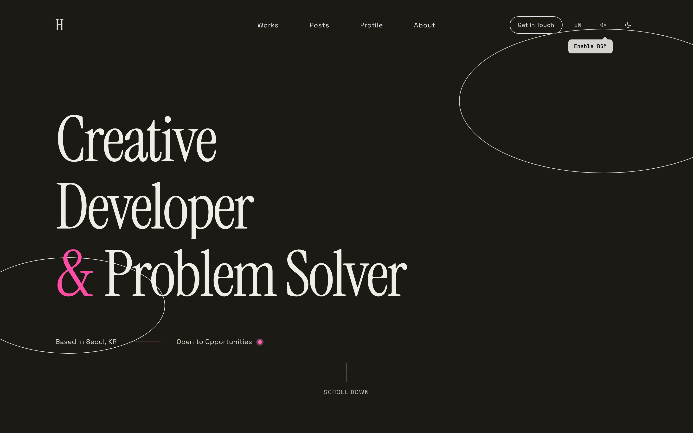
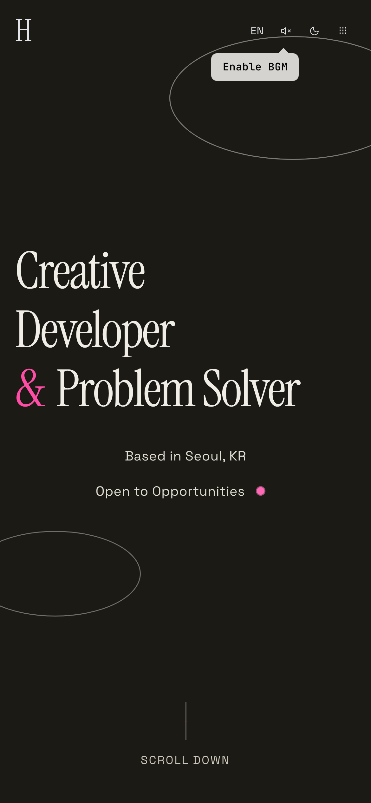

# Trouble Shooting: Performance

[← Index](../troubleshooting.md)

<details>
<summary><strong>22. Deferring third-party scripts: taking reCAPTCHA off the initial load</strong></summary>

<p align="center">
  
</p>

**Problem**

Lighthouse mobile Performance score of 48. LCP 17.1s, TTI 18.2s indicating severe performance degradation

**Cause**

Analysis of Lighthouse reports (Desktop/Mobile) revealed key bottlenecks:

1. **reCAPTCHA v3 immediate loading**: `GoogleReCaptchaProvider` wrapping the entire app downloads ~784KB JS on initial load. Main thread blocked for 280ms
2. **Missing preconnect**: Requests to Google domains start without prior connection -> 400ms delay
3. **Insufficient color contrast**: `#6b7280` on `#f8f6f0` (4.47:1, threshold 4.5:1), `#ff4f9d` on `#f8f6f0` (2.83:1)
4. **Accessibility**: Heading order skipped (h1 -> h3), aria-label and visible text mismatch

**Solution**

**1. reCAPTCHA Lazy Loading** — Biggest impact

Changed to load reCAPTCHA script only after user interaction (scroll/click/touch/keydown) or 4-second timeout:

```tsx
// ❌ Before - immediate load on app mount (784KB)
<GoogleReCaptchaProvider reCaptchaKey={siteKey}>
  {children}
</GoogleReCaptchaProvider>

// ✅ After - lazy load after user interaction
const [shouldLoad, setShouldLoad] = useState(false);

useEffect(() => {
  const load = () => setShouldLoad(true);
  const timer = setTimeout(load, 4000);
  const events = ["scroll", "click", "touchstart", "keydown"] as const;
  const handler = () => { load(); cleanup(); };
  // ...register event listeners (once: true, passive: true)
}, []);

if (!shouldLoad) return <>{children}</>;
return <GoogleReCaptchaProvider ...>{children}</GoogleReCaptchaProvider>;
```

**2. Preconnect Hints Added**

```html
<link rel="preconnect" href="https://www.google.com" />
<link rel="preconnect" href="https://www.gstatic.com" crossorigin="anonymous" />
```

**3. Color Contrast Fixes**

| Token                          | Before                               | After                         | Contrast Change       |
| ----------------------------- | ------------------------------------- | ------------------------------- | --------------- |
| `--color-neutral-600`         | `#6b7280`                             | `#656c79`                       | 4.47:1 -> ~4.9:1 |
| `--text-accent-secondary-alt` | `var(--color-accent-light)` (#ff4f9d) | `var(--color-accent)` (#d40063) | 2.83:1 -> ~4.8:1 |

**4. Accessibility Fixes**

- ServicesSection: `<h3>` -> `<h2>` to normalize heading order
- Language toggle: Include visible text ("KO"/"EN") in `aria-label`

**Insight**

- Excluding third-party scripts (reCAPTCHA, Analytics, etc.) from initial load and loading them after user interaction has a major impact on LCP/TTI
- Lighthouse results on dev server (Turbopack) are measured much lower than production due to unminified JS, devtools, etc.
- When using `mix-blend-mode: difference`, Lighthouse calculates contrast using pre-blend colors, which may differ from actual visual results


</details>

<details>
<summary><strong>23. Resource inventory: removing unused fonts and tuning the loading strategy</strong></summary>

| PC | Tablet | Mobile |
|:---:|:---:|:---:|
|  |  |  |
<sub>Optimization target: Home page — achieved Performance score of 98 across all 3 devices</sub>

**Problem**

After the first optimization pass, Lighthouse mobile Performance score was 60. LCP 7.3s, TTI 13.7s, page size 1,489KB, 63 network requests

**Cause**

Bottlenecks identified by measuring production build directly with Lighthouse CLI:

1. **4 unused fonts loaded**: IBM Plex Mono (5 weights), Bebas Neue, Cormorant Garamond (5 weights), Abril Fatface downloaded 12 font files despite not being referenced in CSS
2. **reCAPTCHA 4-second timer**: Lazy loading had a `setTimeout(4000)` fallback that still loaded ~740KB during Lighthouse tests
3. **scroll event trigger**: reCAPTCHA also responded to scroll events, loading prematurely
4. **font-display not specified**: the font display policy was left to the version default
5. **Unused preconnect**: Since reCAPTCHA was removed from initial load, Google domain preconnects triggered "unused" warnings
6. **Excessive Inter weights**: 7 weights (300-900), but 800 and 900 were unused

**Solution**

**1. Remove Unused Fonts** — Biggest impact

```tsx
// ❌ Before - 9 font families (19 font files)
import {
  IBM_Plex_Mono,
  Inter,
  Playfair_Display,
  JetBrains_Mono,
  Bebas_Neue,
  Space_Grotesk,
  Cormorant_Garamond,
  Abril_Fatface,
  Instrument_Serif,
} from "next/font/google";

// ✅ After - 5 font families (5 font files)
import {
  Inter,
  Playfair_Display,
  JetBrains_Mono,
  Space_Grotesk,
  Instrument_Serif,
} from "next/font/google";
```

Verification: Searched across all CSS for `var(--font-ibm-plex)`, `var(--font-bebas)`, `var(--font-cormorant)`, `var(--font-abril)` -> 0 results. Referenced in `useFontMorph.ts` but that component was not imported on any page

**2. Add font-display: swap**

```tsx
const inter = Inter({
  subsets: ["latin"],
  weight: ["300", "400", "500", "600", "700"], // Removed 800, 900
  display: "swap", // Unblock font rendering
});
```

**3. Improved reCAPTCHA Loading Strategy**

```tsx
// ❌ Before - timer + scroll included
const timer = setTimeout(load, 4000); // Triggered during Lighthouse tests
const events = ["scroll", "click", "touchstart", "keydown"];

// ✅ After - intentional interactions only
const events = ["click", "touchstart", "keydown"]; // Removed timer/scroll
```

**4. Remove Unused Preconnect**

```html
<!-- ❌ Before - unused warning since reCAPTCHA removed from initial load -->
<link rel="preconnect" href="https://www.google.com" />
<link rel="preconnect" href="https://www.gstatic.com" crossorigin="anonymous" />

<!-- ✅ After - removed -->
```

Results (Lighthouse CLI, median of 3 measurements):

| Metric      | Before   | After       | Change          |
| ----------- | -------- | ----------- | ------------- |
| Performance | 60       | **98**      | **+38 points**     |
| FCP         | 2,573ms  | 1,979ms     | -594ms        |
| LCP         | 7,294ms  | **1,979ms** | **-5,315ms**  |
| TBT         | 430ms    | **0ms**     | -430ms        |
| CLS         | 0.012    | 0           | -0.012        |
| TTI         | 13,731ms | **1,979ms** | **-11,752ms** |
| Requests    | 63       | 28          | -35           |
| Page Size   | 1,489KB  | **449KB**   | **-70%**      |
| Font Files  | 19       | 5           | -14           |

**Insight**

- Fonts registered with `next/font/google` download font files even if unreferenced in CSS. Periodically verify actual usage
- Timer fallbacks in third-party lazy loading can be unintentionally triggered by performance measurement tools. Using only intentional interactions (click/touch/keydown) is safer
- The current next/font default for `display` is `swap`, so specifying it is no longer strictly required. Stating it explicitly pins the intent regardless of the default


</details>

<details>
<summary><strong>24. Main thread vs compositor: animation, re-renders and GPU memory</strong></summary>

| PC | Tablet | Mobile |
|:---:|:---:|:---:|
|  |  |  |

**Problem**

Project performance audit revealed multiple optimization points: main thread animations, 60fps React re-renders, GPU memory leaks, unused resources, CSS conflicts

**Cause**

1. **Hero ellipse/marquee**: Framer Motion/GSAP infinite loop animations running as main thread RAF
2. **useMagneticRepel**: `setMagneticOffsets()` on every `mousemove` -> 60fps React state updates -> entire WorksSection re-renders
3. **Three.js**: `DoubleSide` rendering both faces, geometry not disposed on `isMobile` change (GPU memory leak)
4. **Unused resources**: paper.png (17MB), grain.png (5.2MB) unreferenced, 2 unused npm packages
5. **CSS conflicts**: `scroll-behavior: smooth` causing double smoothing with Lenis, `cursor: none` applying to touch devices
6. **useSoundManager**: Creating AudioContext + fetching typing.mp3 immediately on mount

**Solution**

```
1. Hero ellipse/marquee: Switched to CSS animation -> runs on compositor thread
2. useMagneticRepel: useState -> useRef + RAF loop + direct el.style.transform application
3. Three.js: DoubleSide -> FrontSide, geometry.dispose() in useEffect cleanup
4. Deleted unused images (-22.2MB), npm uninstall react-scroll-parallax react-google-recaptcha-v3
5. Removed scroll-behavior, restricted cursor:none to @media (pointer: fine)
6. Deferred AudioContext/typing.mp3 to first interaction
7. next.config: poweredByHeader: false, image formats: AVIF+WebP
8. Removed permanent will-change: transform (released GPU layers)
```

**Insight**

- For simple infinite loop animations (rotate, translateX), CSS animation is more efficient than JS-based approaches — runs on the compositor thread without blocking the main thread
- Updating React state on high-frequency events (mousemove) triggers full component tree reconciliation per frame. ref + direct DOM manipulation is the appropriate pattern
- Geometry/material created with Three.js `useMemo` is subject to React's GC, but GPU buffers are not automatically released. Explicit `dispose()` is required


</details>

<details>
<summary><strong>25. Client-side image compression: shrinking before upload</strong></summary>

**Problem**

Images were uploaded as-is without compression — smartphone photos (5–15MB) failed the 10MB limit, and files under the limit still wasted bandwidth with unnecessarily large originals

**Cause**

No client-side compression logic in the upload function — server-side size rejection was the only defense

**Solution**

Step-by-step compression pipeline runs in the browser before upload:

```
1. SVG/GIF → skip (vector/animation can't be Canvas-converted)
2. Under limit → skip
3. WebP conversion (canvas.toBlob, quality 0.85)
4. Resolution reduction (max 2560px on longest side)
5. Quality step-down (−0.05 per step, minimum 0.7)
```

The `compressImage()` utility is loaded via dynamic import to avoid affecting bundle size

**Insight**

Image compression is more effective on the client than the server — reduces size before transmission, saving both bandwidth and storage. WebP has lower compression ratios than AVIF but is 3–10× faster to encode in browsers with wider support, making it ideal for client-side processing


</details>
