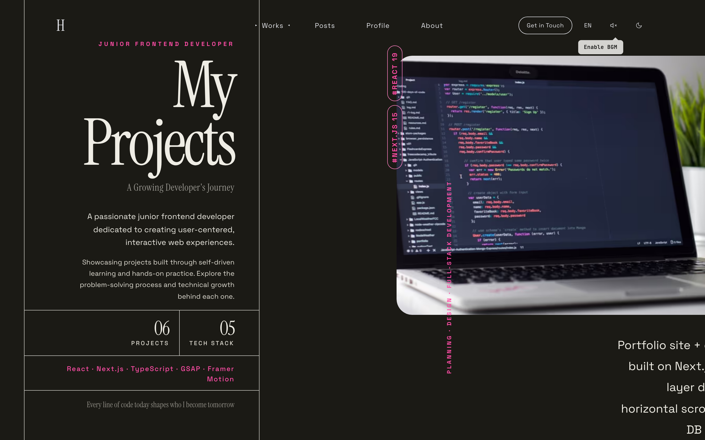
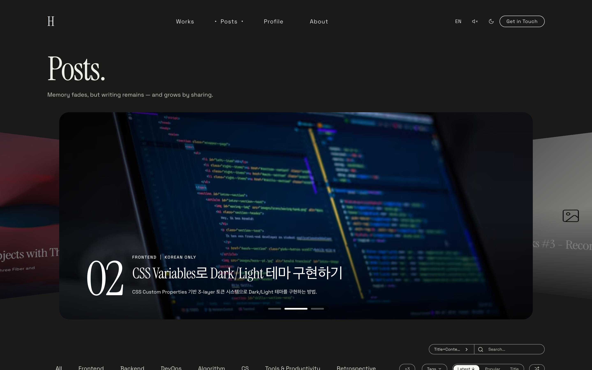
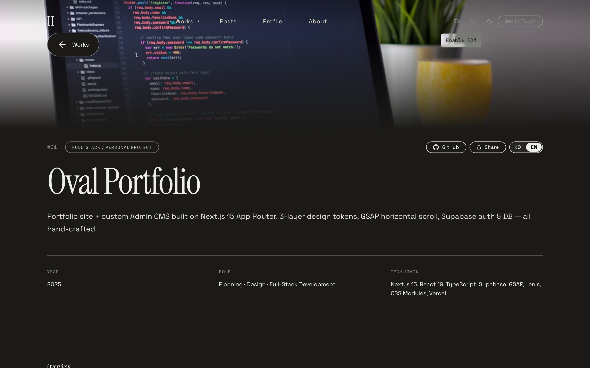
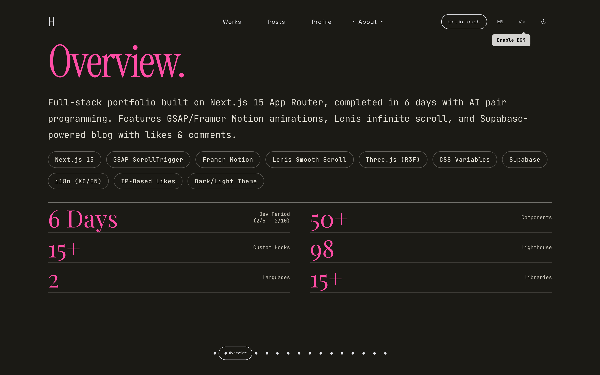
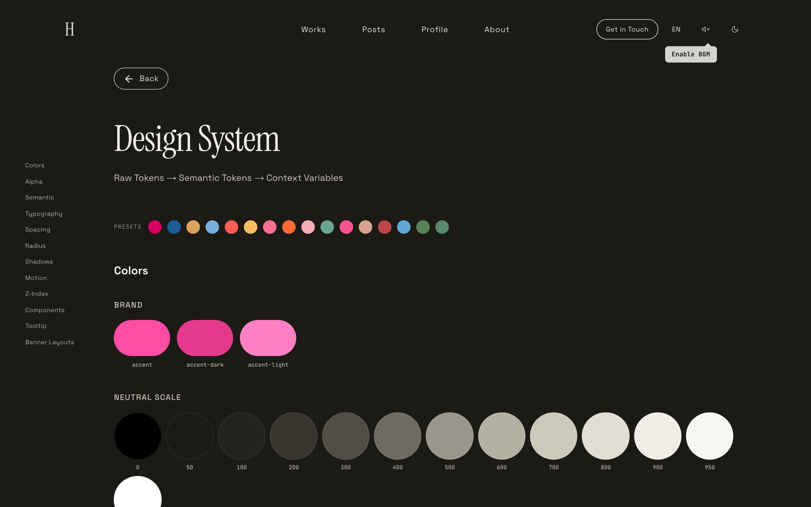

# 기능

[← README](../README.md)

## 주요 기능

### Animation & Interaction

- **Infinite Scroll Loop**: Lenis smooth scroll + Bridge Section 기반 무한 순환 스크롤 — **default OFF** opt-in 패턴. 기존엔 모든 페이지가 mount 시 `setInfinite(false)` / unmount 시 `(true)` 로 되돌리는 opt-out 방식이라 페이지 간 navigation 도중 잠깐 무한 스크롤이 켜져 의도치 않은 점프가 일어났음. HomeClient 만 mount 시 `setInfinite(true)` 호출하도록 반전 — 그 외 모든 라우트는 기본값 false 로 안전
- **Mouse Parallax**: Framer Motion useSpring/useTransform 기반 마우스 반응형 패럴랙스
- **Scroll-Triggered Animations**: GSAP ScrollTrigger를 활용한 스크롤 기반 등장 애니메이션
- **Scroll Velocity Parallax**: Lenis velocity 기반 스크롤 속도 연동 이미지 패럴랙스 (Works 이미지 160% buffer로 원 밖으로 새지 않도록 보정)
- **Directional Scroll Cascade**: Services 항목이 스크롤 방향별로 cascade — 위로 스크롤 시 item0, 아래로 스크롤 시 item3가 leader, velocity 기반 overlap 축소 + 상·하단 border hard stop
- **Hero Oval Spread**: 위쪽 원 그룹은 위로 누적 스크롤 거리, 아래쪽 원 그룹은 아래로 누적 스크롤에 비례해 벌어짐 (방향별 독립 spread)
- **StaggerText**: 호버 시 글자별 순차 외곽선 애니메이션, mouseEnter 시점의 실제 글자 색을 JS로 캡처해 stroke 색을 동적으로 동기화
- **CTA 3D Coffee**: Three.js(R3F) 기반 세라믹 커피잔 — LatheGeometry 둥근 프로파일, 마우스 추적 회전, Canvas 2D로 그린 parametric heart 라떼아트(cream↔coffee wave + 엽맥 blur) + 갈색 halo + contact shadow disc
- **Glass Hover Buttons**: CTA 컨택트/이력서 버튼 hover 시 backdrop-filter blur로 뒷 커피 canvas가 유리창 너머처럼 흐려짐 (transform 기반 compositing 이슈를 marginTop 엔트런스로 해결)
- **3D Scroll Torus**: Three.js(R3F) 기반 3D 메탈릭 토러스 — 리사주 곡선 경로 회전, 테마별 머티리얼, 모바일 터치 반발 인터랙션

  
  

### Works Gallery

- **6종 레이아웃**: Admin 설정 또는 `?layout=` 쿼리 파라미터로 전환 — Flow(기본 가로 스크롤) · Fullscreen(배경 크로스페이드) · Cinematic(패럴랙스 시네마) · Grid(벤토 그리드) · Split(좌 메타 + 우 스크롤) · Cylinder(Three.js 3D 실린더)
- **레이아웃 UX 재설계**: 네 레이아웃을 영상 인트로 + 인터랙션 강화로 통일. **Fullscreen** — 비디오 배경 + 4코너 라이브 HUD(LOC/TIME/WORKS/STACK, 시계 + FPS) + 스크롤-driven 타이틀 morph(CSS `animation-timeline: view()`) + DOM duplication 기반 seamless infinite wrap. **Split** — 비디오를 풀스크린 배경으로 fixed, 우측 panel 만 `backdrop-filter: blur(40px)` 로 frosted glass, 텍스트는 화이트 + 강조부(카테고리 라벨, 번호 워터마크, 큰따옴표)는 accent. **Grid** — 기존 디자인 폐기, About Key Features 의 `DynamicFrameLayout` 을 bento 베이스로 재사용 (100vw·100vh, gap 0). 인트로 셀 + 프로젝트 셀 1~6개를 12×12 그리드에 빈공간 없이 채우는 adaptive position. hover 전 title+subtitle / hover 시 desc+tech 노출, `mix-blend-mode: difference` + `clamp()` 폰트 + 이미지 hover blur + dimmed gradient. **Cylinder** — 3D 메시 자체가 클릭 영역(R3F `onClick`), 메시 hover 시 `data-more` 토글로 CursorTrail "More" 커서 표시, intro 텍스처는 `--bg-primary` 와 매칭(`getComputedStyle` chain resolve)
- **DynamicFrameLayout — bento span 지원**: `defaultPos.w/h` 값을 `gridColumn/Row: span N` 으로 변환해 12-grid 위에서 임의 크기 셀 배치 가능. About 페이지 Key Features 와 Works Grid 가 같은 컴포넌트 공유
- **인트로 영상 외부 호스팅**: `siteConfig.works.introVideoUrl` 에 외부 CDN URL 지정 (Fullscreen / Split / Grid 공통). 빈 값이면 로컬 `/public/intro-bg.mp4` fallback — GitHub 100MB 제한 회피 위해 로컬 파일은 `.gitignore`
- **Flow 레이아웃**: GSAP 기반 가로 스크롤 갤러리 — 양방향 무한 래핑, 마우스 3D tilt, 이미지 hover 확대, 메타데이터 reveal 시차
- **Cylinder 레이아웃**: Three.js 세로 원통 회전 + HTML 오버레이, 우주 테마 인트로 + 바운싱 버니 캐릭터
- **Cylinder 반응형**: 뷰포트 크기에 따라 카메라 자동 후퇴, 태블릿 이하에서 기울기(tilt) 비활성, 스크롤 기반 제목 slide-in reveal (CSS variable `--reveal` + clip-path 마스크)
- **Cylinder 메타 분리**: mix-blend-mode: difference는 제목·카테고리만 적용, 설명·상세(연도/역할/기술 marquee)·CTA는 별도 overlay로 분리해 항상 흰색 텍스트 유지
- **Floating Comments**: 인트로 슬롯에 최신 작품 댓글이 RAF 물리 기반으로 떠다님, 클릭 시 해당 작품으로 전환 효과와 함께 이동
- **Breakpoint Guard**: Cylinder 레이아웃은 리사이즈 시 리로드 없이 실시간 대응, 나머지 레이아웃은 breakpoint 전환 시 자동 remount

  
  

### Blog System

- **Posts (Blog)**: Supabase 기반 블로그 시스템 — SSR + ISR 캐싱, Markdown/Rich Text 전환 에디터, 검색/태그 필터, 조회수 추적, GitHub 링크
- **Posts 서브네비 (`PostsSubnav`)**: All / Series / Tags / History 캡슐 서브네비로 `/posts` 하위 인덱스를 통합 진입
- **목록 레이아웃 6종**: `siteConfig.posts.layout` (Admin 설정) 으로 전환 — magazine(기본, bento masonry) · grid · list · compact · masonry · featured. 글마다가 아니라 **사이트 전역 설정**이며, 사이즈 변주(wide/banner/square/portrait) + JS row-span packing 은 magazine 에만 적용. `/posts/history` 는 timeline 전용
- **카테고리 2단계 트리**: 플랫 목록 → 2단계 트리로 전환 (개발 > 프론트엔드/백엔드/DevOps, 학습 > 알고리즘/CS, 인사이트/회고/일상/기타). 저장은 leaf 만 하고 부모는 `src/lib/categoryTree.ts` 로 도출 — DB 마이그레이션 0. **카테고리 다중 선택**(OR, `?category=a,b`) + `facets` 사이드바 지원
- **다중 작성자 / 멤버**: 작성자(멤버)는 Supabase `app_metadata` 에 역할(소유자/편집자/저자)과 함께 저장되고, 이메일 초대(`author_invites` 테이블)로 추가하며, Settings → Account 탭에서 관리합니다. 인증은 GitHub OAuth, 소유자는 `OWNER_EMAIL` 로 부트스트랩. `posts.author_ids text[]` 는 그대로 글별 작성자 연결로 유지됩니다. 편집기에서는 로그인한 사용자가 작성자 칩으로 항상 노출되고 새 글이면 `author_ids` 에 자동 지정되며, 공동 작성자는 칩에서 추가합니다
- **시리즈(Series)**: 포스트를 시리즈로 묶어 순서대로 발행 — `/series` 별도 페이지 폐지 후 `/posts` 안으로 통합, 카테고리 필터 후 타임라인(스텝 번호 + 세로 connector) 형태로 노출, 상세 페이지 이전/다음 네비게이션
- **Series Deck Cards**: 가로 스크롤 row — 카드를 hover 하면 0.8s 후 deck 형태로 펼쳐지며 소속 글 4개의 미리보기 layer가 0.4s 간격 stagger로 순차 등장 (transform 기반 stack offset, JS state 기반 timer 로 CSS transition-delay snap 회피), 펼침 상태에서 우측으로 next 카드를 밀어내고 `::after` pseudo 로 hit-area 확장해 flicker 없이 hover 유지. **deck 가 가로 스크롤 컨테이너 우측 밖으로 넘치면 rAF 루프로 매 프레임 `scrollLeft` 직접 증가** — 카드 `margin-right` 가 transition 으로 점차 늘어나면서 `scrollWidth` 도 함께 커지므로 단발 `scrollBy` 는 시작 시점 `maxScrollLeft` 에 즉시 clamp 되어 부족함. auto-scroll 종료 후 `card.matches(":hover")` 한번 더 확인해 cursor 가 떠나 있으면 deck 닫음(스크롤로 카드가 cursor 밑에서 빠져나간 false-positive mouseleave 방지)
- **Series Auto Cover**: cover/소속 글 cover 둘 다 없는 시리즈는 SSR 시점에 Unsplash 에서 자동으로 cover 1장 fetch → `series.auto_cover_url` 컬럼에 영구 캐시 (다음 요청부터 외부 호출 0회)
- **Posts 배너 슬라이더**: 피닝된 포스트를 배너로 표시 — 4가지 레이아웃 x 4가지 오버레이 x 2가지 전환 모드, Admin에서 선택. 좌·우 화살표 버튼에 `data-cursor="prev"` / `"next"` 부여 → CursorTrail 의 `CursorType` 에 `next` / `prev` variant 추가해 hover 시 "Prev" / "Next" 라벨 커스텀 커서로 표시
- **Posts 필터 바**: 카테고리 접기/펼치기(+N more), hover indicator(layoutId), sticky + 스크롤 방향 감지, 콘텐츠 blur 효과 — sticky 진입 anchor 시점은 IntersectionObserver `rootMargin` 을 컴포넌트의 실제 sticky `top` 값으로 동기화해 인기글 등 사이드 위젯과 1px 도 안 어긋나게 보정
- **Posts Bento Masonry**: 3/4/6 column CSS Grid + `grid-auto-rows: 1px` + JS 가 각 카드 `scrollHeight` 측정 후 `grid-row: span N` 적용 → 진정한 masonry. wide / banner(21:9) / square(1:1) / portrait(3:4) / standard 5종 variant 가 `grid-auto-flow: dense` 로 빈틈 없이 packing. 모바일은 변형 비활성화 + 16:10 통일. **PC(4·6col) 빈공간 최소화 템플릿 재배열** — banner(21:9, 가장 짧음)는 사이클 앞쪽에 두어 이후 standard 들이 dense backfill 가능, wide(2col 16:10)와 portrait(1col 3:4)는 height 가 비슷해 같은 row 매칭, standard 비중 확대(5/cycle) + square 1개로 축소해 평균 height 변주 줄여 packing 안정화
- **PopularPosts/RecentComments hover 효과**: 사이드 위젯 항목 hover 시 `translateX(var(--spacing-2xs))` 로 부드럽게 들여쓰기 — compound selector `(0,2,0)` 로 글로벌 theme transition `(0,1,1)` 우회 (transform 은 글로벌 규칙에 없어 일반 선택자로는 덮어쓸 수 없음)
- **Posts Sort Capsule**: 최신순(↑/↓) · 인기순(↑/↓) · 제목순(↑/↓) 3-way capsule + 별도 Shuffle(랜덤) 버튼. 방향 화살표는 transform: rotate 로 트위닝, hover indicator(Framer Motion `layoutId`) + 화살표 줄바꿈 방지(`white-space: nowrap`). 랜덤 정렬은 mulberry32 시드 셔플로 페이지네이션 일관성 유지
- **Popular 정렬 sub-option**: 인기순 활성 시 그 옆에 별도 SegmentedControl(종합 / 조회 / 댓글 / 좋아요) 노출 — API 는 `sort=views|likes|comments` 분기(`comments` 는 댓글 join 후 서버 JS 정렬). HOT 배지 · admin 삭제 보호 · TTL 90일 대상은 `src/lib/popularity.ts` 의 `scoreOf({view, like, comments})` + `getPopularPostIds(limit=5)` 한 함수가 산정해 PostsClient · admin · trash 자동삭제 셋 모두 동일 기준
- **RandomPosts 사이드바 위젯**: 사이드바에 신규 추가 — `/api/posts?sort=random&seed=` + Shuffle 버튼(180° 회전 hover) 로 즉시 재추첨
- **TagCloud3D 라벨 + drag cursor**: 라벨에 Tags 아이콘 추가 + 회전 드래그 중 `data-cursor="grab"` 으로 CursorTrail 과 통합
- **Posts Tooltip-everywhere**: 모든 필터·정렬·태그·카테고리·SearchCapsule 트리거에 `<T>` 컴포넌트 + Tooltip(번역 + 설명) 적용 — long hover(600ms) 로 반대 언어 + 짧은 설명 동시 노출, 모바일은 터치 토글
- **SearchCapsule 공통 컴포넌트**: `components/admin/SearchCapsule` → `components/ui/SearchCapsule` 이동. `searchType` prop optional, padding 을 태그/정렬 캡슐 톤에 맞춰 슬림화 (`var(--spacing-2xs) var(--spacing-sm)`). PostsClient · `/admin/comments` 등 모든 인라인 검색 input 을 일괄 교체
- **Seeded Color Generator (OKLCH)**: `src/utils/seededColor.ts` — FNV-1a 해시 + **12 hue 앵커**(orange/amber/yellow/lime/green/teal/cyan/sky/blue/purple/magenta/pink, 모두 brand accent hue 0–30° 배제) × **5 tone 프리셋**(vivid / pastel / muted / deep / soft) = **60가지 결정적 OKLCH 조합**. 같은 seed 는 항상 같은 색, 인접 카드는 anchor + tone 둘 다 cycle 되어 시각적 분리 보장. **HSL → OKLCH 로 전환** — 동일 lightness 가 hue 와 무관하게 동일한 지각 밝기를 보장해 어떤 hue 든 균일한 톤. 각 anchor 마다 `safeChroma` 를 정의해 sRGB gamut clipping 회피. 옵션 `tone` 으로 페이지 단위 톤 통일 가능(예: SeriesCard 가 페이지 안의 카드들 톤을 같이 통일하면서 hue 만 랜덤)
- **PostCard 메타 i18n**: 날짜는 `language === "ko" ? ko-KR : en-US` 로 locale-aware 포맷, min read / views / likes 는 번역 키 사용, Eye/Heart 아이콘 + 0 도 항상 표시, `metaGroup` span 으로 그룹별 줄바꿈 단위 통일
- **PostCard 메타 wrap 시 separator 자동 숨김**: 좁은 카드에서 metaGroup 이 두 줄로 wrap 되면 줄 첫머리 항목의 `::before` separator(`·`) 가 어색하게 떠 있던 문제 — `useLayoutEffect` 로 각 metaGroup 의 `offsetTop` 을 첫 그룹과 비교해 wrap 된 그룹에 `data-meta-wrapped` 부여, CSS 가 해당 그룹의 `::before` 를 숨김. ResizeObserver 로 카드 폭 변화에도 재계산
- **IP 기반 좋아요**: Posts/Works/댓글에서 단일 `likes` 테이블 + `target_type` 구분, IP 기반 UNIQUE 제약으로 중복 방지, 연타 방지(ref lock + busy disabled), formatCount(1k/1.2m) 숫자 축약
- **댓글 시스템**: 게스트 대댓글(threaded) 지원 — 이중 인증(commenter_hash + bcrypt), 닉네임 셔플, 이메일 답글 알림, 관리자 댓글, 닉네임 보존 tombstone. **내용 보존형 삭제 + 관리자 복구** — 삭제(tombstone)돼도 원문을 보존해 관리자 모더레이션에서 되살릴 수 있고(공개 API 엔 내용이 안 보임), 완전 삭제(하드 삭제)된 것은 대상 아님. 관리자 tombstone 2회 삭제로 완전 제거
- **댓글 provider 전환 (자체 / giscus)**: Admin Services 탭에서 `comments.provider` 를 `system` ↔ `giscus` 로 스위치. giscus 선택 시 저장소(`owner/name`)만 입력하면 `GET /api/admin/giscus-repo` 가 GitHub GraphQL(`GITHUB_TOKEN`)로 **repoId + Discussion 카테고리를 자동 조회** — giscus.app 을 따로 방문할 필요 없음. mapping / reactions / strict / lazyLoading / 입력창 위치 / 테마(프리셋 또는 커스텀 CSS URL) 설정 지원. `DetailLayout` 이 `provider === "giscus" && repo 채워짐` 일 때만 giscus 로 스위치하고 **repo 미입력이면 시스템 댓글로 폴백**. 위젯은 `giscus.app/client.js` 동적 주입(iframe), 테마 전환은 postMessage. giscus reactions 를 켜면 사이트 좋아요 버튼은 자동으로 숨김. 저장은 GitHub Discussions 이므로 DB 사용 없음
- **댓글 이모지 반응**: 기존 "좋아요" 를 giscus 식 **고정 8종**(👍👎😄🎉😕❤️🚀👀) 반응으로 완전 대체. Popover 피커 + 낙관적 업데이트 + 실패 시 롤백, 반응 수 기준 정렬. `GET /api/comment-reactions` 로 집계 + 내 반응 일괄 조회, `POST` 로 토글. 반응자 식별은 IP 원문이 아니라 `sha256(IP + ":" + UA)` 앞 32자(`reactor_hash`)
- **댓글 마크다운 에디터**: 작성/미리보기 탭 + 14개 서식 버튼 툴바(텍스트 / 블록 / 목록 / 삽입 4그룹 — 굵게·기울임·취소선·인라인코드 / 제목·인용·코드블록 / 목록·번호목록·체크박스 / 링크·이미지·표·구분선), 툴바 끝에 마크다운 치트시트 도움말 popover. `marked`(gfm + breaks) → `isomorphic-dompurify` sanitize, 링크는 `nofollow noopener` + 이미지는 `loading=lazy` 강제, http(s)/mailto 스킴만 통과. **이미지는 업로드 없이 외부 URL 만** (익명 사용자에게 Storage 쓰기를 열지 않기 위한 의도적 선택 — GitHub 초기 방식). ImageViewer 연동, 긴 댓글은 공통 `Collapsible`(520px)로 접힘 + 더보기. 코드블록은 **Prism 하이라이팅** + 언어 라벨·복사·줄바꿈 토글 바 (언어 미지정 시 휴리스틱 추론). 하이라이터가 Prism 인 건 취향이 아니라 필연 — highlight.js 는 번들러가 유니코드 속성 이스케이프를 전개하면서 정규식을 깨뜨린다 (트러블슈팅 75번)
- **RecentComments 미리보기**: `stripMarkdown.ts` 로 마크다운 기호를 제거해 사이드바에 2줄 클램프 평문으로 표시
- **첫 댓글 축하**: 첫 댓글 등록 시 confetti 효과 + 카드 플립 축하 메시지 (sparkle 별 장식 + accent 라인), 관리자 댓글 전체 선택 / 드래그 선택 / tombstone 일괄 완전 삭제
- **댓글 신고**: 댓글마다 신고 버튼 + 사유 입력 모달, 신고 즉시 `/admin/notifications` 의 "신고" 탭에 누적 — 관리자에서 resolve / dismiss / 완전 삭제 인라인 처리
- **Posts 태그 스위트**: ① **TagCloud3D** — Posts 사이드바 3D 회전 워드 클라우드, 피보나치 구면 분포 + rAF 루프에서 DOM transform 을 직접 갱신해 React 리렌더 0회, hover 시 자동 회전 정지 / drag 로 수동 회전, 클릭 시 `/posts/tags/[tag]` 이동 (`setPointerCapture` 는 자식 Link click 을 흡수해 제거하고 document-level pointer listener 로 drag-after-threshold click 차단). ② `/posts/tags` 인덱스 — 전체 태그 그리드 + 무한 스크롤 + 검색 + admin 전용 태그 설정 바로가기. ③ `/posts/tags/[tag]` 상세 — 서버사이드 fetch, Lenis `setInfinite(false)` 로 무한 스크롤 OFF, 상/하단 검색바(420px cap), 공통 `Pagination`, 라벨 hover 시 관련 태그 툴팁. ④ 공통 `Chip` 컴포넌트 (`src/components/ui/Chip/Chip.tsx`) 로 통일 — DraggableTag / TagPill / TagNotesEditor chip 이 여기로 흡수됐다
- **Posts 그리드 fluid 컬럼**: bento masonry 가 고정 3/4/6 col → `auto-fit minmax(220px, 1fr)` 기반 fluid 로 전환. viewport 폭에 따라 컬럼 개수가 자연스럽게 변하면서 카드 폭이 220~300px 범위에 머무름 — wide/banner 처럼 2col span 카드도 절대 폭이 안정. 모바일은 명시적 2-col(`grid-template-columns: 1fr 1fr`) 로 분기해 너무 잘게 쪼개지지 않게 가드
- **Posts skeleton vs dim hybrid loading**: 초기 페이지 로드는 각 카드 variant(wide/banner/square/portrait/standard) 에 맞춰 height 가 정확히 매칭되는 skeleton 렌더 — 카드 mount 시점에 layout shift 없음. 페이지/필터/정렬 변경 등 이미 카드가 그려진 상태에서의 재요청은 기존 카드를 그대로 유지하면서 `opacity: 0.5 + pointer-events: none` 으로 dim 처리해 jump 방지. 상단에 indeterminate progress bar 추가해 "지금 로딩 중" 시그널 분리
- **Posts 태그 다중 선택**: `activeTag` (단일 문자열) → `activeTags` (Set<string>) 로 전환. 태그 칩 클릭 시 toggle add/remove, URL 도 `?tags=a,b,c` 로 직렬화. 필터 바에 "전체 태그 →" 링크(`/posts/tags`) 도 추가 — 사이드바 태그 클라우드 + 다중 선택 + 전체 인덱스 세 진입점 통합
- **Posts 태그 dropdown 검색 모델 전환**: 기존 \"40개씩 IntersectionObserver 페이지네이션\" 을 폐기하고 **공통 `SearchCapsule` 입력 + 70vh 캡 + 양방향 mask + wheel fallback** 으로 교체. 검색은 태그 이름뿐 아니라 **태그 description 까지 함께 매칭** 해서 \"Three.js\" 같은 키워드로도 관련 태그를 잡아냄. 스크롤 영역 위·아래에 `mask-image` linear-gradient 로 fade — \"더 있다\" 시그널을 자연스럽게 표현. dropdown 내부 wheel 이 위/아래 끝에 도달하면 페이지 스크롤로 fallback 안 됨 → 외부 페이지 스크롤로 빠지는 기존 quirks 해결. 무한 스크롤 제거로 hover-prefetch 같은 후속 인터랙션이 \"보이지 않는 태그\" 에 갇히지 않음
- **Posts 페이지 레이아웃 polish**: 모바일에서 검색창 100% 너비, select max-width 12자 (긴 카테고리/태그 이름이 가로로 폭주하지 않도록 `ch` 단위 cap), sort `SegmentedControl` + 검색 묶음을 윗줄에 단독 배치하고 filter / perPage 가 아래줄. perPage 는 오른쪽 끝으로 정렬 — admin 의 새 필터 바 패턴과 톤 통일
- **Posts 사이드바 Tags 위치 + 링크화**: 사이드바 위젯 순서에서 Tags(TagCloud3D) 를 최상단으로 이동. 위젯 label 자체를 `/posts/tags` 로 가는 `<Link>` 로 만들고 `ChevronRight` 화살표 아이콘 추가 — 클라우드 인터랙션 외에도 인덱스 페이지로 명시적 진입 가능
- **`/posts/tags` 전면 개편 — tag cloud + index hybrid**: ① **정렬 SegmentedControl** (인기순 / 제목순) — 인기는 글 수 desc, 제목은 한글 → 영문 → # 순. ② **알파벳 인덱스** — 한글 초성 (쌍자음은 묶음 ㄱ←ㄱㄲ 등) + A-Z + 숫자/기호 `#`, 클릭 시 해당 그룹으로 즉시 필터. ③ **카운트 기반 폰트 크기** — 글 수에 따라 12~22px 선형 보간 (`fontSize = 12 + (count/maxCount) * 10`) 으로 진정한 tag cloud 시각화. ④ **인기 top 8 강조** — 가장 자주 쓰인 태그 8개는 light accent 배경으로 한 번 더 도드라지게. ⑤ **연관 태그 halo glow** — pill 위에 hover 시 같은 태그가 동시에 쓰인 post 들 (co-occurrence top 5) 의 pill 에도 accent 흐림이 동시에 들어와 \"이 태그랑 같이 쓰이는 다른 태그\" 가 한눈에 보임. ⑥ **터치 디바이스 — 바텀 시트** — `pointer:coarse` 면 hover 인터랙션 전부 끄고, pill 탭 시 바텀 시트가 슬라이드 업해 description + 연관 pill + \"이 태그의 글 보기\" CTA 노출 (ESC / backdrop / X 닫기, `body { overflow: hidden }` scroll lock). ⑦ 태그 관리 버튼 → 공통 `Button` 컴포넌트로 통일, 헤더 padding / margin 축소
- **`lib/posts.ts` `getAllTagsData` — co-occurrence 계산**: 모든 post 의 tags 배열을 순회하며 **pair-frequency 맵** 을 작성, 각 태그마다 같이 등장한 빈도가 가장 높은 5개를 `related[]` 로 반환. `/posts/tags` 페이지가 SSR 시점에 한 번만 계산해 client 로 내려보내 — hover 마다 다시 계산 없음. 데이터 모델: `{ name, count, description, related: [{ name, count }] }`
- **`/posts/series`, `/posts/categories` 인덱스 페이지 신규 — tags 패턴으로 통일**: 기존 `/posts/tags` 의 패턴(정렬 SegmentedControl + 검색 + featured top 3 + 카드 그리드 + 모바일 바텀 시트)을 series · categories 에도 동일하게 적용. ① **`getAllSeriesData` / `getAllCategoriesData`** (`lib/posts.ts`) SSR 시점에 글 수 · 카테고리 · 첫 글 cover 까지 계산해 한 번에 내려보냄. ② 관리자 로그인 중이면 상단에 admin 이동 버튼 노출. ③ 검색은 시리즈 제목/설명, 카테고리 이름 매칭. ④ 모바일 바텀 시트 — pill 탭 시 description + CTA 슬라이드 업
- **SeriesCard — deck navigation + tilt + 화살표 long-press**: ① **deck 클릭 → 해당 글로 page transition** — preview cover_image 또는 자동 생성 색(layerBg) 을 morph 시드로 전달, image 없어도 솔리드 색이 hero 위치로 morph. cover thumb/label 클릭은 기존대로 시리즈 필터. ② **active 시리즈 tilt 효과** — 선택된 시리즈 thumb 가 `rotate(-2.5deg)` 로 살짝 기울어져 강조 (기존 glow 대비 가벼움). ③ **시리즈 row 양쪽 화살표 + long-press 가속 스크롤** — 누르고 있는 시간만큼 RAF 루프로 `scrollLeft` 증가 속도가 가속. hit-area 를 위/아래 세로 전체 + 좌/우 마스크 영역까지 확장, hover 시 `data-cursor="prev"/"next"` 커스텀 커서. ④ **시리즈 전용 검색창** — 기본 닫힘 → 클릭 시 펼침 morph (notify-capsule 패턴), 검색 옵션(제목/내용/제목+내용) 토글. ⑤ **활성 시리즈 메타 패널** — 선택 시 헤더 라인에 시리즈 description + post 수 + X clear 버튼 표시. ⑥ **`getInitialPostsData` post_count 계산** — 기존엔 SSR 시점에 시리즈에 `post_count` 가 누락되어 deck 자체가 안 보이던 버그를 수정 (`previewPosts` 동일 쿼리 결과를 reduce 1줄로 카운트)
- **SegmentedControl — nested/inline sub variant 통합**: 기존엔 main sort buttons 와 popular sub menu 가 inline JSX 로 분리 구현되어 있던 걸 단일 컴포넌트로. `SegmentedControlItem<T, S>` 에 `subItems?` 추가 + `subVariant: "nested" | "inline"` prop. ① **nested** (default) — selected main 에 sub 가 있으면 다른 main items 접고 [back chevron + active main label (Button variant=primary) + vertical divider + sub SegmentedControl] 렌더, outer `motion.div + layout` 으로 main↔nested 전환 시 spring morph. ② **inline** — main + chevron + sub 같은 row. active main label click 시 `onBack` 호출 → toggle. PostsClient 의 popular 그룹이 이 패턴 적용해 inline JSX 약 70줄 제거
- **HorizontalCarousel 공통 컴포넌트**: 가로 캐러셀 동작 — overflow-x scroll + scroll-snap + scrollbar hidden + ResizeObserver 로 `scrollWidth > clientWidth` 측정 → `data-scrollable` attribute 노출. ① **좌우 mask** linear-gradient fade — 끝 도달 여부에 따라 opacity 분기. ② **arrow 버튼** (Button variant=difference, mix-blend-mode 로 배경 무관 가독성) — 220ms 누르고 있으면 raf 루프로 가속 스크롤 (long-press scroll). ③ **mouse drag scroll** pointerdown/move/up + setPointerCapture, drag 4px 넘으면 click capture 단계에서 preventDefault (카드 navigation 충돌 방지). ④ **wheel 수직 → 가로 redirect** + 양 끝 도달 시 페이지 native scroll 패스스루 (Windows 마우스 휠 친화). ⑤ **drag 중 `data-cursor="grab"`** 동적 attribute → CursorTrail 가 "Drag" label 표시. relatedSection / 시리즈 row 모두 이걸로 교체
- **Button — `difference` variant**: `mix-blend-mode: difference` + hover 시 `backdrop-filter: blur(8px)` 추가. transparent + border-none. carousel arrow / image overlay 등 contrast 가변 영역에서 자동 가독성. button branch 의 rest props pass-through 도 같이 추가 (link branch 만 spread 하던 비대칭 수정 → `data-cursor` 등 attribute 전달 가능)
- **좋아요 button — water wave fill 애니메이션**: lucide `<Heart>` 를 inline SVG (`<defs><clipPath id={useId}>` Heart path + `<g clipPath>` 안 3 layer rect — back / mid / front) 로 교체. ① **차오름 (Rise)** — 6 단계 keyframes (0% 100% 80% 60% 40% 20%) polygon 각 step 에서 surface y 가 위로 + control points peak/valley phase 토글 → 출렁이며 점진적 상승. 끝 frame 은 `.likeBtnActive` stable d 와 동일해 jump 없음. ② **출렁임 (Wave)** — rise 끝 frame 과 from 동일한 alternate keyframes 가 영구 oscillate. 3 layer 가 서로 다른 duration (2.4s / 2s / 1.7s) + opacity (0.45 / 0.7 / 0.95) 로 depth. ③ **가라앉음 (Drain)** — 좋아요 취소 시 반대 방향. ④ `useLikeToggle` 의 busy state 를 DetailLayout 에서 wrap 해서 **최소 2초 보장** (DB 응답이 빨라도 animation 끝까지 재생). ⑤ `useLikeToggle` 자체는 `inFlightRef` 차단 제거 + `AbortController` 로 **Optimistic UI (last-write-wins)** — 빠른 toggle 가능, button disabled 안 함 (SNS 표준 패턴)
- **`posts.series_order` 자동 정합화 trigger**: admin reorder 외 글 삭제/시리즈 이동 시점에 `series_order` 가 비연속/중복/1부터 안 시작하던 경계 케이스를 DB 단에서 강제. ① `normalize_series_order(p_series_id)` RPC — 해당 series 의 post 들을 `series_order ASC, created_at ASC, id ASC` sort 후 0-based sequential 재할당 (변경 있는 row 만 UPDATE). ② `AFTER INSERT OR UPDATE OF series_id, series_order OR DELETE ON posts` trigger 가 NEW/OLD 양쪽 series 정합화. ③ `pg_trigger_depth() > 1` 시 skip 으로 재귀 trigger 발동 차단 (normalize 안의 UPDATE 가 같은 trigger 재실행해도 0 row → 종료). ④ 표시는 `series_order ?? idx` 대신 `idx + 1` 사용 (API 가 ASC sort 보장하므로 idx 가 곧 표시 순서). migration 파일에 기존 데이터 일회성 normalize 포함
- **API likes/views 정렬 stable tie-break**: 동률 `like_count` / `view_count` 인 post 들이 매 응답마다 DB 의 unspecified order 로 다른 순서로 정렬되어 페이지 1, 2 사이 동일 카드 중복 표시 + 깜빡임 발생. `.order("created_at", { ascending: false })` secondary sort 추가로 stable. PostsClient 의 `fetchPosts` 에 `AbortController` 도 추가 — 빠른 sort 메트릭 변경 시 이전 응답이 새 데이터 덮어쓰는 race condition 차단
- **Next.js Image aspect ratio warning 광범위 해결**: 한 차원 (width / height) 만 CSS override 시 다른 차원이 attribute 값 그대로 → aspect ratio 깨진다는 warning 이 여러 페이지에서 발생. `src/styles/globals/_base.css` 의 `img, picture` 에 `height: auto` 추가 — Next Image 의 width/height attribute 가 size hint 만 주고 CSS 가 한쪽 변경해도 다른 쪽 자동 비율 유지. 사용처별 개별 수정 없이 근본 해결
- **전체 페이지 title 통일 — root template + Hyeoniverse fallback + admin 별도**: root layout 의 siteName 에 `|| "Hyeoniverse"` fallback + template `${siteName} | %s`. 디테일/시리즈/태그 페이지의 `title.absolute` 제거 (root template 위임). admin (auth)/(preview)/(dashboard) 모두 `Admin | %s` template. `posts/layout.tsx` 의 metadata 가 child segment 의 root template inheritance 를 깨뜨려 제거하고 `posts/page.tsx` 로 이동. home page 는 title 필드 제거 (root default 가 처리, "Hyeoniverse | Hyeoniverse" 중복 방지)
- **카드 layout 일관성 정리 — recommendedItem / AdjacentNav / relatedCard**: 디테일 페이지의 함께 읽어보면 좋은 게시물 + 이전글/다음글 + 관련 시리즈 글 카드들이 height / thumb / body 가 미묘하게 달라 시각 일관성 부족 → 동일 floor (height 100 또는 124px, 16:9 또는 1:1 thumb), body 의 `align-items: center` 통일. recommendedItem 의 mobile-only grid layout (title + category 우측 vertical-center + excerpt) 을 PC 도 적용 (`min-height: 2lh` 로 1줄/2줄 모두 시작 지점 동일). relatedCard 는 가로 캐러셀 (HorizontalCarousel 사용) + cards border 구분 + minimal library tone (mono 메타 + serif title + " / " separator). image stretch + 1:1 cyclic dependency 회피 위해 card height 명시
- **postsLabel / seriesLabel — sectionHeader 통합**: 게시물 헤더와 시리즈 헤더의 동일 layout 을 `sectionHeader / sectionHeaderMain / sectionHeaderTitle / sectionHeaderText / sectionHeaderTitleLink / sectionHeaderChevron` 공통 클래스로 통합. 두 헤더 모두 sectionHeaderMain (icon + text + secondary controls) + sortWrap (정렬 SegmentedControl) 구조. mobile 에서 sectionHeaderMain width 100% → sortWrap 만 자연스럽게 다음 줄
- **페이지 트랜지션 morph 재설계 — image / color / placeholder 통합**: ① `navigateWithTransition(href, image, rect, color?)` 4번째 인자 추가 — image 없을 때 morph 블록의 background. color 도 없으면 `--bg-tertiary` placeholder 로 fallback. ② **morph 단계 중 backdrop opacity 1 → 0 fade** — 끝나는 시점에 morph 블록만 hero 위치에 떠있고, 그 아래로 destination 의 loading.tsx skeleton 이 자연 노출. 사용자 시점에 "이미 다음 페이지로 들어와 있다" 는 인상. ③ **`/posts/[slug]/loading.tsx` 를 실제 PostDetailClient 와 1:1 구조 매칭** — `.hero` + `.headerSection > .articleHeader` + `.contentRow > .content` 까지 정렬. metaRow + title + excerpt + tags + headerDivider + AISummary placeholder + 단락 + code/image placeholder. morph fade 후 real page 로 swap 시 layout 점프 0. ④ **`/posts/loading.tsx` 제거** — Next.js 가 자식 segment 코드 미컴파일 시 부모 fallback (9 카드 그리드 스켈레톤) 을 잠시 노출하던 문제 차단. `/posts/page.tsx` 에 `<Suspense fallback={null}>` 인라인 wrapper 로 `useSearchParams()` prerender 대응. ⑤ **isTransitioning gating** — PostDetailClient 의 4개 `motion.div` (articleHeader / seriesBox / prose / commentSection) 가 마운트 시점에 `initial.opacity` 가 0 → fade-in delay 동안 morph fade 직후 빈 영역 노출되던 문제를 `initial={isTransitioning ? opacity:1 : opacity:0}` 로 해결. DetailLayout 의 hero 가 쓰던 패턴과 동일. ⑥ **타이밍** — EXPAND 380ms / MORPH 260ms / FADE 170ms (총 ~810ms). ⑦ **prefetch on hover** — BannerSlide / TickerBanner / CardsBanner / SplitBanner 가 `
` 패턴이라 Link 자동 prefetch 가 없음. hover/focus 시 `router.prefetch(/posts/${slug})` 수동 호출 (Set 으로 중복 차단). SplitBanner 는 한 번에 1 슬라이드만 보여 현재 슬라이드 useEffect 로 자동 prefetch

  
  

### Works Detail & Project Pages

- **Works Admin CRUD**: Supabase DB 기반 작업물 관리 — 단일 에디터(MD/Rich Text) + 8섹션 템플릿, TOC 자동 생성, 한/영 이중언어(**제목**도 ko/en 이중언어 — 이전엔 단일 언어), 갤러리/팀멤버. **다중 카테고리** (`categories_ko/en text[]` + GIN index, `?category=foo → categories @> ARRAY['foo']`), **nature** (제작 동기 — 토이/사이드/실무/학습/클론), **slug 기반 라우팅** (`/works/[slug]`, JS · SQL 양쪽 `generateSlug` / `_sql_slugify` 동기), **역할별 작업 내용** (`contributions_ko/en jsonb` — `{ "Frontend": ["페이지 구현"] }`), **기술별 메모** (`tech_notes jsonb` — `{ "React": "왜 / 어떻게" }`), 팀멤버 **GitHub/SNS 자동 아바타 추론** (`avatar_url > github.com/{user}.png > unavatar.io > favicon`)
- **Work Detail**: 프로젝트 상세 페이지 — `/works/[slug]` 라우팅, 콘텐츠 내 `##` 헤딩 파싱 TOC, 갤러리 이미지, 좋아요/댓글, GitHub 링크 버튼, DB 미연결 시 정적 데이터 fallback

  
  

### Navigation & UX

- **Mix-Blend Navigation**: mix-blend-mode: difference 자동 반전 네비게이션 — 이미지 로고(숏/풀/다크 전용), 글리치 효과 Admin 제어. **메뉴는 좌측 로고와 우측 actions 사이 남는 공간의 가운데로 자동 정렬**(`flex: 1; justify-content: center`)되어 어떤 viewport 너비에서도 actions 와 겹치지 않음. **active link 의 sliding indicator** 는 일반 hover/이동 시 부드러운 transition, **창 너비 resize 중에는 `transition: none` 인라인으로 즉시 snap** 되어 메뉴 위치를 1프레임 단위로 따라감(120ms 디바운스 후 transition 복원)
- **Tooltip & Translation Tooltip**: 범용 Tooltip + 번역 `<T>` 컴포넌트 — long hover(600ms)로 반대 언어 표시, createPortal 기반, 모바일 터치 토글
- **Footer Sliding Indicator**: Navigation과 동일한 슬라이딩 인디케이터 — hover 시 화살표 이동, ResizeObserver + fonts.ready 정확도
- **Banner (default / cylinder)**: 공통 Banner (구 Carousel rename) — default(CSS opacity) / cylinder(3D perspective) 모드, autoPlay/loop/dots/arrows
- **About 가로 스크롤**: `useHorizontalScroll` 훅으로 GSAP 기반 가로 스크롤(데스크톱), 모바일 자동 세로 스택
- **About 모바일 IDE 패널**: 모바일/태블릿 Troubleshooting 패널을 VSCode 스타일 IDE 로 — 가로 스크롤 탭바 + line-numbered 에디터 + breadcrumb + status bar. 탭 전환은 (a) edge 도달 후 release & 재스크롤 (b) 손 안 떼고 누적 push (c) 가로 swipe 세 가지로 발화, fling 으로 edge 에 닿기만 한 케이스는 300ms grace 동안 흡수 → 의도치 않은 cascade 차단. 탭바 마우스 드래그 시 5px 임계 넘으면 cursor 가 `grab` 으로 전환되어 "Drag" 라벨로 시각화. 추천 항목은 별표 + recommendReason 한 줄 (왜 추천하는지 면접자 1인칭) 노출
- **About 핀스크롤 throttle**: `useMobilePinScroll` 의 onUpdate 가 progress 차이를 ±1 step 으로 잘라 200ms throttle — 강한 fling 으로 progress 가 한 번에 여러 칸 점프해도 한 윈도우당 1탭만 전환, 패널 통과는 그대로 허용
- **Page Transition**: 모든 detail 페이지 이동 시 이미지 확대→hero 위치 모핑→그라데이션 페이드 전환 효과 (PageTransitionProvider, root layout 레벨에서 페이지 간 유지)
- **PostCard hover prefetch**: 카드에 마우스가 올라가는 순간 `router.prefetch(href)` 호출(production-only) — 클릭 시점엔 chunk + 데이터 모두 캐시 → 즉시 mount. dev 에선 compile 미완료된 route 의 prefetch 가 "Failed to fetch RSC payload" + hard reload fallback 을 유발해 의도적으로 skip
- **LoadingScreen 세션 영속**: 초기 로딩 완료 플래그를 `sessionStorage` 에 저장 — dev 모드에서 RSC payload fetch 실패로 hard reload fallback 이 일어나도 같은 세션 안에선 LoadingScreen 이 다시 풀로 노출되지 않음. sessionStorage 읽기는 `useEffect` 안에서만(모듈 로드 시 읽으면 server=false / client=true 로 hydration mismatch)
- **ImageViewer 방향 슬라이드**: 이전/다음 이동 시 반대 방향에서 slide-in (mode wait), 좌/우 영역 hover로 화살표 노출
- **Select 드롭다운 애니메이션**: portal 기반 드롭다운에서 mount 후 rAF 2회 대기로 CSS transition 보장 (compound selector로 글로벌 theme transition 우회). **외부 스크롤 시 dropdown 위치 재계산이 아니라 dropdown 자체를 닫음** — trigger 따라 이동해 산만해지는 걸 방지(내부 옵션 list overflow 스크롤은 유지). `Select.option` 에 `white-space: nowrap + overflow hidden + text-overflow ellipsis` — 옵션 한 줄 + 잘림. `SearchCapsule .selectWrap` + 자식 모두 `width: fit-content` 강제로 옵션 라벨 길이 적응
- **LanguageToggle 동적 측정**: EN 버튼 위치를 useLayoutEffect로 실측해 indicator 정확한 정렬
- **Navigation 폴리시**: 햄버거 점 9개를 `` → SVG `<circle>` 로 교체(2~3px 에서 sub-pixel 렌더링 차이로 타원처럼 보이던 문제 해결). Space Grotesk 폰트 로딩을 `display: optional + preload: false` → `display: swap + preload: true` 로 변경 — optional 은 100ms 윈도우를 놓치면 fallback(시스템 sans) 이 영구 고착되어 늦게 열리는 메뉴 드로어에 적용. 로그아웃 버튼에 관리자 이메일 Tooltip, 드로어 open 시 알림 드롭다운 자동 닫힘, ActionBtn circle radius + 모바일 size md 유지(기존엔 모바일에서 sm 으로 축소되던 회귀 수정)
- **Tooltip 동적 max-width**: 콘텐츠 natural width 를 측정해(max-width 제거 후 재측정) 최대 720px / vw-16 까지 동적 적용 — 긴 텍스트가 세로로 쌓이지 않고 가로로 자연스럽게 퍼짐. z-index 도 인라인 `10001` → `var(--z-tooltip)` (700) 로 낮춰 drawer / modal overlay 가 Tooltip 위로 올라오도록 정정
- **Pagination 정비**: 버튼 size `button-h-sm → button-h-md`, font `xs → sm`, gap `xs → sm` 으로 통일 — 다른 컨트롤 톤과 동일하게
- **Checkbox 히트영역 정리**: wrapper padding+margin (히트영역 트릭) 제거 — 시각 레이아웃은 동일하지만(서로 상쇄됐던 값들) 더 이상 상위 row 높이를 부풀리지 않음

  
  

### Admin & CMS

- **Admin Dashboard**: `/admin` 홈 — 누적 게시물 조회수, 좋아요, 방문자, 댓글 카운트 + 일별 조회 추세 차트(Recharts), 최근 활동 피드, 예약 발행 대기 목록
- **CRUD & 일괄 관리**: Posts/Works CRUD, 드래그 일괄 선택 + 발행/삭제, 시리즈 관리, 휴지통(soft delete + 복원)
- **휴지통 자동 영구삭제 + 인기글 보호**: posts/works `purge_after` 컬럼 + partial index(`deleted_at NOT NULL`) — soft delete 시 일반은 30일, **인기글(score top 5)** 은 90일 retention. `/api/cron/purge-trash` 가 매일 03:00 (vercel.json) 로 `purge_after < NOW()` hard delete. 휴지통 row 마다 "연장" 버튼 + 만료일 표시(`getTrashDaysLeft`), `/api/posts/[id]/extend-retention` · `/api/works/[id]/extend-retention` 가 +30일 연장. 본문 삭제 시점에 인기글이면 ModalConfirm 한 번 더 띄워 실수 방지
- **SegmentedControl (구 SortGroup) 범용화**: `src/components/ui/SortGroup.tsx` → `SegmentedControl.tsx` (`git mv`) — type (`SortItem` → `SegmentedControlItem`) · CSS 모듈 · 9개 사용처(PostsClient / TagPageClient / admin dashboard·posts·works·notifications·reports·settings) 일괄 마이그레이션. sort 외에 admin 탭 / filter / segmented 등 범용 사용처가 많아 iOS 표준 명칭으로 rename. `.btn` padding `box-sm → 2xs md`, font `2xs → xs` 로 Select / SearchCapsule 와 동일 높이
- **Admin posts/works 필터 통합**: sort `Select` → `SegmentedControl` 일괄 교체(main/series/trash 영역 모두), newest/oldest 두 옵션 → date 한 그룹 + dir 토글로 통합. `subFilterBar` / `subPageSize` / `subFilterSelect` / `subFilterSearch` 별도 클래스 제거 → main 의 `shell.filterBar` / `filterPageSize` / `filterItem` / `filterSearch` 재사용. `filterItem button` / `filterPageSize button` padding `0 → 2xs` + `border-color: var(--border-default-color)` → SearchCapsule 과 높이/색 통일
- **Admin works/posts 필터 바 — 2-row 재구성**: \"검색 + sort SegmentedControl\" 을 윗줄 단독으로 빼고, 아래줄에 filter 셀렉트들 + perPage 를 배치. perPage 는 항상 오른쪽 끝 (`margin-left: auto`) — 동선상 가장 \"앵커\" 같은 항목을 끝에 고정. 검색 input 은 데스크탑 280px 고정 너비, 모바일에서 100% width 로 분기 (`.search input { width: 280px; @media mobile: 100% }`). select max-width 는 12자 (`max-width: 12ch`) 로 cap — 긴 카테고리 / 태그 이름이 들어와도 셀렉트가 가로로 폭주하지 않음
- **목록 sticky 헤더 (`StickyGlassBar`)**: admin posts/works 목록의 필터·검색 바와 선택 액션 바가 스크롤 시 nav 아래에 고정 — 배경 투명 + backdrop blur + full-bleed 유리의 공통 `StickyGlassBar` 로 통일
- **게시 상태 즉시 토글**: 목록에서 게시 상태 칩을 클릭하면 발행 ↔ 미발행이 그 자리에서 전환(낙관적 갱신)
- **AdminTable 액션 버튼 ghost 스타일**: `moveBtn` (Move dialog 트리거) / `exportIconBtn` (개별 .md 내보내기) 둘 다 기존엔 1px solid border 가 있어 행 안에서 \"버튼\" 으로 강하게 도드라졌음. border 를 제거하고 **옅은 색 (default `text-tertiary`) + hover 시 accent** 로 ghost 패턴 통일 — 행이 \"테이블 데이터 + 액션\" 이라는 시각적 위계를 회복. 두 컴포넌트가 같은 스타일을 공유하도록 `.ghostIconBtn` mixin 추출
- **AdminTable 상세 페이지 바로가기**: posts/works 리스트 행마다 `ExternalLink` 아이콘 버튼(`.viewBtn`) 으로 게시된 공개 상세 페이지(`/posts/[slug]` · `/works/[slug]`)를 새 탭으로 바로 열기. 발행 + slug 있는 행에만 노출(미발행/슬러그 없으면 숨김), `target="_blank" rel="noopener noreferrer"`, 행 드래그·선택과 충돌 없게 `stopPropagation` — 관리 화면에서 실제 게시 결과를 한 클릭에 확인
- **Admin works 수동 정렬 — 인라인 편집 (`EditableRowNumber`)**: 기존엔 drag handle / Move dialog / 위치 input 세 가지로 정렬했는데, 가장 빠른 경로 — \"행 번호 자체를 클릭해서 새 위치 입력\" — 이 없었음. 행 번호 (`<td class=\"colNum\">`) 클릭 시 `` 이 `<input type=\"number\">` 으로 swap, Enter / blur 시 저장, ESC 로 취소. 공통 컴포넌트 `src/components/admin/AdminTable/EditableRowNumber.tsx` 로 추출해 works 외에도 향후 재사용 가능. 기존 DnD + Move dialog 는 그대로 유지 — \"한 번에 큰 점프\" 가 필요할 때만 dialog, 일상적인 한 칸 / 두 칸 이동은 인라인 입력이 가장 빠름. 서버 PATCH 에선 전체 `sort_order` 를 dense `1..N` 으로 매번 renumber 해 누적 결함 (0 잔재 / 중복 / 빈자리) 도 같이 정리
- **공통 `Popover` + `RowActionsMenu` — MoveDialog 제거**: ① **`src/components/ui/Popover`** — anchor element 기준 position 계산 + portal 렌더 + 외부 클릭/ESC 자동 닫힘. `Menu` 서브셋 (`MenuItem` / `MenuDivider`) 로 드롭다운 표준화. 터치 디바이스(`pointer:coarse`) 에선 dropdown → bottom sheet 자동 분기. ② **`src/components/admin/AdminTable/RowActionsMenu`** — 케밥 트리거(`MoreVertical`) + inline expand 영역에 \"맨앞 / 맨뒤 / 특정 위치 input\" + 다운로드 / 수정 / 삭제 통합. 모달 매번 열렸다 닫히는 흐름 끊김 해소. ③ **`MoveDialog` 삭제** — RowActionsMenu 안으로 흡수. AdminTable / SubTable 의 row 액션 영역이 \"개별 아이콘 묶음\" → \"케밥 1개\" 로 시각적 노이즈 감소. admin/works · admin/posts (메인 + 휴지통) 모두 동일 컴포넌트로 통일
- **체크박스 컬럼 — drag 와 multi-select 분리**: row 전체가 `draggable` 이지만, 체크박스 컬럼 (`.colCheck`) 위에서 시작한 drag 는 \"reorder 의도\" 가 아니라 \"여러 row 선택\" 의도. `onDragStart` 에서 `e.target.closest('.colCheck')` 면 `e.preventDefault()` 로 reorder 를 캔슬, 이후 pointer 추적은 multi-select drag logic 으로 분기. 같은 row 의 다른 영역에서 시작하면 기존대로 reorder
- **CursorTrail — draggable 자손 button hover 보강**: 행 전체가 draggable 인 admin 테이블에서 작은 액션 버튼 (preview / edit / delete) 위에 마우스를 올려도 cursor 가 `grab` 으로 박혀 \"Click\" 라벨이 안 나타나던 문제. `runHitTest` 에 \"button 이 draggable 의 자손이면 button 의 click 이 이긴다\" 분기 추가 (`hitDraggable.contains(hitButton) → click`) — 사용자 mental model 인 \"가장 가까운 컨텍스트 우선\" 과 일치. 행 빈 공간에서는 여전히 grab
- **Pagination jump input**: `showJump?: boolean` prop (default true, totalPages ≤ 5 자동 숨김) — "Go to [n]" capsule input 추가, Enter/blur 시 onChange (clamp), 외부 page 변경 시 sync. number input spinner 는 Firefox + WebKit 모두 제거
- **예약 발행 + 휴지통 자동 영구삭제 (pg_cron)**: `scheduled_at` / `purge_after` 컬럼 + **Supabase pg_cron 직접 실행** (기존 Vercel cron 의존 제거). `publish_scheduled()` 가 매분, `purge_trash_scheduled()` 가 매일 UTC 18:00 (KST 03:00) 실행. **pg_net** 으로 Vault 의 `resend_api_key`/`admin_email`/`notify_from` secret 읽어 Resend API 호출 → 발행/삭제 건수를 `admin_notifications` insert + 이메일 발송. Vault 미등록 시 DB 작업은 정상, 이메일만 skip (fail-soft). DateTimePicker UI(날짜 + 시간 분리, 12h/24h 토글)
- **Posts ↔ Works 양방향 연결**: Notion Relation 스타일 — `post_work_relations` 다대다 테이블, 양쪽 어디서 추가하든 detail 페이지에 자동 노출, `RelationPicker` 검색·썸네일·발행 상태 표시
- **프로젝트 ↔ 시리즈 연결**: `series_work_relations` 다대다 테이블로 프로젝트(work)에 관련 시리즈 연결 — `GET /api/works/[id]/related-series`(공개) · `GET/PUT /api/admin/works/[id]/related-series`(관리자 편집), works 상세에 관련 시리즈 칩으로 노출
- **에디터 신규 블록 (PlateEditor)**: ① **투표(poll) 블록** — void element, 옵션 추가 / 드래그 재정렬, IME 안전 입력, `GET/POST /api/polls/[pollId]` 로 IP 기반 집계 (poll_id/option_id 는 저장 HTML data-attribute). ② **탭(tabs) 블록** — 탭별 이모지+제목 + `+` 버튼 추가. ③ **FloatingBar** — 블록 선택 시 뜨는 플로팅 툴바, 다른 블록과 인터랙션 시 닫힘. ④ **BlockDragLayer** — 블록 드래그 시 커스텀 고스트(흐려진 채 커서 추적) + 에디터 가장자리 자동 스크롤. ⑤ **EditorTextInput** — 에디터 내부 폼 입력용 IME-safe 공용 프리미티브(contentEditable=false + commit-on-blur). ⑥ **서버사이드 코드 하이라이팅** — `POST /api/highlight` 처리, 스타일 `_hljs.css`. ⑦ **mermaid 다이어그램 리더** — 상세/프리뷰에서 그래프 렌더 + "⋯" 메뉴(코드 보기 / 코드 복사)
- **에디터 신규 블록 2차 (PlateEditor)**: ① **캘린더** — 월/주/일/타임라인 4뷰, 이벤트 CRUD + 반복 + 선후관계, ics/csv/json/md 내보내기. **연결형 저장** — 블록은 `calendarId` 만 참조하고 실데이터는 `calendars` 테이블에 있어 여러 글이 같은 달력을 공유 (투표 블록의 내장 저장과 반대 선택). Admin 전용 관리 탭 + 휴지통(30일 TTL) + `?calendar=ID` 딥링크. ② **다이어그램** — `@xyflow/react` 기반 자유배치 노드/엣지(12종 도형), mermaid 는 좌표가 소실되므로 **단방향 export** 만. 리더뷰는 순수 SVG. ③ **코드 플레이그라운드** — HTML/CSS/JS·static 은 자체 `iframe.srcdoc` 러너, React/TS 는 `@codesandbox/sandpack-react`. 레거시 `{html,css,js}` 자동 마이그레이션. ④ **날짜 멘션** — `@` 입력 시 노션식 날짜 pill, 리더에서 hover 하면 미니 캘린더. ⑤ **포스트 내부 링크** — `[[` 입력 시 게시물 검색 + 추천. ⑥ **mermaid** — 리더뷰를 에디터와 동일한 React island 로 통일
- **게시물 낙관적 동시성 제어**: `posts.version` — 로드 시점 버전을 `baseVersion` 으로 보내고 서버가 `UPDATE ... WHERE id AND version = baseVersion`. 0행이면 `409 { error: "version_conflict", currentVersion }` → `SaveConflictDialog` 가 **취소 / 최신 불러오기 / 덮어쓰기** 3선택지 제시. 보조로 `usePostPresence` 가 Supabase Realtime presence 채널(`post-edit:{postId}`)로 다른 세션을 감지해 저장 전에 비차단 경고 배너 (DB 테이블 없음)
- **Storage 직접 업로드**: `POST /api/upload/signed-url` + `src/lib/directUpload.ts` — 파일명·타입만 서버로 보내 signed URL 을 받고 브라우저가 Storage 로 직접 업로드, Vercel 요청 본문 크기 제한 우회. 기존 `/api/upload`(서버 경유) 도 병행하며 절대 상한 200MB
- **Favicon 고도화**: 폰트 크기 프리셋 + 직접 입력, 텍스트/배경 독립 그림자(8방향 + sm/md/lg/custom), 색상 override, **WCAG 대비율 검사기**(`src/utils/contrast.ts`). `src/lib/favicon.tsx` 의 `resolveFavicon()` 을 route(SVG)와 admin 미리보기(React)가 공유해 동일 로직 보장. **nav·로딩스크린 로고 그림자는 favicon(브라우저 탭)과 별개로 설정 가능** — `brand.logoShadow` 토글이 켜지면 nav/로딩 로고(글리프·배지·이미지)에 favicon 과 독립된 drop-shadow 를 적용하고, 꺼지면 favicon 텍스트 그림자를 상속. `Navigation` 이 배지의 구운 그림자와 이중 적용되지 않게 처리
- **소셜 링크 편집 분리**: `SocialLinksEditor` + `types/social.ts`, `socialIcons.ts` 에 아이콘 12종 추가
- **이모지 picker 개편**: 아이콘 476개(lucide 추출, `IconEntry.svg` inner-SVG 필드 + `iconSvgInner` 헬퍼) + 신규 카테고리(날씨/기기/음식/건강/도구/교육/표정/지도/도형 등), 한국어 검색(`emojiKo.ts`) + emoji-mart 메타(영문 이름/키워드, `emojiMeta.ts`) + 이모지 이름 툴팁(공용 Tooltip), 이미지 드래그앤드롭 업로드, inline 스타일 → CSS 모듈(`EmojiPicker.module.css`). 값 형식: native 이모지 / `img:url`(커스텀 업로드) / `icon:id`(SVG 아이콘). **커스텀 업로드는 `localStorage` → `custom_emojis` 테이블 동기화** (`GET/POST /api/custom-emojis`, `DELETE /api/custom-emojis/[id]`) — localStorage 는 오프라인 캐시 + 첫 페인트용으로 남기고, 서버에 없는 로컬 항목은 POST 로 백필 후 `src` 기준 dedup 병합 (서버 목록으로 통째 replace 하면 백필 실패 항목이 삭제 불가 상태가 됨)
- **SEO 체크리스트**: 에디터 하단 위젯 — title/slug/excerpt(30자+)/cover/category/tags 6항목 점검, score 진행 바, 항목 클릭 시 해당 필드로 스크롤 + label accent 강조 (다음 인터랙션 전까지 유지)
- **`.md` 동기화**: `content/posts/` · `content/works/` · `content/about/` 폴더 → DB 단방향 싱크 (Jekyll-style, `pnpm sync-all`)
- **About 콘텐츠의 두 원본**: About 패널 6종(Design Decisions · Security · Features · Process · Overview · Credits)은 `content/about/` 의 `.md` 로도, 관리자 About Studio 로도 쓸 수 있습니다. 사람이 원본을 고르지 않고 동기화가 **더 최근에 손댄 쪽**을 남깁니다 — 파일 수정 시각이 그 패널의 마지막 화면 편집보다 나중일 때만 반영(`pnpm sync-about`, `--dry` 로 미리보기). DB 가 비면 `.md` 를, 그것도 없으면 빈 값을 보여줍니다. ERD · User Flow · Architecture 다이어그램은 좌표·그래프 데이터라 md 로 표현하면 지금 편집기보다 나빠져 UI 전용으로 둡니다
- **`.md` 내보내기**: 전체/선택/개별/시리즈 단위로 frontmatter 포함 `.md` 다운로드
- **PlateEditor 요소별 floating toolbar 개편**: 노션식 인라인 편집 경험으로 재설계. ① **이미지 floating bar** — 레이아웃(Inline / Block / Float) · 정렬(block 좌·중·우, float 좌·우) · 캡션 · 교체 · 삭제(확인 팝오버) · ⋯(비율 잠금 / 크기 / 필터)을 한 줄 컴팩트 바로. W/H 입력은 공통 `NumberInput`(캡슐형, blur·Enter 확정 + 스텝퍼), 필터는 공통 `Select`. 캡션 줄바꿈 + 200자 제한(초과 시 toast), 리사이즈·이동 핸들 위치/깜빡임 정리, float 이미지는 인라인 void 클릭 선택을 capture 단계에서 처리. ② **노션식 `+` 버튼 + 블록 도구 popover** — 이동 핸들 왼쪽 `+` 클릭 시 빈 블록은 그 자리, 내용 있으면 아래(⌥/Alt+클릭=위)에 빈 블록 추가 후 슬래시 메뉴 오픈(취소 시 자동 제거). 이동 핸들 클릭 → 전환 / 복제 / 블록 링크 복사 / 글자색 / 삭제 popover. ③ **슬래시 메뉴 그룹화** — 기본 / 목록 / 미디어 / 고급 그룹 + lucide 아이콘 + 항목 확장(이미지·비디오·2·3단 컬럼·토글) + Lenis 호환 스크롤. ④ **리스트 단계별 자동 마커**(`•→◦→▪`, `1.→a.→i.`) + 첫 단계 들여쓰기 0, 빈 블록 문장형 placeholder, 다중 블록 드래그 시 텍스트 하이라이트 대신 블록 배경(float 이미지 영역은 `::before`/`::after` 로 분리). floating 포맷 바는 선택(드래그) 시에만 표시
- **Plate.js 에디터**: Markdown ↔ Rich Text 양방향 변환 (파일/오디오 첨부 포함), 커스텀 각주, 5종 템플릿, 에디터 전환 skeleton, 직접입력 font size/line height
- **GitHub 마크다운 문법 확장 (에디터·댓글)**: 알림 콜아웃(`> [!NOTE/TIP/IMPORTANT/WARNING/CAUTION]`), 각주(`[^1]`), 이모지 shortcode(`:tada:`), 위·아래첨자·밑줄·형광·kbd, 이미지·링크 자동변환을 에디터와 댓글 양쪽에 도입. 인라인 코드는 **Notion 식**(보더 없는 배경형·양끝 캡슐·accent 텍스트)으로 재설계 — 색상값(`#hex`·`rgb()`·`hsl()`)이면 색 스와치, 명확히 코드로 추론되면 자동 syntax highlight, 길면 여러 줄로 wrap. 코드블록 복사/스크롤 버튼은 emboss 타일 + 코드블록 위 세로 스크롤은 페이지로 통과(축 기반 wheel 라우팅). 댓글 툴바에 이모지·색상 피커 + 다른 글을 검색해 `[제목](/posts/slug)` 로 꽂는 게시물 링크 피커 추가. 문법·단축키 전체 레퍼런스는 [`docs/editor-guide.md`](docs/editor-guide.md)
- **에디터 미리보기(Preview) — 게시 상세와 동일 렌더**: Preview 화면이 실제 게시된 detail 페이지와 똑같이 보이도록 공용 뷰 컴포넌트로 통일. `/admin/posts/preview` · `/admin/works/preview` 가 detail 과 같은 `DetailLayout` + `PostArticleView`(`PostArticleHeader` / `PostArticleBody`) 를 그대로 렌더 — 미리보기 전용 마크업을 따로 두지 않아 "프리뷰는 멀쩡한데 게시하면 다르다" 류 괴리 제거. KO/EN 토글 · TOC · hero 까지 detail 과 1:1
- **works 표시 번호 (#01) — `sort_order` 단일 source**: 기존 `works.number text` 컬럼을 제거하고 표시 번호는 매퍼(`workToProject`) 시점에 `formatProjectNumber(sort_order)` 로 derive. number 와 sort_order 가 어긋날 가능성 자체를 차단. DB 마이그레이션(`ALTER TABLE works DROP COLUMN IF EXISTS number`) + setup.sql 동기화 + API ALLOWED_FIELDS 정리 + admin 리스트 표시까지 일괄 정리
- **WorkEditor 정비**: ① **연도 → PeriodPicker** — 단순 연도가 아닌 시작/종료/진행중 까지 표현, JSON 직렬화로 기존 단순 year 문자열과 back-compat. ② **역할 multi-select + 역할별 작업 내용** — combobox 캡슐 + chip (preset 10종 + 직접입력, IME composition Enter 가드), 선택된 각 역할 아래에 공통 `TagNotesEditor` (`contributions_ko/en jsonb` — role → KO/EN pair[]) 펼침, 항목별 drag-reorder + 체크박스 일괄 삭제 + 편집/취소 3-state 토글. ③ **기술 스택 + 기술별 메모** — Select combobox 에 100+ tech preset (`src/data/techIcons.tsx`, SimpleIcons + FontAwesome) + 한글 alias 검색 ("리액트" → React), 추가된 각 기술 아래에 공통 `TagNotesEditor` (`tech_notes jsonb` — tech → KO/EN pair[]) 펼침, multiLine 모드로 항목 여러 개 추가 가능. ④ **다중 카테고리** — `categories_ko/en text[]` 로 한 작품이 여러 형태 가질 수 있음 ("웹앱 + 라이브러리"), KO/EN inline 캡슐. ⑤ **nature** — 별도 축으로 제작 동기 single select (토이 / 사이드 / 실무 / 클론 / 학습). ⑥ **팀 멤버 add-card** — 아바타 (GitHub/SNS 자동 추론) + 이름/이메일/URL inline 편집 (더블클릭 → input, `field-sizing: content` 로 폭 자동), 한글/영문 이름은 공통 `BilingualInputPair` 로 KO/EN 동시 입력, 역할 select + 역할별 작업 내용 (멤버에도 동일 `TagNotesEditor` 적용). ⑦ **slug 입력 + 자동 생성** — title 변경 시 generateSlug 자동 채움 + 수동 override, SQL `_sql_slugify` 와 동일 로직 (마이그레이션 backfill 호환). **제목 입력은 이중언어** — subtitle 처럼 에디터 언어 토글에 따라 ko/en 전환. ⑧ **정렬 순서 drag list** — 다른 작품들과 같은 list 에서 grip handle drag, 페이지네이션(5개씩) + 위치 input + 맨앞/맨뒤 jump, edge(60px) hover 시 `apply()` 로 인접 페이지 첫/끝 reorder 자체 수행해 source unmount 방지. ⑨ **capsule button group** — add input + add button 을 outer border + inner `border: none` 으로 캡슐 한 덩어리로 묶음 (Select dropdown portal 충돌 회피 위해 `overflow: hidden` 미사용)
- **PostEditor 태그별 설명 (`tag_notes`)**: 게시물 태그마다 KO/EN 설명을 붙일 수 있는 새 필드 — `posts.tag_notes jsonb` (`{ tag: { ko, en } }`). 공통 `TagNotesEditor` 로 works `tech_notes` 와 동일 UI 공유 (item drag-reorder · KO/EN bilingual notes · 편집/취소/삭제 3-state capsule). 태그 자체 chip 옆 grip 으로 표시 순서 변경, 설명은 inline 펼침/닫힘 + IME composition 안전 Enter 닫힘
- **공통 `BilingualInputPair` + `TagNotesEditor`**: ① `src/components/admin/BilingualInputPair` — KO/EN 배지가 인풋 좌측 안쪽에 박힌 bilingual input 쌍, 값 있을 때 X 클리어, IME composition 안전 onEnter, `data-cursor="text"`. ② `src/components/admin/TagNotesEditor` — 항목별 KO/EN 설명 + drag-reorder. multiLine 모드(works tech/contributions, posts tag_notes)에서 + 설명 추가 standalone capsule, 편집 모드 진입 시 모든 pair input 전환 + 항목별 체크박스로 일괄 삭제, pair 자체 drag-reorder, 빈 pair 자동 정리(normalizeEntry). PostEditor / WorkEditor 전반에서 4곳 공유 (works 역할별 작업 · 기술별 메모 · 멤버 작업 · posts 태그별 설명). **추가·편집이 팝오버(popover) 기반으로 개편** — 설정 > Content 의 태그·게시물 카테고리·작품 카테고리 에디터에서 "추가"는 툴바 팝오버, "편집"은 해당 칩 옆에 앵커된 팝오버로 뜬다. 공용 `TagNotesEditor` 에 `renderEditPopover` prop 을 추가해 편집 트리거를 팝오버로 감싸고(하위호환 — 미제공 시 기존 인라인 동작), 하단 고정 편집 박스를 없앴다. 2열 카테고리·태그 에디터의 툴바·섹션 정렬은 grid `align-content: start` 로 이웃 섹션 높이에 끌려 어긋나던 문제를 함께 정리
- **RelationPicker 강화**: chip 좌측 grip handle 로 **pointer-based drag-reorder**(HTML5 D&D 의 source-unmount cancel / 자식 click 흡수 / state-driven `draggable` 토글 등 quirks 회피), `framer-motion` `layout` prop 으로 재정렬 시 FLIP spring 자동 애니메이션, drag 위치에 따라 chip 좌/우 가장자리에 `::before/::after` 삽입 indicator. 입력 영역 닫힘 시 안내 placeholder("+ Add" / "No more items"), 화살표는 `ChevronRight` + 열림 시 90° 회전. 썸네일 로드 실패 시 동일 사이즈 ImageIcon placeholder 로 fallback
- **PostEditor 커버 picker 애니메이션**: ① 닫기 버튼 텍스트 "선택 ↔ 닫기" 가 `AnimatePresence mode="wait"` 로 부드럽게 swap. ② picker 펼친 상태에선 같은 row 의 excerpt textarea 가 picker 높이만큼 함께 stretch(`align-items: stretch` + `flex-direction: column`). ③ 닫기 시 `closingCoverPicker` state 로 ~450ms collapse 애니메이션 끝난 뒤 unmount(즉시 unmount 면 닫는 모션이 안 보임). 시리즈 순서 list 는 grip 핸들 가장 앞 + framer `layout` 으로 drop indicator + spring reorder
- **CursorTrail HTML5 drag 지원**: HTML5 native drag 가 활성이면 브라우저가 `pointermove` 를 시스템 차원에서 억제 → CursorTrail 이 freeze + 다른 요소 hover 마다 cursor type 흔들림. `dragover` 를 `handleMouseMove` 로 forward 해 좌표 stream 복원 + `dragstart` 시점에 `cursorType="grab"` lock + `runHitTest` 진입부 early-return 으로 "내가 잡고 있는 것" 의 cursor 를 끝까지 유지
- **CursorTrail press 피드백**: `.grab.clicking` 조합에 명시 룰 추가 — drag 가능 영역을 누르는 동안 cursor inner 가 0.85x 로 축소 (`width` 직접 변경 + `transform`/`animation` 무효화). 일반 `.clicking` 의 `transform: scale(0.8)` 만으론 시각적으로 잘 안 드러나던 케이스 해결
- **이미지 깨짐 placeholder 시스템**: 모든 이미지 surface(에디터 cover, Plate inline, MarkdownRenderer, RelationPicker chip/option, ImagePanel 썸네일, WorkEditor main/gallery)에서 로드 실패 시 `/images/placeholder.svg` 로 통일 swap. React 컴포넌트는 `onError` + state, `dangerouslySetInnerHTML` 영역(MarkdownRenderer / useRichtextEnhance)은 `attachImageFallback(root)` — `addEventListener("error")` + 즉시 `complete && naturalWidth===0` 체크 + MutationObserver 로 dynamic 추가 img 자동 추적, swap 시 `removeAttribute("srcset")` 로 srcset 재시도 차단
- **자동저장 / 리비전 분리 (v2)**: ① **continuous draft (`localStorage`, `useEditorDraft`)** — 폼 변경마다 즉시 저장, 페이지 재진입 시 silent 자동 복원 (모달 없음, Notion/Linear 스타일). ② **DB revision (`useEditorAutoSave`, save point)** — 3s debounce + 10자 이상 변경분일 때만 생성, 페이지 이탈은 임계 무관 강제 1개 (`sendBeacon` + `keepalive fetch`). 글자별 row 폭증 / 모달 흐름 끊김 해결. `savingRef` mutex + leave 핸들러 baseline 선갱신으로 중복 row race 차단. **서버(cross-device) 자동복원은 stale revision 롤백을 막기 위해 현재 비활성** — localStorage(같은 기기) 복원만 쓰고 `posts.content` 가 진실
- **새 글 이탈 시 draft 저장**: 새 글을 발행 없이 페이지에서 이탈(SPA 이동 / 탭 닫기 · 새로고침)해도 내용이 있으면 미발행 draft 로 자동 저장 — 세션 draft id 로 같은 작성분의 중복 생성을 막음
- **리비전 패널 UX**: ① **header sticky** (back + timestamp / restore + delete, glass bg + blur). ② **detail meta** — title / 부제목 / 설명 label|value grid (form 식). ③ **meta groups** — `fields` (단일 pairs) / `items` (sub-header + rows) / `secondary` (content 아래) / `bulletValues` / `separateRows` 옵션. ④ **이미지 URL** thumb 96×96 + 새 탭 / 일반 URL clickable / multi-line `<ul>` + 2-space indent → nested sub-bullet. ⑤ **KO/EN 토글** editor lang sync + 패널 내 독립 전환 (`getCurrentSnapshot(lang)`, `onLoadRevisionDetail(index, lang)`). LCS diff 비교, 기기 간 공유, 50개 초과 자동 정리는 기존대로
- **AI 번역/요약**: DeepL/Google/Gemini/Claude fallback chain, 발행 시 자동 요약 생성
- **카테고리 일괄 재할당**: `BulkCategoryModal` — 선택한 게시물들의 카테고리를 한 번에 변경, 시리즈 매핑 보존
- **댓글 관리**: `/admin/comments` 통합 패널 — Posts/Works 댓글 동시 표시, 일괄 tombstone/완전 삭제, 신고 필터
- **알림 + 신고 통합 (`/admin/notifications`)**: 4탭(전체 / 댓글 / 시스템 / 신고) — "신고" 탭에 `ReportsList` 컴포넌트(기존 `/admin/reports` 에서 추출)를 임베드해 resolve / dismiss / 완전 삭제 인라인 처리. 제목 우측 아이콘(LayoutDashboard / Bell / Settings), `SearchCapsule` 로 제목·메시지 클라이언트 필터(신고 탭에서는 숨김), 로딩 중 RefreshCw 회전 새로고침 버튼. `navigationData.ts` 의 `admin-reports` 메뉴는 `admin-notifications` 로 교체
- **시스템 알림 9종 확장**: 기존 댓글·좋아요·신고만 다루던 `admin_notifications` 를 운영·보안·인프라까지 커버. 신규 type 9종 — `device_login`(새 기기 로그인, pending 진입) · `device_approved`(승인 토큰 사용) · `login_lockout`(5회 실패 잠금) · `signout_all`(전기기 로그아웃) · `ai_failure`(AI 요약/번역 전 provider 실패) · `email_failure`(Resend 메일 발송 실패, `opts.type === "email_failure"` 가드로 무한루프 차단) · `cron_error`(pg_cron 실행 중 예외) · `config_changed`(siteConfig 저장 시 prev JSON.stringify diff 후 변경된 키만) · `migration_applied`(schema migration 최초 적용). pg_cron silent failure 는 `safe_publish_scheduled` / `safe_purge_trash_scheduled` PL/pgSQL wrapper 가 EXCEPTION 블록에서 catch 후 알림 insert, migration 추적은 `applied_migrations` 테이블 + `log_migration_applied(name, description)` 헬퍼가 `GET DIAGNOSTICS was_new = ROW_COUNT` 로 첫 적용만 감지해 알림 발생
- **Settings 충돌 리스트 리디자인**: 양옆 트인 flat list(border-top + 행별 border-bottom, 좌·우 border 없음, capsule row 제거) 로 통일
- **Admin 로그인 잠금**: 5회 실패 → 15분 잠금 (`admin_login_attempts` 테이블 기반 서버 사이드 체크). 로그인 UI 는 남은 시도 횟수 + 잠금 카운트다운 메시지 표시. `/api/admin/auth` 와 `/api/admin/auth/approve-device` 는 middleware public-paths 에 추가해 인증 전 호출 허용
- **GitHub OAuth 로그인 + 멤버 관리**: 소유자·편집자·저자가 GitHub OAuth (`supabase.auth.signInWithOAuth` → `/auth/callback` → `exchangeCodeForSession`) 로 로그인 — 비밀번호 로그인(`signInWithPassword`)은 소유자 폴백으로 유지. `/auth/callback` 에 **인가 게이트**: OAuth 는 인증만 하고, 서버가 이메일이 `OWNER_EMAIL` 이거나 이미 역할이 있거나 `author_invites` 초대 행이 있는지 확인 — 아니면 `signOut()` + service-role `deleteUser()` 로 계정을 삭제하고 에러와 함께 로그인으로 리다이렉트(초대받지 않은 GitHub 사용자는 진입 불가). 역할(소유자 / 편집자 permission_level 2 / 저자 1)은 `auth.users.app_metadata` (service_role 만 쓰기 — 사용자가 자가 편집 가능한 `user_metadata` 아님)에 저장하고, 소유자는 `OWNER_EMAIL` 로 부트스트랩. 서버 헬퍼 `requireOwner()` / `requireRole()` / `requireAuth()` (`src/lib/api/requireRole.ts`) 가 매 요청 app_metadata 를 재조회 — 클라이언트가 보낸 값은 신뢰하지 않음. Settings → **Account 탭**에서 소유자가 멤버 목록(아바타 · RoleBadge · ProviderChips[GitHub/이메일] · 마지막 로그인) + CRUD(추가/수정/삭제 · 이메일 초대 · 권한 변경)를 관리. **비소유자는 Account 탭만** 보이며, 사이트 설정 탭은 클라이언트 + 서버(`/api/admin/settings` PATCH 가 비소유자의 타 항목 쓰기를 거부) 양쪽에서 소유자 전용. 멤버 목록은 프로필이 연결되지 않은 로그인 계정도 별도 그룹 없이 단일 리스트에 통합해 보여줌
- **이메일 초대 (Resend)**: 소유자가 이메일로 초대 → `author_invites` 행 insert + Resend 안내 메일 발송(인증된 도메인 필요). 해당 이메일로 OAuth 로그인 시 역할이 app_metadata 에 부여되고 초대는 소비됨(`consumed_at`)
- **크로스탭 로그아웃**: `AdminAuthSync`(admin 대시보드 layout 에 마운트)가 Supabase `onAuthStateChange` 를 구독 — `SIGNED_OUT` 시 `/admin/login` 으로 리다이렉트. Supabase 가 탭 간 auth 변경을 브로드캐스트하므로 한 탭에서 로그아웃하면 열린 모든 탭이 자동으로 로그아웃(기존엔 수동 새로고침 필요)
- **모든 기기에서 로그아웃**: Settings → Account → Security 의 신규 버튼 — Supabase `signOut({ scope: "global" })` 호출로 모든 디바이스 세션 일괄 무효화
- **새 기기 인증**: UA 지문(SHA-256) 을 `admin_known_devices` 테이블과 비교 — 미등록 기기는 자동 signOut + 승인 토큰(24h TTL) 이메일 발송. 링크 클릭 시 기기 승인 → 로그인 페이지에서 비밀번호 재입력. 승인 응답 HTML 페이지는 `error.tsx` 패턴(원형 border 아이콘 + Instrument Serif 헤딩 + 캡슐 버튼 + 데코 ovals) 으로 리디자인, Accept-Language 헤더 ko/en 자동 감지
- **이메일 템플릿 헬퍼**: `src/lib/mail/template.ts` — 새 기기 알림 + 보안 알림 메일이 공유하는 레이아웃(Space Grotesk + Instrument Serif Google Fonts, 캡슐 CTA, prefers-color-scheme dark/light)
- **Settings 5탭**: General/Content/Appearance/Services/Account — 브랜드, SEO(기본 콘텐츠 언어 ko/en 설정 포함), 이중언어 편집
- **Cover Image Picker 고도화**: 5탭 구조(프리셋 / Unsplash / Pexels / AI 생성 / 이력) + 클라이언트 이미지 WebP 압축. **프리셋 = Adobe Color 스타일 그라데이션 에디터** — base color + 8 scheme(유사 / 단색 / 삼각형 / 보색 / 분할 보색 / 정사각형 / 혼합 / 음영) + linear/radial 토글 + 각도/크기/속도 슬라이더 + drag-to-reposition stop bar(2~4 stop, capsule bar + 핸들 아래 아이콘), **이미지 업로드 → 색 추출** 또는 **클립보드 색상표 붙여넣기**(`#rrggbb` / `#rgb` 둘 다 인식, 모달 prompt fallback)로 stop seed, **완전 랜덤 버튼**(pattern/크기/속도/색/개수/위치 모두 random) + presets[0] 자동 시드 — picker 첫 진입 시 현재 cover 이미지에서 palette 추출해 stops seed (사용자가 preset 클릭/수동 편집하면 seed 비활성). **이력 탭** 은 ai/unsplash/preset 통합, Supabase 영구 저장(cover_image_history 테이블, RLS) — 선택/삭제/키워드 복사/색상표 복사/다운로드 버튼이 좌상단에 cluster, active 체크는 우상단
- **CoverImageField 공용 컴포넌트**: `src/components/admin/CoverImageField` — 라벨 + inline 액션(Upload / Choose / Remove) + 썸네일 + 추출 팔레트 swatch row. 깨진 이미지 placeholder fallback, 클릭으로 picker open. PostEditor / WorkEditor 가 동일 UI 공유
- **ColorPicker 커스텀 구현**: `src/components/ui/ColorPicker` — native `<input type="color">` 의 OS 별 일관성 부재 해결. SV pad + hue slider + Hex/RGB 입력, render-prop trigger(부모가 swatch 모양 자유), createPortal popover(`overflow:hidden` 부모 escape). **wrapper span 이 0×0 으로 collapse 되는 케이스**(자식이 `position: absolute` 인 stop handle 등) 는 `firstElementChild.getBoundingClientRect()` fallback 으로 popover 위치 정확. PlateEditor / Settings / RichTextEditor / MainToolbar / TableToolbar 등 13곳 native input 일괄 교체
- **SortOrderDragList 공용 컴포넌트**: `src/components/admin/SortOrderDragList` — 페이지네이션(5/페이지) + grip handle pointer 드래그 + 페이지 edge hover 시 즉시 reorder + 위치 input + 맨앞/맨뒤 jump. WorkEditor 정렬 + PostEditor 시리즈 순서 동일 UI 공유
- **글로벌 Toast**: `src/stores/toastStore.ts` + `src/components/ui/Toast` — zustand 기반 싱글톤, success/error/info variant, 자동 dismiss(기본 2.4s), 하단 중앙 stack. 팔레트 swatch / 팔레트 row 복사 등 non-blocking 피드백 ("Copied!") 에 사용
- **카테고리 직접입력 모드 유지**: PostEditor / WorkEditor 카테고리 select 가 별도 `categoryCustomMode` flag 를 추적 — "직접 입력" 선택 시 값을 지워도 input 은 사용자가 다른 옵션을 고를 때까지 유지(이전엔 빈 값 → 첫 카테고리로 자동 복귀해 input 이 사라지던 회귀 해결)
- **미디어 업로드 관리**: 허용 파일 형식 화이트리스트 (MIME 타입별 크기 제한), 차단 확장자 블랙리스트, 인프라 키 읽기 전용 표시 — 추가 가능한 MIME은 그룹별 chip UI(이미지/비디오/오디오/문서/압축)로 클릭 한 번에 허용 목록에 추가되며, 같은 그룹(예: JPEG/PNG/WebP)의 크기 제한을 공유
- **HEIC / TIFF 자동 변환**: 업로드 시점에 sharp로 HEIC/HEIF/TIFF → WebP(quality 85) 서버 변환, 브라우저 네이티브 미지원 포맷도 모든 브라우저에서 표시 가능
- **문서 뷰어**: 파일 첨부 시 PDF(iframe) · 오피스(MS Viewer) · 텍스트(fetch+pre) 인라인 미리보기, 다운로드 원본 파일명 유지
- **아이콘 단일 경계**: 앱 전체 아이콘을 `src/components/icons` 카탈로그 한 곳에서만 가져온다 — 컴포넌트는 `lucide-react`를 직접 import 하지 않고(같은 역할은 한 종류만 노출해 편집=Pencil 식 불일치 차단), 브랜드 마크·커스텀 SVG도 같은 카탈로그로 재노출. 인라인 SVG ~200개를 이 경계로 통일 — 트리 셰이킹 + 일관된 strokeWidth/size API
- **About Studio — 실제 `/about` 페이지 위에서 인라인 편집하는 비주얼 에디터**: 관리자 설정 Content > About 에서 실제 About 페이지를 그대로 띄워 텍스트를 클릭해 고치고, 항목은 hover 시 나타나는 버튼으로 추가·삭제한다. 패널마다 따로 저장하며 되돌리기·기본값 복구 지원. 편집 가능한 패널: ① **Hero 패널** — `[Line 1] [Line 2 (accent)] [Subtitle] [Watermark]` 4개 텍스트마다 ⚙ 버튼으로 dropdown(데스크탑) / bottom sheet(모바일) 안에서 **줄별 독립** 컬러 / 폰트 크기 / 굵기 / 폰트 패밀리 편집. 배경은 CoverImagePicker 로 이미지 / 동영상 통합 선택 + 동영상 시 opacity 슬라이더 + accent overlay (color + 강도) 별도 컨트롤. 모든 변경 사항은 inline style CSS 변수 (`--_hero-line1-color` 등) 로 panel 에 주입 — `.heroSubtitle` 같은 컴포넌트 CSS 가 `var(--_hero-subtitle-color, fallback)` 으로 받아씀. ② **Features 패널** — 카드 hover 시 backdrop-filter blur 적용으로 텍스트 가독성 확보, admin 에서 각 카드 image 를 CoverImagePicker (Pexels 포함) 로 교체. ③ **Architecture 패널** — `architectureItems` (path · description ko/en · indent level) 를 admin compact row 에디터로 추가 / 수정 / 삭제 / 위 · 아래 reorder. config 우선 적용, 비어있으면 정적 `projectStructure` fallback ④ **Tech Stack 패널** — 칩(chip) 형태 에디터: 100+ 프리셋(`src/data/techIcons.tsx`, SimpleIcons + FontAwesome) + 칩별 아이콘(검색/업로드/URL), **카테고리 combobox 자동완성**(기존 항목 제안 + `koSearch` 초성/한글 alias 검색), **그룹(카테고리) 간 chip drag&drop** — framer-motion `layout`/`layoutId` FLIP 애니메이션, 내용물 비어도 그룹 유지, 칩 전체에 `data-cursor="grab"` ⑤ **ERD 패널** — SQL 을 붙여넣거나 `.sql` 파일을 드롭하면 `parseSqlErd` 가 스키마를 읽어 ERD 를 만든다. `CREATE TABLE` 만이 아니라 `ALTER`(컬럼·제약·이름 변경) · `DROP` · `CREATE VIEW` · `CREATE TABLE AS SELECT` · `CREATE TYPE … AS ENUM` · `CREATE INDEX` · `COMMENT ON` 과 **`DO $$ … $$` 블록 안의 DDL** 까지 문서 순서대로 적용한다. 읽어낸 정보는 컬럼에 그대로 남는다 — `NOT NULL` · `UNIQUE` · 인덱스 · 기본값 · 설명 · ENUM 값, 뷰는 `VIEW` 배지로 구분. **병합 / 교체** 두 모드가 있고(기본 병합: ERD 에만 있던 컬럼을 지우지 않음), 적용 전에 무엇이 추가·갱신·삭제되는지 **이름과 전/후 값까지** 보여준 뒤 확인을 받는다. 입력창은 CodeMirror 기반(`SqlEditor`)으로 SQL 하이라이팅 · 테이블/컬럼 이름 자동완성 · `⌘F` 찾기 · Tab 들여쓰기 · **파서가 못 읽은 자리에 밑줄**(문법 오류 / ALTER 대상 없음 / 관계가 버려지는 `REFERENCES`)을 표시한다. 목록 뷰는 다이어그램 노드의 축소판 카드로 테이블을 훑고, 공개 페이지는 개념도(Chen 표기 `ChenFlow`) / 관계도(`ErdFlow`) 두 뷰를 토글하는 `ErdExplorer` 로 렌더 — 테이블을 누르면 연결된 것들이 한 화면에 담기고, 한 번 더 누르면 그 하나만 채운다 ⑥ **User Flow · Architecture 다이어그램** — 노드 · 엣지 비주얼 트리 에디터(`FlowDiagramEditor` / `ArchDiagramEditor`), 비어있으면 코드 기본값 fallback ⑦ **Code Highlights 패널** — 좌측 데모 칸에 실행형 sandbox 파일(`DemoFilesEditor`, Sandpack) 또는 업로드 미디어를 지정 ⑧ **패널 순서 · 표시 · 제목** — 드래그로 순서 변경(hero 는 항상 맨 앞, credits 는 맨 뒤 고정), 체크로 표시 여부 토글, 제목 override. ERD 설정은 저장 시 앱(`validateAboutErd`)과 DB(`about_erd_valid` CHECK) 양쪽에서 형태를 검증
- **설정 필수값 빈값 저장 차단 (UI·API·DB 3중 검증)**: 사이트 제목·이름·테마 색상 5종·멤버 이름은 비울 수 없고, 댓글 provider 가 giscus 면 repo·repoId·category·categoryId 필수, 이메일은 입력 시 형식 검사. 예전엔 전역 저장 버튼에만 부분 검증이 있고 **섹션별 저장이 우회**되던 것을 세 계층으로 막는다 — UI(`validationError` + `SectionHeader` 저장 가드로 전역·섹션 저장 버튼 비활성 + 사유 표시), API(`checkRequiredSettings`, `/api/admin/settings` PATCH 에서 위반 시 400), DB(`settings_required_valid(config)` + `site_settings_required_valid` CHECK). About ERD 검증과 동일한 3중 방어선 관례 (자세한 규칙은 [DB 설계 문서](docs/db-design.md#사이트-설정-필수값-검증-settings_required_valid))
- **ColorPicker 모바일 bottom sheet + copy / paste / 잘못된 입력 흔들기**: 모바일 (`width ≤ 768px`) 에서 dropdown popover → Modal 의 sheet 패턴 (top radius / handle bar / max-height 85vh) 으로 자동 전환. backdrop-filter blur 10px + `pointer-events: none` 으로 trigger 클릭 통과 — outside-click effect 가 tap-to-close 처리. Lenis smooth scroll 환경이라 `useLenis().stop()` 까지 추가 안 그러면 메인 페이지 스크롤이 같이 움직임. 툴바에 Copy / Paste 버튼 — Copy 는 현재 format (HEX / RGB / HSL / HSV / OKLCH) 으로 클립보드 write, Paste 는 `parseAnyColorToOklch` 로 모든 5가지 포맷 + bare `r, g, b` 까지 자동 인식. HEX 형식 오류 / 붙여넣기 인식 실패 시 popover 좌우 0.4s 흔들기 + Toast `error`. picker input wrapper 폭 정렬 — `padding: var(--spacing-sm)` 균일 + min-width OKLCH 6자 기준 (`0.2249`) 으로 통일

  
  

### Performance

- **번들 최적화**: react-icons를 inline SVG로 교체, Three.js dynamic import, About 6개 패널 코드 스플리팅(JS 62% 절감), 미사용 패키지/이미지(22MB) 삭제
- **성능 최적화**: Hero/마퀴 CSS animation 전환(컴포지터 스레드), useMagneticRepel ref 직접 DOM 조작(60fps), Three.js FrontSide + dispose, AudioContext 지연 초기화
- **Detail page server-side 슬림화**: posts/[slug] · works/[id] 의 `page.tsx` 에서 매 요청마다 호출하던 `getSiteConfig` + `getSecret` 두 DB query 제거 — root layout 의 `SiteConfigProvider` 에 이미 로드된 값을 client `useSiteConfig()` 로 직접 읽음. cold cache 시점에서 약 2 query 분의 latency 감소
- **Middleware graceful degradation**: `/admin/*` · `/api/admin/*` 요청마다 도는 `supabase.auth.getUser()` 가 fetch 실패(네트워크 끊김 / Supabase 프로젝트 paused / DNS) 시 throw 하면서 500 응답으로 죽는 걸 try/catch 로 막음 — 세션 쿠키 리프레시만 skip 되고 응답은 정상 통과. 실제 인증 차단은 admin layout 에서 한 번 더 수행

| 메트릭 | Before | After |
|:---|:---:|:---:|
| Lighthouse Performance | 60 | **98** |
| LCP | 7,294ms | **1,979ms** |
| 페이지 용량 | 1,489KB | **449KB** (-70%) |
| 네트워크 요청 | 63건 | **28건** |

### Design System

- **Design System 프리뷰**: `/design-system` 라우트로 토큰/컴포넌트/배너 레이아웃 확인 — Tooltip, Select(portal 기반 dropdown + combobox + **오른쪽 말풍선(bubble) variant**), **NumberInput**(캡슐형 숫자 입력 — blur·Enter 확정 + 스텝퍼 + label/suffix), 공통 **Chip**(capsule/bare · grip handle · leftIcon · count · drag), Pagination(smart ellipsis), DatePicker / PeriodPicker, CloseButton(X ↔ minus morph), ModalTemplates(Confirm/Alert/Prompt — 28px action 버튼), Banner (구 Carousel), BilingualInputPair(KO/EN 배지 in-input), TagNotesEditor(item drag-reorder + multiLine KO/EN notes), EmojiPicker(개편 — lucide 아이콘 476개 + 한국어 검색 + 드래그 업로드), RelatedChips(썸네일+제목+카테고리 칩 + hover 미리보기 카드 `useHoverPreview`), ViewModeToggle(Footer PC/모바일 모드 전환, 터치 기기에서만 노출), CoverBanner(admin 에디터 커버 배너), FloatingBar(에디터 블록 선택 플로팅 툴바), BlockDragLayer(블록 드래그 커스텀 고스트), EditorTextInput(IME-safe 에디터 폼 입력), MenuDots(공용 메뉴 아이콘 — 9-dot grid, open 시 X 로 morph, Navigation 메뉴 버튼 · settings 탭바 토글 공용), Gradient Tokens, 3-phase scroll 애니메이션
- **한글 초성 검색 (`src/lib/koSearch.ts`)**: `getChosung()` + `matchesSearch()` — 부분 문자열 + 한글 초성("ㄹㅇㅌ" → 리액트) + 한글 alias 매칭. 태그/카테고리/Tech Stack 등 짧은 이름 필터에 사용(본문 검색은 `@/lib/searchQuery` 별도)
- **OKLCH 색 토큰 전체 전환**: 모든 raw color token + module CSS 의 산발 hex/rgba 가 [culori](https://culori.js.org) 를 통해 `oklch(L% C H)` 로 일괄 변환됨. **`oklch(L C H / α)` alpha syntax**, hue 무관 균일한 지각 밝기. fallback 없이 `var(--color-*)` 만 참조 (component CSS hex 직접 사용 금지). 신규 색 추가 시 culori 의 동일 정밀도(5 dp L/C, 2 dp H) 유지

  
  

> **상세 문서**: [Security](./security.md) · [DB 설계 결정](./db-design.md) · [User Flow](./user-flow.md)

